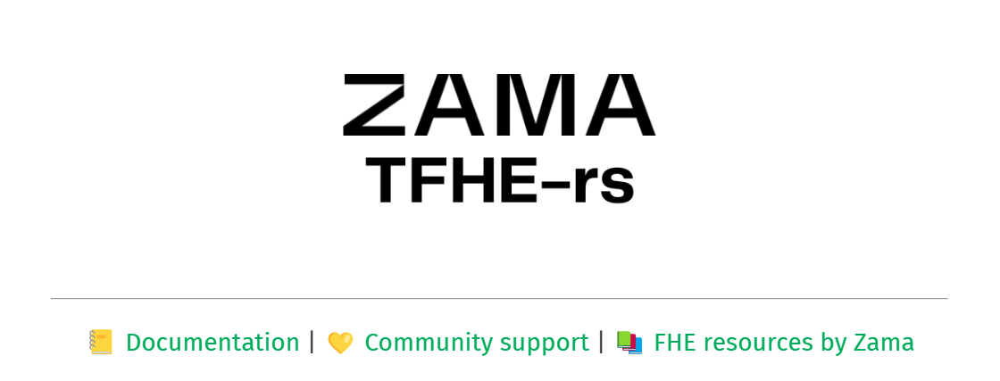

# Work with native coins

## TODO

## Intro

## Example - stake native chain coins to get liquidity tokens back and earn staking points



<figure><figcaption></figcaption></figure>

<figure><figcaption></figcaption></figure>

<figure><figcaption></figcaption></figure>

<figure><figcaption></figcaption></figure>

<figure><figcaption></figcaption></figure>

<figure><figcaption></figcaption></figure>

<figure><figcaption></figcaption></figure>

<figure><figcaption></figcaption></figure>

<figure><figcaption></figcaption></figure>

<figure><figcaption></figcaption></figure>

## Unstaking these liquidity tokens to get back your real ETHes, BSCs, AVAXes, etc.

<figure><figcaption></figcaption></figure>

