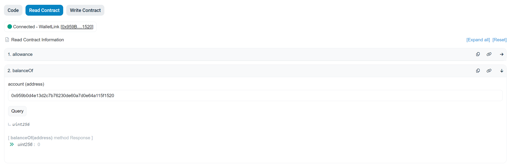

# Work with native coins

## Intro

By placing your native network coins on a multistaking contract, you receive similar liquidity tokens in a 1:1 ratio.

This way, you can earn rewards on Klyntar (helping to decentralize the network) and at the same time continue to use the tokens in DeFi applications, lending protocols, etc.

In this tutorial we will use the Etherscan interface because many EVM chains support it, so we are sure that you will be very familiar with the working mechanisms shown below.

You can also repeat the multistaking process through our own interface on our website:



## Example - stake native chain coins to get liquidity tokens back and earn staking points

Now we will show the whole process using an example:

1. Smart contract **0xa2f1537720d243e042376127b0007551db239368**
2. User address **0x959b0d4e13d2c7b76230de60a7d0e64a115f1520**
3. The address of the validator to which we will stake our coins - **0x069bdf66961ce2D38eBe48DD2E095f2c8015ac82**



This is the contract page:

<figure><figcaption></figcaption></figure>

Go to to **Contract > Read Contract** and check - initially balance will be 0


For your own account, before any interaction - your balance will be 0


<figure><figcaption></figcaption></figure>

Also, the staking power of our pool is zero

<figure><figcaption></figcaption></figure>

Since tokens are issued in a 1:1 ratio, the initial totalSupply will also be 0.

<figure><figcaption></figcaption></figure>

## Start staking

Go to **Write Contract** and find `stake()` function. Set the wished amount of coins to stake - it might be ETH, BSC, AVAX, TRON, etc. (depending on network). Also, set the address of pool to stake to.

<figure><figcaption></figcaption></figure>

After that, execute transaction and check details.


In this example we staked 0.01 ETH to pool 0x069bdf66961ce2D38eBe48DD2E095f2c8015ac82


<figure><figcaption></figcaption></figure>

Now, notice please that your balance decreased. Before transaction:&#x20;

<figure><figcaption></figcaption></figure>

After:

<figure><figcaption></figcaption></figure>

If you try to check `balanceOf` - you will see that you received 0.01 KETH (KlyntarETH) tokens back

<figure><figcaption></figcaption></figure>

And your pool received appropriate amount of staking power

<figure><figcaption></figcaption></figure>


Congratulations, you have now completed the staking process. Let's see what we have as a result


1. 0.01 KETH (KlyntarETH) has your account 0x959b0d4e13d2c7b76230de60a7d0e64a115f1520
2. Your pool(where you staked) has staking power equal to 0.01 ETH
3. Now you can continue use you KlyntarETH in DeFi apps while also receiving rewards from Klyntar - no locked liquidity

## Unstaking these liquidity tokens to get back your real ETHes, BSCs, AVAXes, etc.

So you have 0.01 KETH and you want to get your original ETH back.

<figure><figcaption></figcaption></figure>

Let's assume you want to withdraw back 0.001 ETH.

Go to contract page and visit **Contract >** **Write Contract** to find `unstake()` function. Specify the pool from which you want to unstake. You can choose any pool that has enough coins. Not necessarily the one you staked on.

<figure><figcaption></figcaption></figure>

The example of transaction below:

<figure><figcaption></figcaption></figure>

Now the contract ETH balance is 0.009 ETH instead of 0.01 ETH as before:

<figure><figcaption></figcaption></figure>


At this stage, you signal that you want to get your original tokens back. The unstaking process in real conditions will take about 3 days (to prevent contract abuse). To do this, you will need to additionally call the withdraw() function on the contract


