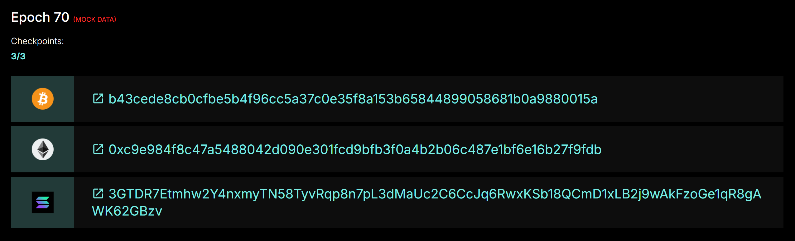

# Searchbar

In searchbar you can find everything you need by applying a special filter. Please, click the button to expand the full list of available filters

<figure><figcaption>
Full list of filters
</figcaption></figure>

Follow the prompts in the input field to find what you need :relaxed:&#x20;

## Find your transaction by tx ID

Choose appropriate filter and paste TxID. Please note that:

1. KLY native tx id is 256-bit BLAKE3 hash
2. KLY-EVM tx id is 256-bit 0x-prefixed SHA3 hash

For example:

<figure><figcaption></figcaption></figure>

<figure><figcaption></figcaption></figure>

The same works for EVM transactions. Get the txid from your wallet or web3 SDK and paste to explorer

<figure><figcaption></figcaption></figure>

<figure><figcaption></figcaption></figure>

## Find block by shard index&#x20;

Each shard works as independent linear blockchain. So, to find the first block on shard or, saying 1337th block on shard choose filter and paste required input

Find the first block on shard 0 (indexation starts from 0)

<figure><figcaption></figcaption></figure>

Result

<figure><figcaption></figcaption></figure>

Find the block 1337th on shard 0

<figure><figcaption></figcaption></figure>

<figure><figcaption></figcaption></figure>

## Find block by ID

Also, each block has own ID. This ID consists of 3 parts:

1. Epoch Index
2. Creator-pool pubkey (currently Ed25519), Base58 encoded
3. Block index in own sequence

In each epoch on each shard there is a timeframe for each validator to generate blocks. Each validator starts own sequence of indexation.

For example, if:

1. Epoch index = 455
2. Set of validators for shard X - V0, V1, V2

The IDs of blocks will be:

1. 455:V0:107 - 107th block by pool V0 on epoch 455
2. 455:V1:37 - 37th block by pool V1 on epoch 455
3. 455:V2:10 - 10th block by pool V2 on epoch 455

So, choose filter, paste ID and search

<figure><figcaption></figcaption></figure>

<figure><figcaption></figcaption></figure>

If you click \`Check AFP\` you will be able to see the AFP - aggregated finalization proof created by quorum majority. If block has this proof - it's a signal that it was approved and included to blockchain

<figure><figcaption></figcaption></figure>

AFP presented in a raw form but your node and developers will know what to do with it

<figure><figcaption></figcaption></figure>

## Find staking pool(validator) by ID

Pool has appropriate pubkey and the full ID of pool will be pubkey + `(POOL)` postfix

For example, go to searchbar and try to find:

<figure><figcaption></figcaption></figure>

You will be redirected here

<figure><figcaption></figcaption></figure>

## Find epoch data by ID

The easiest - just pase index of epoch and find required data

<figure><figcaption></figcaption></figure>

<figure><figcaption></figcaption></figure>

## Find account info by ID

There are 2 types of accounts in KLY network - **user**(EOA - externally owned account) and **contract.**

Due to the sharded nature of our network, when searching for an account (user or contract) you should specify a prefix with the shard ID.

For example:

1. User account vlad on shard\_0 has ID - **shard\_0:vlad**
2. Contract **blablabla** on shard\_5 has ID - **shard\_5:blablabla**

Examples

<figure><figcaption></figcaption></figure>

<figure><figcaption></figcaption></figure>

<figure><figcaption></figcaption></figure>

<figure><figcaption></figcaption></figure>

Example with contract

<figure><figcaption></figcaption></figure>

<figure><figcaption></figcaption></figure>

Find EVM account

<figure><figcaption></figcaption></figure>

<figure><figcaption></figcaption></figure>
