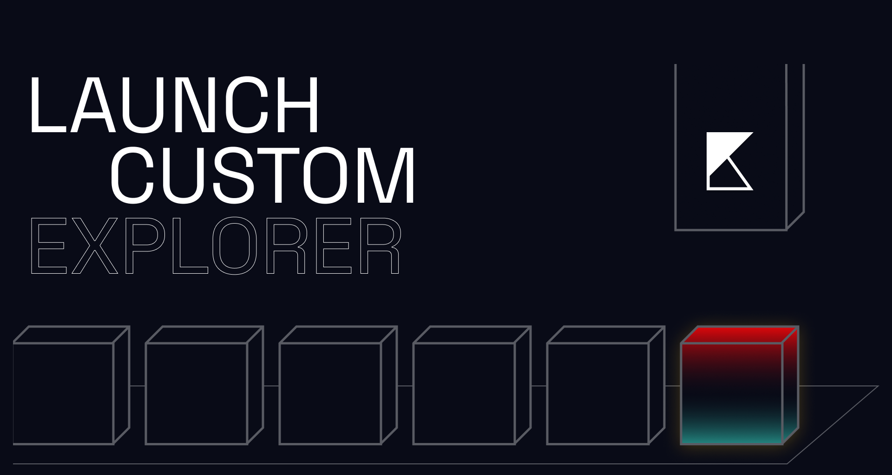

# Your own custom explorer

Intro

During development, it is often useful to visualize changes in the chain.

For example, when launching a private testnet, it would be interesting to know the details of the network operation - created blocks, transaction statuses, validators, shards, and so on.

That is why we decided to make our explorer open source. But in general, there are two reasons:

1. The ability to make changes to the common repository by different developers
2. The ability to simplify the process of development and interaction with the Klyntar network

Therefore, below you will see the process of launching a local explorer and a short guide on using it using the example of a local testnet with 1 shard and 1 validator

<figure><figcaption></figcaption></figure>

## Installation process

Install **Node.js** first

Then, clone repository

```bash
git clone https://github.com/KLYN74R/Explorer.git
```

Then, go to repository and install dependencies

```bash
cd Explorer && npm install
```

## Options

Now, if you need just explorer to view network - build it and run

```bash
npm run build

npm start
```

In case you want to make changes to explorer and track changes - run it in development mode

```bash
npm run dev
```

## Environmental variables

By default, explorer expects a URL for node RPC. This is how it looks like in code&#x20;

```typescript
const baseUrl = process.env.KLYNTAR_NODE_URL || 'http://localhost:7332';
```

So, set `KLYNTAR_NODE_URL` manually in Linux/Windows/Mac or just run your node on port 7332

## Usage

Go to [http://localhost:3000](http://localhost:3000) and check the main page of explorer

<figure><figcaption></figcaption></figure>

There are 3 main areas you should pay attention to here:

1. **Searchbar**
2. **Network Parameters** section
3. **Network Info** - section with starting points to other pages that detail the explorer

Find out more about how to use them in the **Usage guide** section


[usage-guide](usage-guide/)

