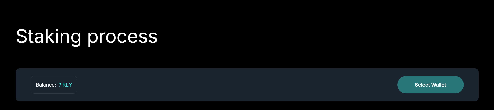
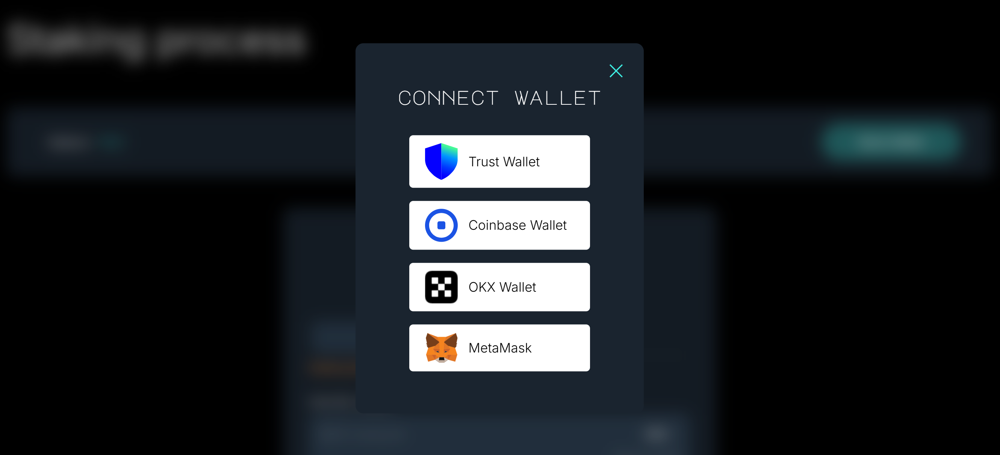
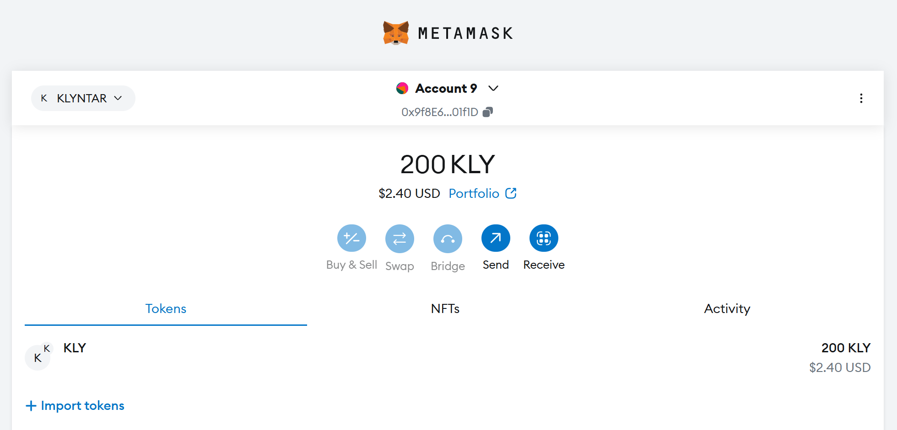
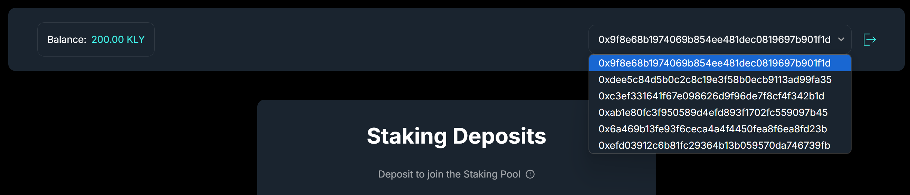
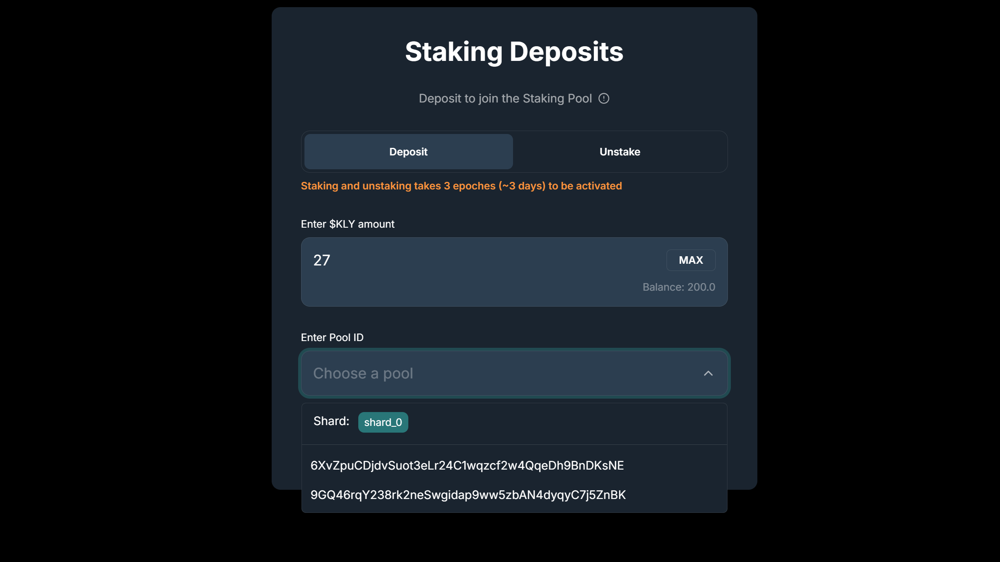
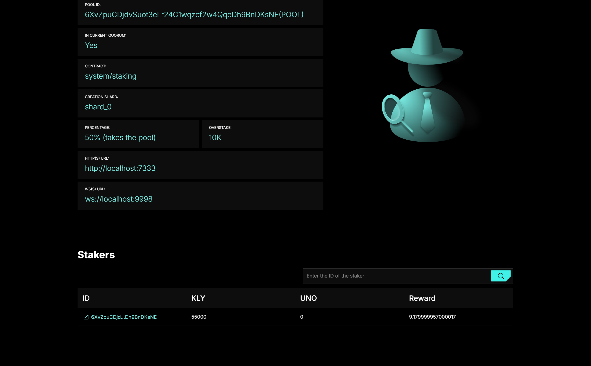
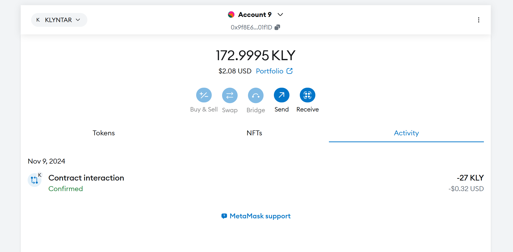
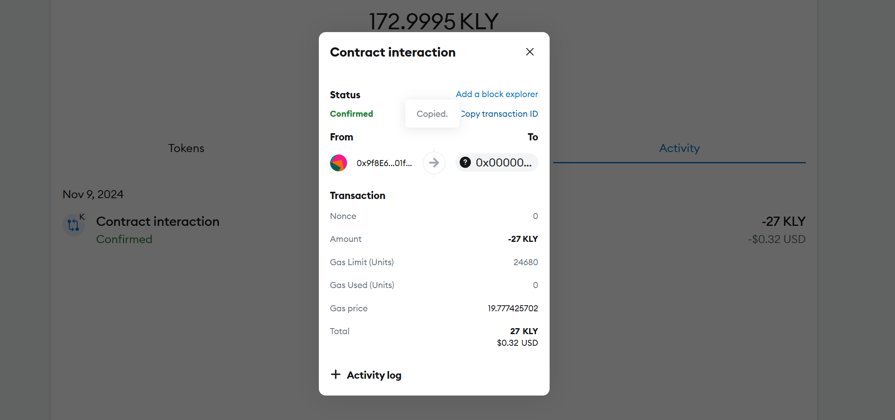
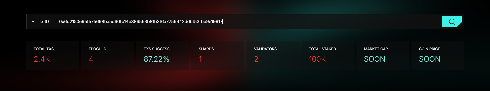
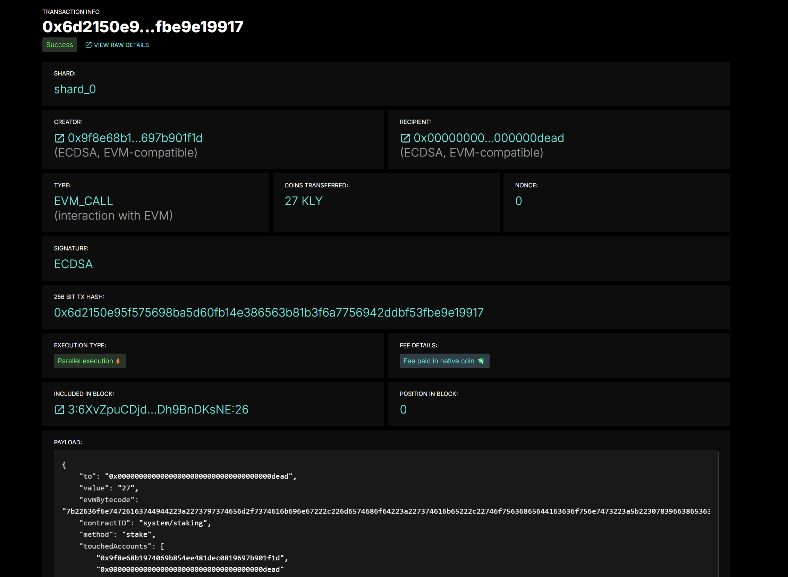

# Staking


## Intro

The staking process in crypto projects is very important because it allows you to attract more independent parties to maintain the decentralization of the network.

Obviously, not everyone is able to put a large amount to launch a validator, and not everyone has the necessary technical skills to maintain a validator (it is still a server) - update it, work with the cloud, and so on.

Staking gives you the opportunity to put your coins on those who can maintain a server, and in return - the validator will share with you part of the profit from the network.

Below we will demonstrate the staking process.

## Find validator(staking pool) to stake on

First of all - search for the staking pool (validator) you want to stake on.

You have several ways to do this:

1. Own data channels - this can be your own pool, some large staking provider (for example Everstake or staking by some top-tiers exchanges).
2. Search on our resources - you can find a staking pool in the explorer and select it for staking

Visit the main page of explorer and choose `Epoch data`

<figure><figcaption></figcaption></figure>

Now below you should see the list of leaders on shards for current epoch:

<figure><figcaption></figcaption></figure>

By clicking on a specific validator you will be redirected to a page with information about it.

<figure><figcaption></figcaption></figure>

Below is a list of stakers of this pool. For example, for this pool, only the owner himself is a staker. The total strength of the pool is 55,000 KLY, while the owner has staked all 55,000 KLY

<figure><figcaption></figcaption></figure>

However, using this pool as an example, we will demonstrate the staking process below.

## Method 1 - via user interface

The easiest way is to go to our website, connect your wallet and start the staking process in a special form

<figure><figcaption></figcaption></figure>

Click **`Select Wallet`** and choose your provider (Metamask, Coinbase Wallet, OKX Wallet, etc.)

<figure><figcaption></figcaption></figure>

<figure><figcaption></figcaption></figure>

Metamask shows us that we have 200 coins on balance

<figure><figcaption></figcaption></figure>

After connecting the wallet, select the desired account from the list

<figure><figcaption></figcaption></figure>

Select the number of coins you want to stake and select the pool

<figure><figcaption></figcaption></figure>

If we visit the page of pool before the transaction, we'll see that currently pool has only one staker - it's pool owner itself

<figure><figcaption></figcaption></figure>

Initiate the transaction

<figure><figcaption></figcaption></figure>

After this, you should see the decreased balance

<figure><figcaption></figcaption></figure>

### When your stake will be activated ?

If we open the transaction details - it's possible to copy the transaction ID

<figure><figcaption></figcaption></figure>

Let's visit the explorer and try to find our transaction

<figure><figcaption></figcaption></figure>

<figure><figcaption></figcaption></figure>

### When your stake will be activated ?

Please note that the stake will not be activated immediately, but only after **3 epochs**


Check the duration of epoch on the main page of explorer


<figure><figcaption></figcaption></figure>

Look at the block ID in which your staking transaction was located. The first part of the ID stands for the epoch ID. In this case, it is **3**.

<figure><figcaption></figcaption></figure>

Therefore, your stake will be activated in epoch:

$$
ActivationEpoch = 3+3 = 6
$$

After waiting for epoch **6** - let's go to the page of the validator we stake on:

<figure><figcaption></figcaption></figure>

<figure><figcaption></figcaption></figure>

Now your account will be in the list of stakers and you will be able to see the reward for this epoch

## Method 2 - programmatic way using SDK

### 1. Prepare your account

Imagine that you have some keypair of your account. Definitely you should have some coins on this address to stake

```javascript
let keypair = {

    pub:"3JAeBnsMedzxjCMNWQYcAXtwGVE9A5DBQyXgWBujtL9R",

    prv:"MC4CAQAwBQYDK2VwBCIEIDteWfNev7NOlNmwP8Irwg5miWKoErYGV+UU5VrFgYev"

};
```

For example, this account have `20M` KLY

<figure><figcaption></figcaption></figure>

### 2. Create the transaction to call staking system smart contract

Now use the Web1337 [**SDK**](../../../web1337/web1337-intro.md) to create the special transaction which calls system smart contract related to staking

```javascript
import Web1337 from 'web1337';

let web1337 = new Web1337({

    chainID:'aaaaaaaaaaaaaaaaaaaaaaaaaaaaaaaaaaaaaaaaaaaaaaaaaaaaaaaaaaaaaaaa',
    workflowVersion:0,
    nodeURL: 'http://localhost:7332' // or your node URL

});


// This is your keypair

let keypair = {

    pub:"3JAeBnsMedzxjCMNWQYcAXtwGVE9A5DBQyXgWBujtL9R",

    prv:"MC4CAQAwBQYDK2VwBCIEIDteWfNev7NOlNmwP8Irwg5miWKoErYGV+UU5VrFgYev"

};


const shardID = "shard_0";

const poolToStakeOn = "9GQ46rqY238rk2neSwgidap9ww5zbAN4dyqyC7j5ZnBK";

const amountToStake = 100;


let payload = {

    shard: shardID,

    contractID:'system/staking',

    method:'stake',

    gasLimit:0,

    params:{

        poolPubKey:poolToStakeOn,
        amount: amountToStake

    },

    imports:[]

};


const fee = 2;

const nonce = await web1337.getAccount(shardID,keypair.pub).then(account=>account.nonce+1);

const txType = "WVM_CALL";

let tx = web1337.createEd25519Transaction(shardID,txType,keypair.pub,keypair.prv,nonce,fee,payload);

console.log(tx);

web1337.sendTransaction(tx).then(value =>{

    console.log('Response from node => ',value)

    console.log(`TX ID is => `,web1337.blake3(tx.sig))

}).catch(err=>console.error('Error: ',err));
```

The structure of transaction that will be sent to node should be like this:

```code-runner-output
{
  v: 0,
  creator: '3JAeBnsMedzxjCMNWQYcAXtwGVE9A5DBQyXgWBujtL9R',
  type: 'WVM_CALL',
  nonce: 1,
  fee: 2,
  payload: {
    shard: 'shard_0',
    contractID: 'system/staking',
    method: 'stake',
    gasLimit: 0,
    params: {
      poolPubKey: '9GQ46rqY238rk2neSwgidap9ww5zbAN4dyqyC7j5ZnBK',
      amount: 100
    },
    imports: []
  },
  sigType: 'D',
  sig: 'gNT1S5kN7rJtLBSCVclgp+kSN/aScQu65VVxPGXSji2KNLVOPAOp2ya/80eDjNBMUDMFXL4Q98UQzCjTBM8xBQ=='
}
```

And in console you should see something like this:

```code-runner-output
Sent =>  { status: 'Ok, tx redirected to current shard leader' }
TX ID is =>  685db080d685f73b79daa72676da2d6e8003e4eebc4d0e19410cb4e0f92a66c3
```

### Check the staking status

Once you have the transaction ID, go to the explorer and look at the transaction status:

<figure><figcaption></figcaption></figure>

### Wait untill the next epoches

Due to the network features (such as multi-level sharding, parallel virtual machines, etc.) - you need to wait some time until the rate comes into effect.

On the transaction status page, you will see a field that indicates which block the transaction was in.

<figure><figcaption></figcaption></figure>

The first part of the identifier (44) indicates the epoch index when the block was created. This block was created in epoch 44.


Well, that's it - only after 2 days your bet will come into effect. So, in this case, the bet will become active in the epoch 46


### Make sure you're in a staking list

Now if you visit the validator page, you will see yourself in the list of stakers.

<figure><figcaption></figcaption></figure>

<figure><figcaption></figcaption></figure>

As you can see, the stake here is actually 100 coins.
