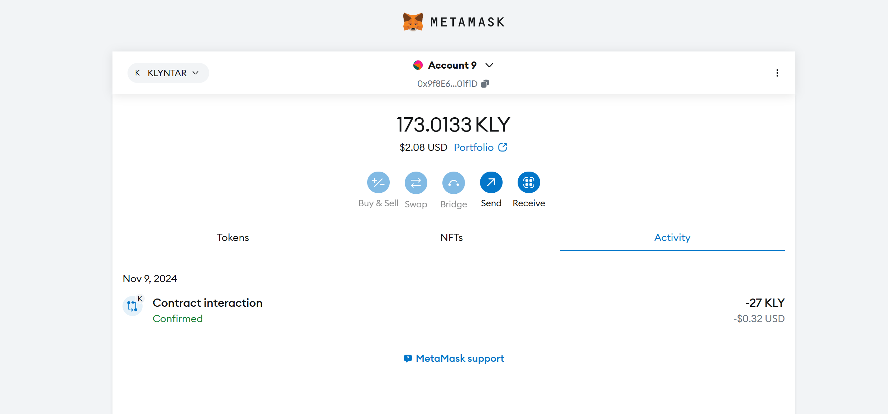
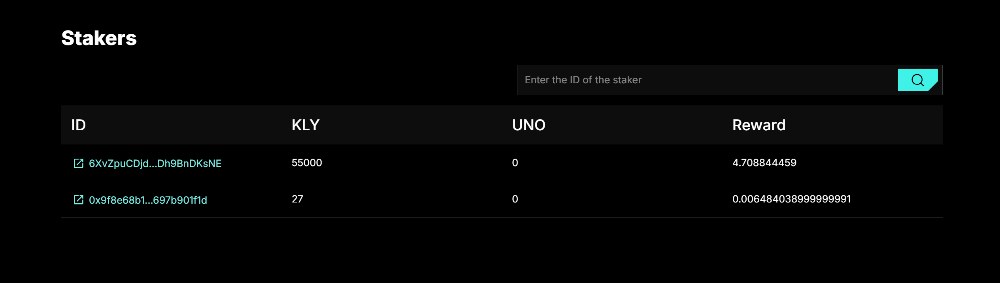
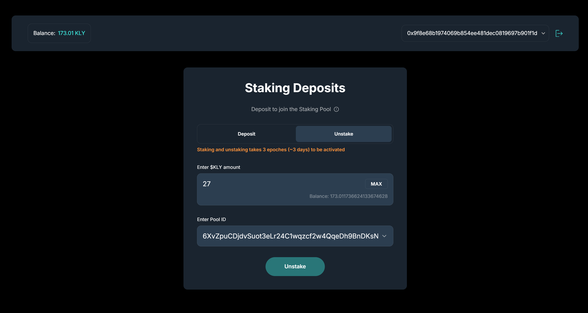
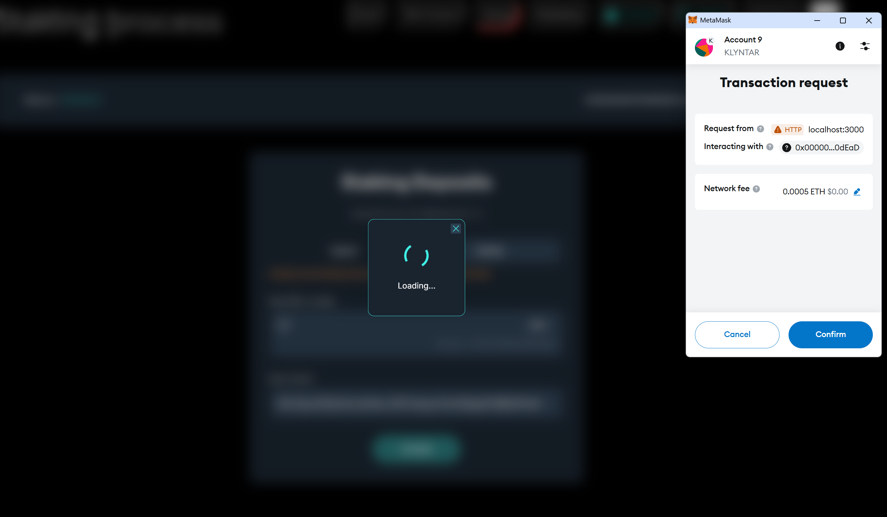
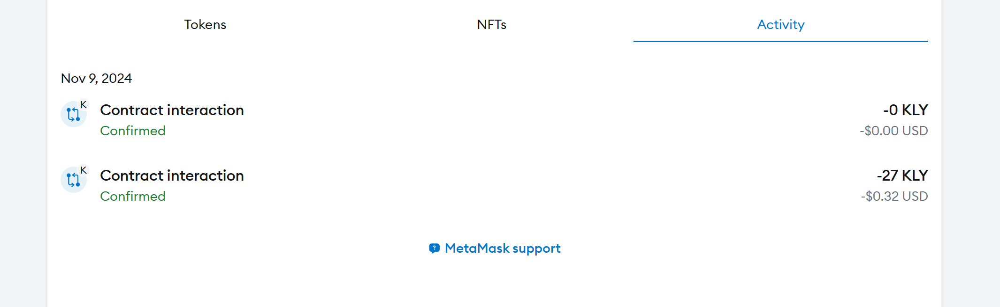
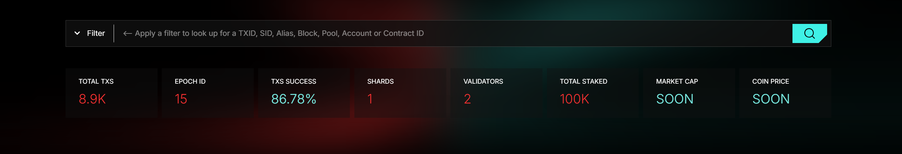
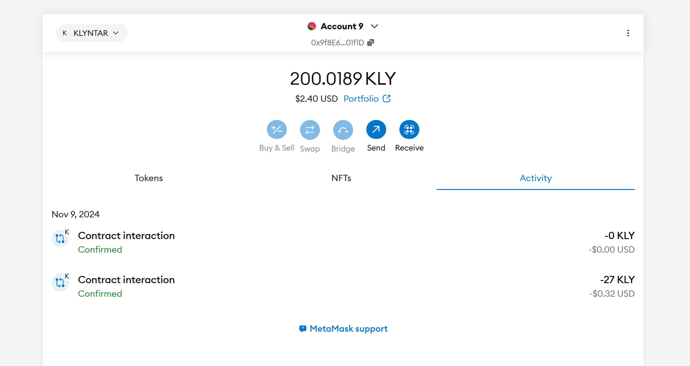
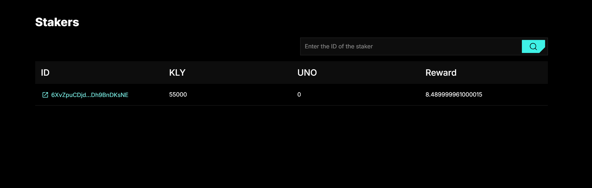

# Unstaking

## Intro

When unstaking, you withdraw your coins from the staking balance of the validator you previously staked on.

## Method 1 - via user interface

Again, the easiest way to do this is through the interface on our website. As you remember:

1. We staked 27 coins
2. On the pool `6XvZpuCDjdvSuot3eLr24C1wqzcf2w4QqeDh9BnDKsNE`
3. From our account `0x9f8E68B1974069B854eE481deC0819697B901f1D`

<figure><figcaption></figcaption></figure>

Our account is still on the list of stakers and receives rewards:

<figure><figcaption></figcaption></figure>

On site - choose the mode **`Unstake`** . Input the amount and your pool

<figure><figcaption></figcaption></figure>

Confirm the transaction

<figure><figcaption></figcaption></figure>

<figure><figcaption></figcaption></figure>

### Check the transaction status via explorer

<figure><figcaption></figcaption></figure>

Unstaking also require some time. So, now we know that unstaking transaction was in block in epoch 12:

<figure><figcaption></figcaption></figure>


So, let's wait for epoch 12 + 3 = **15**


<figure><figcaption></figcaption></figure>

After this - you should receive your stake back

<figure><figcaption></figcaption></figure>

And if you visit the page of pool info:

<figure><figcaption></figcaption></figure>

You will see that your account is not in the stakers list

<figure><figcaption></figcaption></figure>

As you can see, your account has been removed from the list of stakers in this pool. From this moment on, you will no longer receive rewards.

## Method 2 - programmatic way using SDK

Let's assume that we have this:

1. Your address - `3JAeBnsMedzxjCMNWQYcAXtwGVE9A5DBQyXgWBujtL9R`
2. Pool you staked on - `9GQ46rqY238rk2neSwgidap9ww5zbAN4dyqyC7j5ZnBK`

Let's assume that we want to do the following:

1. Unstake 30 coins - this will return to our balance
2. 70 coins remain in the pool - you will continue to receive rewards from the validator

### 1. Call system smart contract to unstake

```javascript
import Web1337 from 'web1337';


let web1337 = new Web1337({

    chainID:'aaaaaaaaaaaaaaaaaaaaaaaaaaaaaaaaaaaaaaaaaaaaaaaaaaaaaaaaaaaaaaaa',
    workflowVersion:0,
    nodeURL: 'http://localhost:7332'

});


let keypair = {

    pub:"3JAeBnsMedzxjCMNWQYcAXtwGVE9A5DBQyXgWBujtL9R",

    prv:"MC4CAQAwBQYDK2VwBCIEIDteWfNev7NOlNmwP8Irwg5miWKoErYGV+UU5VrFgYev"

};

const shardID = "shard_0";


let payload = {

    shard: shardID,

    contractID:'system/staking',

    method:'unstake',

    gasLimit:0,

    params:{

        poolPubKey:'9GQ46rqY238rk2neSwgidap9ww5zbAN4dyqyC7j5ZnBK',
        amount: 30

    },

    imports:[]

}


const fee = 2;

const nonce = await web1337.getAccount(shardID,keypair.pub).then(account=>account.nonce+1);

const txType = "WVM_CALL";

let tx = web1337.createEd25519Transaction(shardID,txType,keypair.pub,keypair.prv,nonce,fee,payload);

console.log(tx);

web1337.sendTransaction(tx).then(value =>{

    console.log('Sent => ',value)

    console.log(`TX ID is => `,web1337.blake3(tx.sig))

}).catch(err=>console.error('Error with unstaking: ',err));
```

Output:

```code-runner-output
{
  v: 0,
  creator: '3JAeBnsMedzxjCMNWQYcAXtwGVE9A5DBQyXgWBujtL9R',
  type: 'WVM_CALL',
  nonce: 2,
  fee: 2,
  payload: {
    shard: 'shard_0',
    contractID: 'system/staking',
    method: 'unstake',
    gasLimit: 0,
    params: {
      poolPubKey: '9GQ46rqY238rk2neSwgidap9ww5zbAN4dyqyC7j5ZnBK',
      amount: 30
    },
    imports: []
  },
  sigType: 'D',
  sig: 'YkfiMMLFopmxwuf3pmuKgNrpcdOuhxg3D+szrMQyIwk6DcUCS0Tl4taNIbGX1nGsQRMXiuNpKASxqyUCJxZ0Cg=='
}
Sent =>  { status: 'OK' }
TX ID is =>  ee8053b379a44662252afcd42a316e152f47a45353f7accd294a9ee321a38aed
```

### 2. Check the unstaking tx status

Go to explorer and try to find your transaction

<figure><figcaption></figcaption></figure>

Transaction finished with `Success` :green\_circle: status

<figure><figcaption></figcaption></figure>

### 3. Wait untill the next epoches

There is also a delay for the unstaking procedure. Since the transaction was in epoch 61

<figure><figcaption></figcaption></figure>

Then you will receive the coins in epoch **61+3=64**

### 4. Check that you have less coins in pool and receive your coins back

We waited for a while and now the epoch is **64.** Let's try to go to the pool page and see the list of stakers now:

<figure><figcaption></figcaption></figure>

Now in pool you have 70 coins instead of 100

<figure><figcaption></figcaption></figure>

And if you visit the page of your account you will see that 30 coins was sent to your address back

<figure><figcaption></figcaption></figure>

Calculation:

```
Init balance: 20_000_000 (20 millions)

Balance after staking: 20_000_000 - 100(staking) - 2(fee) = 19_999_898

Balance after unstaking: 19_999_898 + 30(unstaking) - 2(fee) = 19_999_926
```

As you can see, everything is correct [✅](https://emojipedia.org/check-mark-button)
