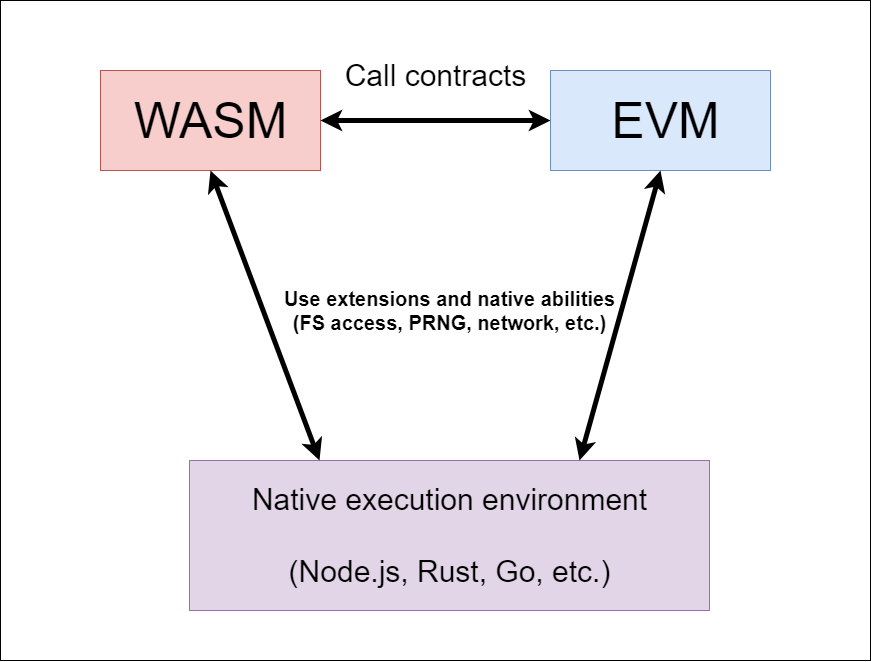
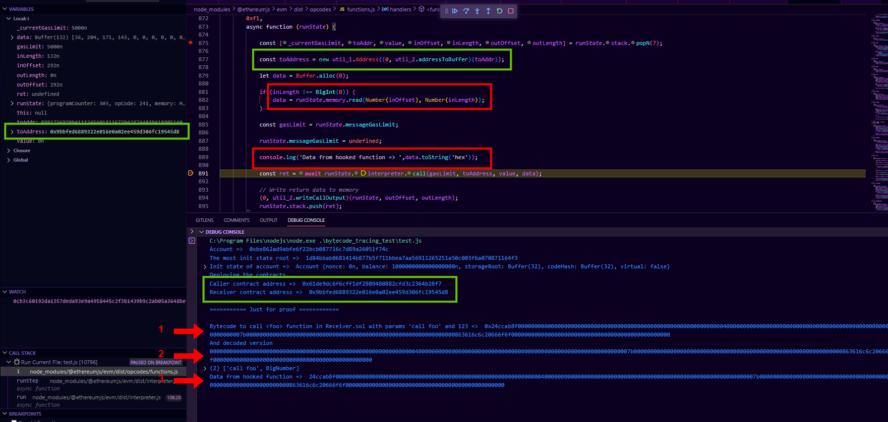
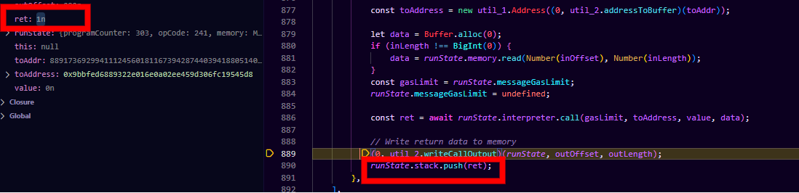
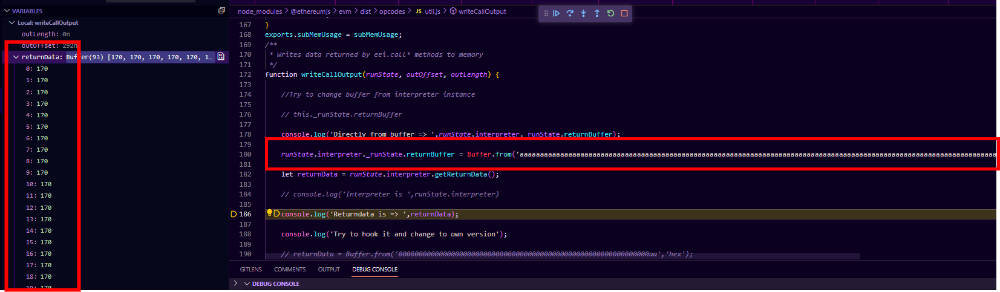

# 🧙‍♂️ Magic address

## Intro

EVM and WASM are the dominant technologies in the cryptocurrency market. That is why KLY supports both EVM and WASM.

But you must admit that the project would not be complete if it were not possible to combine these 2 technologies and use them interchangeably. That is, for example, it would be cool if you could use some interesting algorithm in the EVM, the implementation of which is only available in Rust or Go, or, for example, call EVM logic directly from WASM smart contracts and vice versa.

In addition, since both VMs have access to the native runtime environment (we have Node.js since the KLY core has JS implementation), this means that both the EVM and WASM will have limited and controlled access to the JS environment. This means that it will be possible to expand both VMs by injecting the logic and functions of the native launch environment into them. Here's how it looks on the diagram

<figure><figcaption></figcaption></figure>


This brings us to the idea of hybrid smart contracts.



## Hybrid smart-contracts, EVM opcodes and magic address

The EVM is a stack machine that runs low-level bytecode that has been sourced from Solidity, Vyper, or Yul.

Like many other languages, EVM bytecode includes a set of opcodes, each of which performs a certain action - puts something on the stack, reads something from the memory (heap), performs mathematical operations, and so on.



However, unlike classic assembler listings, there are no syscalls, access to the file system, random number generator or other things that can lead to non-determinism and disruption of the cryptocurrency node.

In fact, the EVM only imitates low-level work, and under the hood uses special functions that execute the logic of a specific opcode.

For example, the operation of the **0x56**(<mark style="color:red;">**jmp**</mark>) opcode corresponds to the following function


```typescript
// 0x56: JUMP
  [
    0x56,
    function (runState) {
      const dest = runState.stack.pop()
      if (dest > runState.interpreter.getCodeSize()) {
        trap(ERROR.INVALID_JUMP + ' at ' + describeLocation(runState))
      }

      const destNum = Number(dest)

      if (!jumpIsValid(runState, destNum)) {
        trap(ERROR.INVALID_JUMP + ' at ' + describeLocation(runState))
      }

      runState.programCounter = destNum
    },
  ]
```


Look at lines 5, 10 and 16. The function reads the top value from the simulated stack and removes it from there (pop), and then redefines the program counter to the specified address.

Here,for example, simple opcodes that allow you in the EVM to get the height of the block in which the contract is executed, the block time, its index, and so on:

```typescript
  // 0x41: COINBASE
  [
    0x41,
    function (runState) {
      runState.stack.push(runState.interpreter.getBlockCoinbase())
    },
  ],
  // 0x42: TIMESTAMP
  [
    0x42,
    function (runState) {
      runState.stack.push(runState.interpreter.getBlockTimestamp())
    },
  ],
  // 0x43: NUMBER
  [
    0x43,
    function (runState) {
      runState.stack.push(runState.interpreter.getBlockNumber())
    },
  ],
```

So, everytime you call these in Solidity sources:

```solidity
address sendFeesTo = block.coinbase;
uint blockTime = block.timestamp;
uint blockIndex = block.number;
```

Previous functions will be executed

## Functions hooking

In order to combine EVM and WASM, we need to find such an opcode that would allow us to call a certain function with parameter passing and get the result.

Fortunately, the EVM has the ability to _**cross-contract**_ calls. The result of the execution is then written to a variable in the form of raw bytes that can be decoded and get everything we need - the data structure, the result of the execution, and so on.

Let's experiment. Let's say we have 2 contracts - <mark style="color:red;">**Caller**</mark> and <mark style="color:green;">**Receiver**</mark>. As part of the tests, Caller makes a cross-contract call to Receiver.


```solidity
// SPDX-License-Identifier: MIT
pragma solidity ^0.8.17;

contract Caller {
    event Response(bool success, bytes data);

    // Let's imagine that contract Caller does not have the source code for the
    // contract Receiver, but we do know the address of contract Receiver and the function to call.
    function testCallFoo(address payable _addr) public payable {
        // You can send ether and specify a custom gas amount
        (bool success, bytes memory data) = _addr.call{value: msg.value, gas: 5000}(
            abi.encodeWithSignature("foo(string,uint256)", "call foo", 123)
        );

        emit Response(success, data);
    }

    // Calling a function that does not exist triggers the fallback function.
    function testCallDoesNotExist(address payable _addr) public payable {
        (bool success, bytes memory data) = _addr.call{value: msg.value}(
            abi.encodeWithSignature("doesNotExist()")
        );

        emit Response(success, data);
    }
}
```


And Receiver


```solidity
// SPDX-License-Identifier: MIT
pragma solidity ^0.8.17;

contract Receiver {
    
    event Received(address caller, uint amount, string message);

    fallback() external payable {
        emit Received(msg.sender, msg.value, "Fallback was called");
    }

    function foo(string memory _message, uint _x) public payable returns (uint) {
        
        emit Received(msg.sender, msg.value, _message);

        return _x + 1;
    }
}
```


The CALL opcode function has the following listing

```javascript
async function (runState) {
            
            const [_currentGasLimit, toAddr, value, inOffset, inLength, outOffset, outLength] = runState.stack.popN(7);

            const toAddress = new util_1.Address((0, util_2.addressToBuffer)(toAddr));

            let data = Buffer.alloc(0);
            if (inLength !== BigInt(0)) {
                data = runState.memory.read(Number(inOffset), Number(inLength));
            }
            const gasLimit = runState.messageGasLimit;
            runState.messageGasLimit = undefined;

            const ret = await runState.interpreter.call(gasLimit, toAddress, value, data);

            // Write return data to memory
            (0, util_2.writeCallOutput)(runState, outOffset, outLength);
            runState.stack.push(ret);
}
```


By the way, it's good that this function is asynchronous because it will allow us to further give the EVM access to the Internet, read / write to the database, and so on.


The most interesting values ​​here are the address **toAddr** and **data** - parameters and a function that needs to be called in the Receiver contract.

If we run this sequence

1. Deploy Receiver.sol
2. Deploy Caller.sol
3. Calling the testCallFoo function from the Caller.sol contract

```javascript
async function crossContractCallFromCallerToReceiver(vm,senderPrivateKey,callerContractAddress,receiverContractAddress) {

    const data = encodeFunction('testCallFoo', {
    
        types: ['address'],
        values: [receiverContractAddress],
    
    })

    console.log('\n=========== Just for proof ============\n')

    let dataForProof = encodeFunction('foo', {

        types: ['string','uint256'],
        values: ["call foo",123],
    
    })

    console.log(`Bytecode to call <foo> function in Receiver.sol with params 'call foo' and 123 => `,dataForProof)

    console.log('And decoded version')

    // Slice the first 4 bytes(function signature)

    dataForProof = dataForProof.slice(10)

    console.log(dataForProof)

    console.log(AbiCoder.decode(['string','uint256'],'0x'+dataForProof))


    const txData = {
        to: callerContractAddress,
        data,
        nonce: await getAccountNonce(vm, senderPrivateKey),
    }

    const tx = Transaction.fromTxData(buildTransaction(txData), { common }).sign(senderPrivateKey)

    const setGreetingResult = await vm.runTx({ tx, block })

}


const CALLER_CONTRACT_BYTECODE = '608060405234801561001057600080fd5b50610...'

const RECEIVED_CONTRACT_BYTECODE = '608060405234801561001057600080fd5b506105158061...'


console.log('Deploying the contracts...')
   
const contractAddressOfCaller = await deployContract(vm,accountPk,CALLER_CONTRACT_BYTECODE)

const contractAddressOfReceiver = await deployContract(vm,accountPk,RECEIVED_CONTRACT_BYTECODE)

console.log('Caller contract address => ', contractAddressOfCaller.toString())

console.log('Receiver contract address => ', contractAddressOfReceiver.toString())

await crossContractCallFromCallerToReceiver(vm,accountPk,contractAddressOfCaller,contractAddressOfReceiver.toString())
```

And at the same time, we set a breakpoint in the debugger at the moment the **CALL** opcode is executed, we will see this:

<figure><figcaption></figcaption></figure>

Let's clear up a few things

<mark style="color:green;">**Green part:**</mark>

Here I demonstrate that at the level of the CALL opcode function, we managed to intercept the address of the contract being called. This will be needed later where we will talk about the magic address.

<mark style="color:red;">**Red part:**</mark>

In the red part, we are trying to read and understand the data that will be passed to the function.

If you look at the listing of the **crossContractCallFromCallerToReceiver** function(above), you will see that we encoded the parameters there. Next, we print it to the console (<mark style="color:red;">**red step 1**</mark>), then decode it (<mark style="color:red;">**red step 2**</mark>). In the end, I show that we get the same data values already inside the CALL function (<mark style="color:red;">**red step 3**</mark>).


This PoC shows the possibility that if we replace the behavior of the **CALL** opcode function, then we will be able to understand that the EVM wants to call a WASM or a function from the JS environment, as well as understand and decode the call parameters (strings, complex data structures, integer arguments, and so on )


After execution, we're going to push 1 to stack as th result of successful execution

<figure><figcaption></figcaption></figure>

After all, we would be interested in knowing how to write the result of a function to get it back to the EVM. Let's take a look at the **writeCallOutput** function. Continue debugging

We're in and ready for stepping

<figure><figcaption></figcaption></figure>

Line 178: Try to read raw returned data. As you see, we get the 32 bytes buffer filled with nulls and 124 as the last value.

<figure><figcaption></figcaption></figure>

It is because in function <mark style="color:red;">**foo**</mark> (see **Receiver.sol**) we return the incremented value of parameter. Since we pass the 123 it's obvious that we get 124 as result.

```solidity
function foo(string memory _message, uint _x) public payable returns (uint) {
        
        emit Received(msg.sender, msg.value, _message);

        return _x + 1;

}
```

**Now, let's check if we can rewrite the value before it will be returned to Caller.sol**

As a reminder, here's the function with cross-contract call

```solidity
// Calling a function that does not exist triggers the fallback function.
function testCallDoesNotExist(address payable _addr) public payable {
    (bool success, bytes memory data) = _addr.call{value: msg.value}(
        abi.encodeWithSignature("doesNotExist()")
    );

    emit Response(success, data);
}
```

The result of the execution(**data**) will be transferred to the log, so if we manage to correctly overwrite the data, then the EVM will continue to execute correctly, and in the logs we will get the overwritten value instead of 124.

<figure><figcaption></figcaption></figure>

Here we try to rewrite the 124 with 93 **aa** bytes. Now, let's finish. After logs decoding, check the console

<figure><figcaption></figcaption></figure>

## Magic

<figure><figcaption></figcaption></figure>

Now, we can pre-set specific address to handle calls to WASM and JS(or other env).

For example:

* **0x00 - WASM**
* **0x01 - JS**

Once the modified EVM hook one of these addresses it's a signal to call a JS function or WASM contract.

```javascript
if(toAddress.toString()==='0x0000000000000000000000000000000000000000'){

    // Get the destination address and continue to work with payload
                
    ret = 1n // TODO: call function here. Pass the <data> as payload. Get the result, store somewhere and return the result to EVM

}else{

    ret = await runState.interpreter.call(gasLimit, toAddress, value, data)

}
```

## Links








