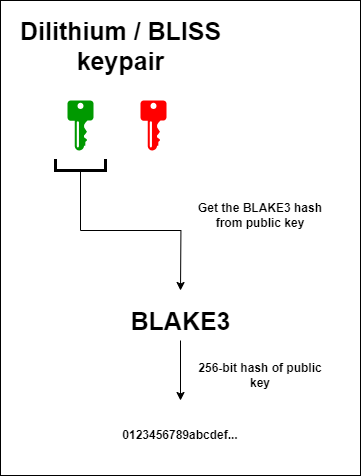

# ⚛ Post-quantum transactions


PQC - Post-Quantum Cryptography


## Useful links


Detailed information


## Intro

As we said earlier, we use Dilithium and BLISS signatures as post-quantum signature schemes. Depending on the Dilithium mode, the size of the keys may change, but the structure of the key pair remains unchanged. Also, since post-quantum schemes usually have large public keys, the address of the post-quantum key pair will be the [_<mark style="color:red;">**BLAKE3**</mark>_](https://mastering.klyntar.org/beginning/cryptography/hash-functions) hash of the public key. Here's what it looks like:

<figure><figcaption></figcaption></figure>

## <mark style="color:red;">Disclaimer</mark>


Post-quantum cryptography is just coming into play. Unlike other cryptography primitives which works for decades for various purposes(AES, ED25519, ECDSA, RSA, SHA, etc.), these algorithms are still going through the final stages of NIST certification. Although we have chosen the best ones, there is still the possibility of a zerodays and errors in the implementation. Be careful


### Generate account


Due to some issues with compiling addons for Node.js environment, the use of post-quantum signatures is only possible in Linux environment. Therefore, in order to generate transactions of this kind, you need to use the Web1337 library in a Linux environment or in a container. We'll fix it in the next versions


Clone the Web1337 repository

### PQC => Ed25519 transaction

### PQC => BLS(multisig address) transaction

### PQC => TBLS(thresholdsig address) transaction

### PQC => PostQuantum(Dilithium/BLISS) transaction
