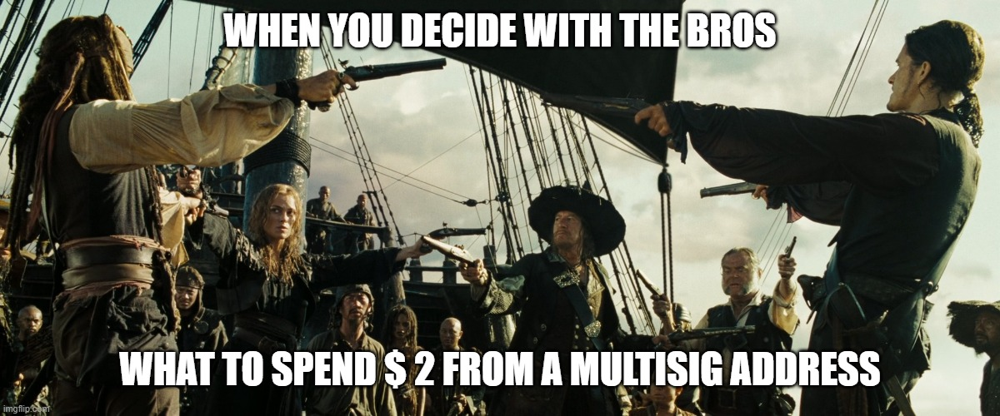

# 🤝 BLS multisig transactions

<figure><figcaption></figcaption></figure>

## Intro

Shortly, the typical keypair looks like this:

```javascript
let publicKey = '0xabe301a20289d1e014c69906febbee42626e084dc93f70c689803e163963101fc90a3674576f86ff90ba9c71310685f1';
let privateKey = '69bfb956053e034b1b7d8b634c9bb8acd1b5743fab64245fad4b1472f63799a9';
```

* 48-bytes, <mark style="color:red;">**0x-prefixed**</mark> hex encoded public key(used as address)
* 32-bytes hexadecimal private key
* 96-bytes hex encoded signature

## Generate BLS keypair(s)


Read detailed information [here](default-ed25519-transactions.md#ed25519-greater-than-bls-multisig-address-transaction)


## BLS => Ed25519 transaction

```javascript
import Web1337,{crypto} from 'web1337';


let web1337 = new Web1337({

    chainID:'aaaaaaaaaaaaaaaaaaaaaaaaaaaaaaaaaaaaaaaaaaaaaaaaaaaaaaaaaaaaaaaa',
    workflowVersion:0,
    nodeURL: 'http://localhost:7332'

});


let publicKey1 = '0xabe301a20289d1e014c69906febbee42626e084dc93f70c689803e163963101fc90a3674576f86ff90ba9c71310685f1';
let privateKey1 = '69bfb956053e034b1b7d8b634c9bb8acd1b5743fab64245fad4b1472f63799a9';

let publicKey2 = '0x8486ccde87fe2603815587a64bd43596d45b383d12563e6b513a9ca033ec9974490f9d577125bbd2b80ada893476a603';
let privateKey2 = '001b9abf2e6d23e13b30a4d35242a11848530f5e40a0fea8c3c50d2902c6c056';

let publicKey3 = '0x87960819a282b2092825c73ac3afbe2e1d5680dff8e00c1f10851ab0b025ae45ac46698d6c0dfda229e2a187bde9690c';
let privateKey3 = '5eca1e38f579064091c4c84eab47b5b5f2a0256847674e6f590879c2dc1605e0';

let publicKey4 = '0x965c986dc91c1a45b6a6d24bb7b8509e9c80f6e77827de1e70737bdeeb23ef3362864da538da57a57384c17dcc9a3fc7';
let privateKey4 = '1635f5c69f695673e83184aba52316a9d2a458016e791ae0180d8c42d05a144c';


// General pubkey retrieved from 4 friends public keys
const rootPubKey = crypto.bls.aggregatePublicKeys([publicKey1,publicKey2,publicKey3,publicKey4]);

// Root pubkey of 3 friends who want to use account - imagine that 1 of friend(the 4th one) is AFK
const aggregatePubKeyOfThreeFriends = crypto.bls.aggregatePublicKeys([publicKey1,publicKey2,publicKey3]);

// Array of pubkeys of friends who dissenting to sign
const arrayOfAfkSigners = [publicKey4];

// ID of shard where you want to transfer KLY or call contract
const shardID = 'shard_0';

const recipient = "nXSYHp74u88zKPiRi7t22nv4WCBHXUBpGrVw3V93f2s";


let payload = {

    active: aggregatePubKeyOfThreeFriends, // aggregated pubkey of ACTIVE signers who participate in THIS transaction

    afk: arrayOfAfkSigners, // here you should paste array of parties who is afk

    to: recipient,

    amount: 13.37,
    
    shard:shardID

};


const fee = 0.03;

const nonce = await web1337.getAccount(shardID,rootPubKey).then(account=>account.nonce+1);

const txType = 'TX';


// Now 3 sides need to sign the same tx data locally(on their devices)

let signature1 = web1337.signDataForMultisigTransaction(shardID,txType,privateKey1,nonce,fee,payload);

let signature2 = web1337.signDataForMultisigTransaction(shardID,txType,privateKey2,nonce,fee,payload);

let signature3 = web1337.signDataForMultisigTransaction(shardID,txType,privateKey3,nonce,fee,payload);


console.log('\n============ Partial signatures ============\n');
console.log(`[0] ${signature1}`);
console.log(`[1] ${signature2}`);
console.log(`[2] ${signature3}`);


let aggregatedSignatureOfThree = crypto.bls.aggregateSignatures([signature1, signature2, signature3]);

console.log(`\n\nAggregated signature of 3/4 parties : ${aggregatedSignatureOfThree}`);


// Finally, build the transaction that will be sent to network
let finalTx = await web1337.createMultisigTransaction(rootPubKey,txType,aggregatedSignatureOfThree,nonce,fee,payload);

console.log("\n\nFinal tx to sent to mempool => ",finalTx);
```

Output:

```code-runner-output
============ Partial signatures ============

[0] a1bc9a2441fcb8662bf1f2503a1f2c23500d8a5b27d0d13e29a8f9edc0f74c2e63c09db70b03fd3b698c62c229beb7ea114dcb96296032fdedcb9f6ba8f8825f26ba3b367cd0e5dd1b46d085956c6113463b4022b7387a33d048a32ae39ed318
[1] ae687c9b452b9d8ba634294f20e1932d9f94635a938c953c50478b3ba50ce5afab4e3d4335ada2e0e425d0b0b1ee4750144b27109bb4186da04899c34749926fcbca09dd83dd80511baaf34c2ea1334c2ff7477bddf43ffa31eafdcb0ef76b0a
[2] b69f20b43e7e303165d2f698464d768665602f4aaa4fb880de69cfa2d5610c9103548482608f8e4778dbd4ce0e331d37140c9ef05435f7c48e37061bb6df49795801ddccc8a0607fb8f08bd66116a484276c4a3af1bbe94a1d6959eb9f915a44


Aggregated signature of 3/4 parties : 8a1a30435c71aa0e58d755e61873f69f9c0afe9c092f12b3c4df98b3c664afa5d0db70bb1b7852b793be5c59eab56e080e5c05996ac31cd58df9149d95cf7d5ab004a85325cfc77e933ed34c4705aaf6f252ded33c9249f8821a4165158241e8


Final tx to sent to mempool => 

{
  v: 0,
  creator: '0xb89c4bf0b9dab0224201d06d46ed6cb49b94f34f8dc8feb0d7bad77caab5b41fc16531dce9ba2cba5784359d2b701cc4',
  type: 'TX',
  nonce: 1,
  fee: 0.03,
  payload: {
    active: '0x8b342d0ea511983d78865b53e75f203d6795d2ae5fbb77bf95858b5958d3dfc65f73139ce69746b7c2254841411a7949',
    afk: [
      '0x965c986dc91c1a45b6a6d24bb7b8509e9c80f6e77827de1e70737bdeeb23ef3362864da538da57a57384c17dcc9a3fc7'
    ],
    to: 'nXSYHp74u88zKPiRi7t22nv4WCBHXUBpGrVw3V93f2s',
    shard:"shard_0",
    amount: 13.37
  },
  sigType: 'M',
  sig: '8a1a30435c71aa0e58d755e61873f69f9c0afe9c092f12b3c4df98b3c664afa5d0db70bb1b7852b793be5c59eab56e080e5c05996ac31cd58df9149d95cf7d5ab004a85325cfc77e933ed34c4705aaf6f252ded33c9249f8821a4165158241e8'
}
```

Now, you can send this transaction:

```javascript
let sendStatus = await web1337.sendTransaction(finalTx);
```

Then, go to explorer and check the status. Remind that TxID is Blake3 hash of tx signature, so you can get the TxID using this snippet:

```javascript
let txID = web1337.blake3(finalTx.sig);

console.log(txID);
```

## BLS => BLS(multisig address) transaction

Remember that in case you fund NEW recipient address, you need to add `rev_t` to payload. Otherwise - just paste recipient to payload.

```javascript
import Web1337,{crypto} from 'web1337';


let web1337 = new Web1337({

    chainID:'aaaaaaaaaaaaaaaaaaaaaaaaaaaaaaaaaaaaaaaaaaaaaaaaaaaaaaaaaaaaaaaa',
    workflowVersion:0,
    nodeURL: 'http://localhost:7332'

});


let publicKey1 = '0xabe301a20289d1e014c69906febbee42626e084dc93f70c689803e163963101fc90a3674576f86ff90ba9c71310685f1';
let privateKey1 = '69bfb956053e034b1b7d8b634c9bb8acd1b5743fab64245fad4b1472f63799a9';

let publicKey2 = '0x8486ccde87fe2603815587a64bd43596d45b383d12563e6b513a9ca033ec9974490f9d577125bbd2b80ada893476a603';
let privateKey2 = '001b9abf2e6d23e13b30a4d35242a11848530f5e40a0fea8c3c50d2902c6c056';

let publicKey3 = '0x87960819a282b2092825c73ac3afbe2e1d5680dff8e00c1f10851ab0b025ae45ac46698d6c0dfda229e2a187bde9690c';
let privateKey3 = '5eca1e38f579064091c4c84eab47b5b5f2a0256847674e6f590879c2dc1605e0';

let publicKey4 = '0x965c986dc91c1a45b6a6d24bb7b8509e9c80f6e77827de1e70737bdeeb23ef3362864da538da57a57384c17dcc9a3fc7';
let privateKey4 = '1635f5c69f695673e83184aba52316a9d2a458016e791ae0180d8c42d05a144c';


// General pubkey retrieved from 4 friends public keys
const rootPubKey = crypto.bls.aggregatePublicKeys([publicKey1,publicKey2,publicKey3,publicKey4]);

// Root pubkey of 3 friends who want to use account - imagine that 1 of friend(the 4th one) is AFK
const aggregatePubKeyOfThreeFriends = crypto.bls.aggregatePublicKeys([publicKey1,publicKey2,publicKey3]);

// Array of pubkeys of friends who dissenting to sign
const arrayOfAfkSigners = [publicKey4];

// ID of shard where you want to transfer KLY or call contract
const shardID = 'shard_0';

const recipient = "0x8f079049121d5e2ae885bdc6581df9fb68eab94a7aa3ae54bfe1d1ac35aceefbb202f656b0c1b56d64583630612a9970"

const rev_t_for_recipient = 1; // imagine that this acccount is 2/3 multisig so allow 1 afk signer

let payload = {

    active: aggregatePubKeyOfThreeFriends, // aggregated pubkey of ACTIVE signers who participate in THIS transaction

    afk: arrayOfAfkSigners, // here you should paste array of parties who is afk

    to: recipient,
    
    rev_t: rev_t_for_recipient,
    
    shard:shardID,

    amount: 13.37

}


const fee = 0.03

const nonce = await web1337.getAccount(shardID,rootPubKey).then(account=>account.nonce+1);

const txType = 'TX'


// Now 3 sides need to sign the same tx data locally(on their devices)

let signature1 = web1337.signDataForMultisigTransaction(shardID,txType,privateKey1,nonce,fee,payload);

let signature2 = web1337.signDataForMultisigTransaction(shardID,txType,privateKey2,nonce,fee,payload);

let signature3 = web1337.signDataForMultisigTransaction(shardID,txType,privateKey3,nonce,fee,payload);


console.log('\n============ Partial signatures ============\n');
console.log(`[0] ${signature1}`);
console.log(`[1] ${signature2}`);
console.log(`[2] ${signature3}`);


let aggregatedSignatureOfThree = crypto.bls.aggregateSignatures([signature1, signature2, signature3]);

console.log(`\n\nAggregated signature of 3/4 parties : ${aggregatedSignatureOfThree}`);


// Finally, build the transaction that will be sent to network
let finalTx = await web1337.createMultisigTransaction(rootPubKey,txType,aggregatedSignatureOfThree,nonce,fee,payload);

console.log("\n\nFinal tx to sent to mempool => ",finalTx);
```

Output:

```code-runner-output
============ Partial signatures ============

[0] a4a516b9b1094891db6820d6f03e194e389d679f0b3b634edc142c6ba444bc31bf10d8a959a7c8fcc55e1078541803ff14f3594549959c8fa81a9d448cfac856def1d37957f5adddefaeab1f53ddefbaa9525db460a91bd2f50f89a52ebd5633
[1] 9360299b103991a2ecbaf25233328b4a47da087f8d8d7457d9b24c85c27e530cd5ddb787ec736e7eea47165d38c2fe200bada413ad7a5d4d02bae8f9f23038b10f846fae4128004d6cf51b47974a62e7943923c8418812552a42af547aab7b61
[2] 869c5c7a92a8b8ea38ef6e636c13a286a6e3ee7a31a85cc573ed02d38afcc5381203958fbfd725c4fa9d245ae25fa7310486b2bf0f09f2917d0f1f5670e4bb7f4dd5512d6e95b58da3dc2a6719915d50ec8b685b1aaa8c0c2eecceaff710025e


Aggregated signature of 3/4 parties : b481810611e42a8b6f41abf3326d7c44ade5f2c87b0ccbce49206503e3f6ad32ad7d54bc9dec9323430bd638e26a18c007c7ba6bf9cf987b278533ea2cd94355e8b1db4b02048c78e41abced4b843687090ff3e683ade1e54176c4aa8fe283e5


Final tx to sent to mempool =>  {
  v: 0,
  creator: '0xb89c4bf0b9dab0224201d06d46ed6cb49b94f34f8dc8feb0d7bad77caab5b41fc16531dce9ba2cba5784359d2b701cc4',
  type: 'TX',
  nonce: 1,
  fee: 0.03,
  payload: {
    active: '0x8b342d0ea511983d78865b53e75f203d6795d2ae5fbb77bf95858b5958d3dfc65f73139ce69746b7c2254841411a7949',
    afk: [
      '0x965c986dc91c1a45b6a6d24bb7b8509e9c80f6e77827de1e70737bdeeb23ef3362864da538da57a57384c17dcc9a3fc7'
    ],
    to: '0x8f079049121d5e2ae885bdc6581df9fb68eab94a7aa3ae54bfe1d1ac35aceefbb202f656b0c1b56d64583630612a9970',
    rev_t: 1,
    shard:"shard_0",
    amount: 13.37
  },
  sigType: 'M',
  sig: 'b481810611e42a8b6f41abf3326d7c44ade5f2c87b0ccbce49206503e3f6ad32ad7d54bc9dec9323430bd638e26a18c007c7ba6bf9cf987b278533ea2cd94355e8b1db4b02048c78e41abced4b843687090ff3e683ade1e54176c4aa8fe283e5'
}
```

## BLS => TBLS(thresholdsig address) transaction

The same as [#bls-greater-than-ed25519-transaction](bls-multisig-transactions.md#bls-greater-than-ed25519-transaction "mention") but change the recipient to 48-bytes TBLS root key

## BLS => PostQuantum(Dilithium/BLISS) transaction

The same as [#bls-greater-than-ed25519-transaction](bls-multisig-transactions.md#bls-greater-than-ed25519-transaction "mention") but change the recipient to 32-bytes post-quantum address. See:


[post-quantum-transactions.md](post-quantum-transactions.md)


#### REMEMBER


<mark style="color:red;">**In case you fund a NEW post-quantum account you need to add the post-quantum pubkey of recipient to payload**</mark>


By default, you recipient have locally keypair like this:

```javascript
let blissKeyPair = {

    pub: '001b4609d500e31a0a188911900aac07fb06f91566038104e90c01031707d6154701701a15046d07f5089f0c730c8515e712c90b5a130d10081bca0ab40c8f0027101501870ccb17041d691bac0c30162d11ff0566198710f308cd08b30be804261a040c530cb8042e16841623069200b9175410a5016a171e1ceb10f813261bae0acc06be176214471d7013530d92180a0dbd15c800fd09f700ed0a8616141a14095b08a71c3317031d78106602ef1c1f1a53097016df192905b50ad40b5c1d1c027e026b0ecb115417ae1b6f1c1101c60d3f1c12016010a309f8183411840d7d12d414071a5b10d1162111f712951b36066209500e1d137d1dbf055417e6075c0ce307460ff9040715b51d0000cc11cf1bd1194c0a2d19e901191c5306040c8002be0d19024f10b31b19152912fe06900de21b2e10110ab111f80b6403ac1b8505221bac09830e3501a1175705c7138e1db6035c09871c4c121706b70b560ac70c001d2305b0107117ef02c1178a13f010bb193004ca02bc035e036f109419770a2017f11dd00cb3016405b41604091206c61603085208fa0df0130912cb14cd187914b009e306440a3018ca0c5810c305400507103b1113016c0ead00100e3f02b6003410981cdf04c50d0213d61984110c0ba700ae0c8912f618a01a231bc81066010a1d051242103013ac05c30dae14030f890e1117b319a002a707f30923',
    prv: 'd112525a9435c29d732592e9ec90eba2ae7b1ae2c0d3ac9b6d6ce662ca5140abb02bc846c7f54f955a84fed543107c9180366d025324aac2d253ec60515cf9ee',
    address: '1826d3782d53b127c53129fe67f4a3e3c1140feb2af36a0517077297a6e867e5'

};
```

#### Case 1: His account already in state and has balance

In case recipient account already exists, just ask him for **address.**

In this case your payload of transaction will look like this:

```javascript
let payload = {

    to: "1826d3782d53b127c53129fe67f4a3e3c1140feb2af36a0517077297a6e867e5",
    
    amount: 13.37,
    
    shard:shardID
    
}
```

#### Case 2: Recipient account will be new and didn't exists before tx

So, if you fund new account the payload of your transaction should be:

```javascript
let payload = {

    to: "1826d3782d53b127c53129fe67f4a3e3c1140feb2af36a0517077297a6e867e5",
    
    amount: 13.37,
    
    shard:shardID,
    
    pqcPub:"001b4609d500e31a0a188911900aac07fb06f91566038104e90c01031707d6154701701a15046d07f5089f0c730c8515e712c90b5a130d10081bca0ab40c8f0027101501870ccb17041d691bac0c30162d11ff0566198710f308cd08b30be804261a040c530cb8042e16841623069200b9175410a5016a171e1ceb10f813261bae0acc06be176214471d7013530d92180a0dbd15c800fd09f700ed0a8616141a14095b08a71c3317031d78106602ef1c1f1a53097016df192905b50ad40b5c1d1c027e026b0ecb115417ae1b6f1c1101c60d3f1c12016010a309f8183411840d7d12d414071a5b10d1162111f712951b36066209500e1d137d1dbf055417e6075c0ce307460ff9040715b51d0000cc11cf1bd1194c0a2d19e901191c5306040c8002be0d19024f10b31b19152912fe06900de21b2e10110ab111f80b6403ac1b8505221bac09830e3501a1175705c7138e1db6035c09871c4c121706b70b560ac70c001d2305b0107117ef02c1178a13f010bb193004ca02bc035e036f109419770a2017f11dd00cb3016405b41604091206c61603085208fa0df0130912cb14cd187914b009e306440a3018ca0c5810c305400507103b1113016c0ead00100e3f02b6003410981cdf04c50d0213d61984110c0ba700ae0c8912f618a01a231bc81066010a1d051242103013ac05c30dae14030f890e1117b319a002a707f30923"
    
}
```
