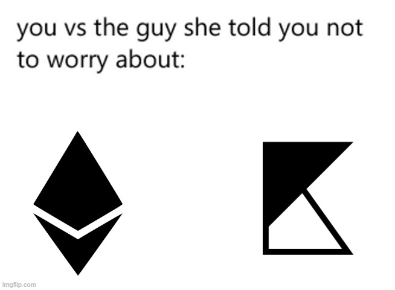

# 📃 KLY-EVM - deploy and interact with the smart-contract to EVM


<figure><figcaption></figcaption></figure>

## Intro

The Klyntar platform has support for an improved version of the EVM and has been tested up to Solidity **v0.8.17**

So, in your contracts you can put something like this:

```solidity
// SPDX-License-Identifier: MIT
pragma solidity ^0.8.17;
```

## What to remember

Since the Klyntar network has multilevel sharding - in the RPC endpoint URL you need to specify a URL of a special form:

```javascript
const web3 = new Web3('http://localhost:7332/kly_evm_rpc/shard_0')
```


In case you use Node-as-a-Service RPC providers - they may have their own URL format - follow their instructions


## Code snippet

For the procedure of deploying a smart contract to the Klyntar network, you can use publicly available examples of the web3 library from Ethereum

```javascript
import {Transaction} from '@ethereumjs/tx'
import {Common} from '@ethereumjs/common'
import Web3 from 'web3'


const web3 = new Web3('http://localhost:7332/kly_evm_rpc/shard_0')

// KLY-EVM
const common = Common.custom({name:'KLYNTAR',networkId:'0x1CA3',chainId:'0x1CA3'},{hardfork:'london'})

// EVM account

const evmAccount0 = {

    address:'0x4741c39e6096c192Db6E1375Ff32526512069dF5',
    privateKey:Buffer.from('d86dd54fd92f7c638668b1847aa3928f213db09ccda19f1a5f2badeae50cb93e','hex')

}

const BYTECODE_TO_DEPLOY = '<take this code from Remix or other development env>'

web3.eth.getTransactionCount(evmAccount0.address,async(err,txCount)=>{
			
    if(err) return

    // Build a transaction
    let txObject = {

        from:evmAccount0.address,

        nonce:web3.utils.toHex(txCount),
    
        //Set enough limit and price for gas
        gasLimit: web3.utils.toHex(800000),
    
        gasPrice: web3.utils.toHex(web3.utils.toWei('10','gwei')),
            
        //Set contract bytecode
        data:`0x${BYTECODE_TO_DEPLOY}`

    }


    // Choose custom network
    let tx = Transaction.fromTxData(txObject,{common}).sign(evmAccount0.privateKey)

    let raw = '0x' + tx.serialize().toString('hex')

    // Broadcast the transaction
    web3.eth.sendSignedTransaction(raw, (err, txHash) => console.log(err?`Oops,some has been occured ${err}`:`Success ———> ${txHash}`))

})
```

This will create the contract on **shard\_0:**

```code-runner-output
Success ———> 0xf6d675170210c7c01df88da5bcf844a791806efb35e01d576c1e13bd0f803036
```

## Check the explorer

<figure><figcaption></figcaption></figure>

You should see something like this:

<figure><figcaption></figcaption></figure>

And if you visit the page of newly created contract:

<figure><figcaption></figcaption></figure>
