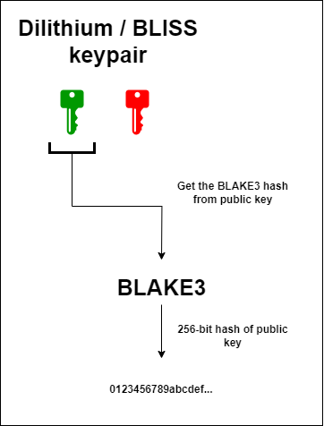

# ⚛ Post-quantum transactions

<figure><figcaption></figcaption></figure>


PQC - Post-Quantum Cryptography


## Useful links


Detailed information


## Intro

As we said earlier, we use Dilithium and BLISS signatures as post-quantum signature schemes. Depending on the Dilithium mode, the size of the keys may change, but the structure of the key pair remains unchanged. Also, since post-quantum schemes usually have large public keys, the address of the post-quantum key pair will be the [_<mark style="color:red;">**BLAKE3**</mark>_](https://mastering.klyntar.org/beginning/cryptography/hash-functions) hash of the public key. Here's what it looks like:

<figure><figcaption></figcaption></figure>

## <mark style="color:red;">Disclaimer</mark>


Post-quantum cryptography is just coming into play. Unlike other cryptography primitives which works for decades for various purposes(AES, ED25519, ECDSA, RSA, SHA, etc.), these algorithms are still going through the final stages of NIST certification. Although we have chosen the best ones, there is still the possibility of a zerodays and errors in the implementation. Be careful


## Generate account

```javascript
import Web1337,{crypto} from 'web1337';

let web1337 = new Web1337({

    symbioteID:'aaaaaaaaaaaaaaaaaaaaaaaaaaaaaaaaaaaaaaaaaaaaaaaaaaaaaaaaaaaaaaaa',
    workflowVersion:0,
    nodeURL: 'http://localhost:7332'

});

const dilithiumKeypair = crypto.pqc.dilithium.generateDilithiumKeypair();

console.log(dilithiumKeypair);

const blissKeypair = crypto.pqc.bliss.generateBlissKeypair();

console.log(blissKeypair);
```

Output:

_<mark style="color:red;">**Dilithium**</mark>_

```javascript
{
    pub: 'bfafb8ac70403cb603342a90b0f62673a2bbd2cd237148d47620794135abeeba56b72ce5d2e6df9b96d11b2335f23712735eaeeeaf25c1f1d5709dccff4387146e8c7ed52ae6982b0ca5a6e921c4f61e2c527e2d9da3d7a842372e34290aea51781a1f561f0daf49e6a0a1067524099a4741c7f64a25a55d02a2971b31ab27f6baae0c66f7bfc7619d03ff3771b029378c5e79b725b6ce9c39a0cf4c8708993c19b65fd3492a96076b01fa2f89c5bc49c142db67480460adcf9f628486e6cac6af8340bd96345bb9e8ef41905e5f5082428393ffa8ae978830ad3d96b5f705c45f0640d87fecee7a43e6c0c493833c72d24d2108dad6e20b2ad36a38f1790d835238138831fbb93dfd9f11f46cc2e7ebdccd3f76d0c160cdd743969ec5ce8ad26029f85325713e083f9fe8169f235ab2d719c7135b1ab8deec707f0caf1d118fbfe469f65d29fd88fb07a6d4d3adc861df4c8f2708ea0357ccf4b396cd1c0b41aed632527508c2396010de94134d90dc03a30a95e32336ab839c7b3976583891ccda980c9104c8de8dd784ba9c587a93083c4ae4f9d117e025e2cbb3c53b8828e11199f1fed89dca12e521df07eed3e28cab3fe1e1404c5891ee29e95854536cc065e1afd558e7da0adce618fd09953820df5bb959dfe317d5ad7b2882e33c637851956898438c10f3537d907a5f68e6c813f40b2e4ddd25f6d8fe57ac456cfd0477a327dff747ccf469356b0ba1365860b39ca038670a8f4255755c5b8d8925d70a3bca508c0d53c75a9d7863aea0fdc0964fae59c2ecf150620224e49096064bc56689b169f4dab85c964bac05036c6ba0006f300cbc72dd866574e76a35ec239bc94d4b7601baf13da3eb9457714748ab82e80ebfa163618c64926ac06fa6ca83d713ab7b1debd78d115244ad7924175e00d827675f248c5c54b247d425d3fa379fbb9c1b90b1d5e7242132cd3e672891e3eda74651585f4d5038bfe12a8a3b289f15ea42dfe480f1a76290b2e78e7f8668712e144af4eeb9906235285e669f4c85d268ec6dcb73310331dc2550b151b41df6b570d7124f90af0f6ad18b2e296afd30c08eb36e1fe2d58d8ad462482c598a0e17e55c4f101af212356d9cee2aa1fb8342fe26b060e93509e21d895f11f742d4707b74027348b2838a045c51c10dd0c8fe563fd813bb6f99ebaf20182431d927fd6738c8c9731086997b1b9cb2ed628bd931ca996db3572b6ce075e0e78bdfc066790110e5e8e538c11623ceaf66e14aa1757ce052f52b9c9bee54f765b74a48de44cad593d4973bf84f663b594d475fcfc638fef7414d546fb2fdd0785958499ea16fbc7df84646d05b769675f781538319447292f72304a163d1f7155d72fda67907b7af9bee6a0b323c65e4800603f72501027e339691c899b4154d519a3fcb5d33824e06e194fdbcb4e7a390151915b644e55416cfc129ed2a07e30a7adf1a363dfcc3e20731ec2ba18c6115324516de9bea5b1f3b0852aece124648340842b4658484da6f53d5edfb197d081cc96fdfcb350e4152b3eb17853cca40b6d584e81bf133b098962f876054a77faeacc662a935056893c06c876d92392457d4465372a3770911772eedb507e2d54645229c5aa1217dc1bb0a4a6f6e90e46a60d35e790e0283a31f754ede7be16619050abc7abc93ba06965d59c50d2f9e749a2151724369928dee17f4a2ff469a0c449c69c7e94cc1a9a0a74948b19672483cfeaea253bdbb032ff22edd80fe6024e087893f29f7fa3f03b346b7719f4946010d4eb7d42f0a6b37f616b3b54417e507f04e5fffc640eb31ff50a7d227462710c29181d116dcbae010a23b82f865b8e90f8f29096216dbb932ae9df1aa51befacfb730b08bb08907a660a06336ac2bba2026a4133ee471ebe369e2b2d29c2e7b7eae15c827b9b615107f13fd8fe7d74362e15cf9afaa7fa352eaff83db0dc68504c96a5b3999ad1fccd78018f4a6d50745f4c8835fb0adc93dc921953d2ec161f53664ae9a7e73e879469c42b52beb9c2a14ab5e3e12f64f9a80dac4844a887443b0b0d4c290462d0712e9a02d2f216f99f15235a23b4ca6d628e28d3d9c2af79686ae09ca110611577fee4a204c7bab4d23d1da5b29edbee9489b3f3c119e2dfe796b7a758aed1a9280f39b73a5d9b5888e52f4c5c2ed9434fb53940c1878ebaa369bc40a31c8227da7ede0cf3e2f619744bf1ede2adfe2d91256522b66fcd6ac194e13e2c0b069708e0df9b8a3e0b3b02614400b7ba69be77453b7be612ecb6adfde93b64ce01c07f28de175f71b657d53414a7cb1ccdabe770d4f7b3a1f6dee1548f7d8e6491d7054afc434837009c53ebf9762074900b7afeb2bfa172b4e2980aee6089c3e6b776b18fc63866b18f17be22aa8c705f70c4daf428bb408f14deadb5ee26f1e22c29fe6d0923336fab98e866399758d06dbda2558ce14bf2e9d5e5aa70b10096939c17471e8391fb9ff7f013c6fa68150dc6373b50439676a468a0b2effb6eb1c7c2c4a1df38fd6f1c9cee639f7d8fce7b838fa13c3905b366bc0f4d0b9a417d82e42405ea175319b565df822beb8915dada8500aab1436bf632500f2eb72e32fbc2026e89808cf2c91a5c1b98ad767a73d0b3a8d60d24283686d65f2563c5b40d35d1c305760c18715211f955e4ca04dfb35c2c9dbee08c62470ee2db89c06817992ef10eadaff468d21afcff0a480dde314f4976699b48841074e8b2cd259198a9c2a149cd984e0187e77bb3d5d3e229e2b4502f0d6433342c0325d3140a23f2e0c0ee8274ecb2bd35217722beb2fa529f549714a4e1a07170b326edf043958b5a63739395a988a693e25c25e74a64b44c00f750329c55e6647e0c5a2760914ff1cd7add97de4bddccffee21747f9d150baa3abc59de5804309a8d932652b793803b50db3c7811265b87a71e4d6ad9b54809d66b542aed1dacd0a3b1057f196ee7afefb8b59ec09fca0c7b7941dbed1b642b0ab96c0b8fe5b1aa62b63861f220c8b89bc9af95ed52fd0f683ead5b39495163188cca5298d51e91860021919ac2f7af737adb4a03592bd2bc590e1ad064f831a1841ea1f35836885d40192113cf55cbd589df21f5d1716e88eebb79494ca6a3ba908e0b1e098d31a0e30d87ce08d52145995a57ecb51c02d9ab0a516fcb2b288646dbad6eb32579635a841e3c111ed7cbeae065d58cba66c26f1191ca9ae90adc5d6496a41ddf4c22885923fa5a8d0e60c51fd6b2c6300daa0018a12d71351b7cb58f81c3e7bca4d729ab6bbe597b57e0772bac47c5b33235eb2cc4d33aeaabb5dad9cb247aba7aa90be1c3dbce42b7214e1cf99b11da92496213006d528f344e4af2156f385eaba211582a49292daf1721dc834f86dffe908b099c3b65259940daef5649955a3939ceb5de7f6199d0aff23dbe25af939a9d119ba12d16366abcc5c0c07aae531fec8153eff260a4bc81195aa9d7f7478558cd3f89ec23690acb0a5705b31e7ff899a98f129696ef923af9f31185dae1645cc3d680cdc8c3f4160b202089f1102e6c27e5ee949f17efeb5adae1f50c53527876b3e4dd03337aa3688d9fc60d288dde8e4d8c3c74c4fc11c572b07b2a00d1d26e0682fcf868a4ff96db5d1993a4ccab7646fe08ec69d0031',
    prv: 'bfafb8ac70403cb603342a90b0f62673a2bbd2cd237148d47620794135abeeba4968f5030f39cba05052505c6fbee0e4230519f2ad11f2edd7d95d2b53266bf673d735deba83fa286679bc5c8b98baf29e03826e8da7c1fbb2675f2f1b706e2e60360a13a36403034852b688a22406481012888011c9305201a44800028283c001100141c2800049404d58200212498d881060e0a83023c8218bc669e11809a186491212610b2032e3a850c9342c5aa284d1c68988428964444d90060964244022c75103b381e0b48062c82009063153a8240c41020a828500100e6426510aa86da1b86892c24409137220200dd89664e0460512c78c01b0488c206e009061148568d036904b228d0c95241c208d181669db400e11a52888062edb224621125280240ccba669513285a230692425281a27080a101202b74d13c14d8c304064402ac9b8241c17899a209224199252c4694836304c366d98384e23c9495c8405e4046698947104c30122b9304a8229d432901c944d08475052a46924b190da08080bc12504130e11b91018108002c510a4062e628621614600d2c4251a924022043002940d948868db023211c62d8036025406405a048248422ddb1412101782e03860990800c114728a4206c3a06dc4c41010c448d04620940682c1126e0436448c204842c671c930711b834d41a064d2924590a82ddb8601d9340009a96961064c1114606248602385201cc681d490250c452d0a407124c38c119030c1a85021252cd2262c013461a3904dc48225dca4500a256a1229921c2460090951592864148220c0b008243944da048204022e0a012e9bb068141186da340018150251966d1c89206046215b008c12173113b14dda16120a9089d3a010c1822593408c1205125112641b310aa2b871d9108d0033040a0432dac010123102e3042ed2860d834442d9b84cc1120688003263222890a249c2184ed9042da216688c0208e02631c28469c84491dbc491d12891d2448858828cd8485183420cd0048c222269482632823228233321901864209610dc9629d4c84c61283191b408490286d20249012345c2b60d212709d4a2401ba3651a44448bb22c1b04711c020c1a21244010510c418d08030890804551b031234846833804123862ca802c43824512094609214d0915421b866840026c02c788043050cba06080865140c46084308100892488b270d1448d1419901ba4691a048e2244855ab2290ca001ccb40d24c80c22a3488b864c524260d41090e1c829d08091c92628412471ccc201e3160aa2b860e2162cc12020a2c6602336651bc39154044e9434291bb04008b09192082d02a820849044c89401812204c9a40d99c22cc8b805da1068d03065c49251cc02049a200c9ab440e39644c208328ac824da0264419884e4461203b02c1b85251212454bc2904c12081a354e53a2210c314252c66008814c0ab060dc2660d800818b1826c0960c41404ad1486a6182909830420bb28011459143822119268c4a308109452c0b420919c965d2082203c730cc221188263183026803232911c26dccb86118394dd3148a044328a3228e88b26c01957110a92983084ea4a0495326265ba871c1926d89003018c328c9003289382e12196a81b88009496414964d40b80542422a239809514022904612021789239451208331a4b66c8246889a048453c0481b352488942541384593306649084024a660e1083083084a5a94441b2245808809c114305c462d01113193468689188a48b42581086143066920c7308236060846805c120a12b3490a00600999490090451cc0095832520c406250308ad8b81019164108392898b649d3328e0a82008c12721c0681022549423424c0042621b06d94c20410100e0239428b2289d2487102168d02370a64100ae0140c2002241028890491090c43481a224c24c69000c641601432c8049192844598387222880003a20c4496901a3310213200d400208b8008204521512090d9c03091204c0889118b44919848025ba821083260e410052311519b4482e1202d190589519609e19241012648e49045e2966498169211a64d13a2299b4250240461c2a68d82c210a4120903157003204e118169c0221214154409a2500827650c9611040085dcb8248d61b8cda53d8ec94c17f5700f28dda5d9ac7a759521c4cbf53d3201883c1dce095fb230926afdb3fd13f1c0317d8a3d1bae5b8d39ad2d123bbba4aea9618168ba9b42392ed57d1fad85fff388e26897e51c8cb2ceafc405a1e618f339b6ca11db667719c1c6ec811db902dafb94e5eed6644592f390f42f6d741fcdf9b8511432c260f51a7c900ada82f550732ad013606287e860b5d6413dacaf3d0916e9be2afafdbe9a8949d05fece51919bb8b6403d59af1f2435ea102f419d31c63a209d4dda92ecb73b288d855bdb89faaba1f33f7590dee25a2202f04117e721528013c6bb9424b8ed41a655c6e1926b283a7dcc2a3899935fc4cd4cb78bb7b7cb06d7cf21f1c8a86ea0c818ab86a0526ff4e43ddbabdb8507212c79506ad54d6afa195a0f35c391693852c64014b9aa6450805b75982fbfe2321a8eb80a7a415550ce92ee3e9c01496ed9f82cfcd54568e0cfa50280afa927081d36bf19a76b94d24c69ffd7a6e2865c41a3a69d3b76816f450d6d71865d1721076402cefa8c68987e2fba474cbec44a91d5fe375a4ff68a408566b919f315e09a00a678b614b938d82a692e7f26a81319837600091267a088cfc2aeb04563ec6ddf762508cda60893869a54b7a9058f00e68e814bfda071923d89e544474b81acd90a60c16e270104c4efe5e712556ed007b4b6e9ba5ffa8f967094d6b1263aeaa5f827a7c32b993d6d455bcd803b448455297d8dbc66f695df2df49d3fb61f9a1fd0dd8d40004a68143589d83d5757ecd431e96a09ba9a825444fb3eae0d3dc9a60bfbb36def16867a8d2534bf347605dfd3bb192ffa59471e7a58a93bf33ba57f424fefcd00def85c3e1b1323958f1bf1e70999d82bc6cb69ba0b0bb8b98e3c4ca7e49fa0f2c8faeea502f5ee28cff6821f223ab05a599ab5fdcc76f8007a516692e6f4e863a5ca919b9371cac9090959357959e7bac5b2d26d128fb1a21cb3db00e17382d31980967f7781d17f117a7daca7e2bbcfb0a3d4921daaaf43417b7a673e9cf78e1102624bbadd9b62e6e89b2cffe8e1ef746c939323bd23a5f24cf712fe01776d983fd4fa9f22eb773592f8b84ee8be3eb29a41a7a79d31fcdba3a0df399bde9d12760ba010e226937849a9f56469a5c3ed9159e6a1d4341ccf00b3c8dc50b42d8c4c696228d92a6cace380822be55e33fc6c538dc437355b986bc25f4e392a85f8ba8703d75481880ac6674497ed6f7906d046da49b39f7893252dd428e4a60f0104d31e66ef06e7087fcae3d476d71fdb4e28859697d88e980586cf27239da828c01023b4e9f9492f23a68e410fe3c6bafc5eadcac37ed53c1e261592c83630cb9096f3b2148218ec5f994e44afc455ae767318aa83d4f5d4d016753f40a458d00677e42ceda2b9d850feb76f4000cbd5b4543d02bee5999c10c2f042fb6e965d16ea22a7bb07f26ee5bc100cbb2831e7f9ae8c56ba428ebb31cb82c24106be3b3615ba263ed90fbba37b976a58e2a5eb65feb1bfcbf1c463c691c542bc228ea5fa1c1c168ca2ef3acb8fccf801d7551dbe9d00c254f67a0d261d1370aaa81daca2792edc6ff6ee8e64850e2e1f44f99dac0f993a28ecfafe19420e7dddebaedad9ec9bff1beb5f6c8851186d4f0f5232b27e239bc14f3e78b3d982aba60948516666ab4d4d553a3c635fb22635aefac31939b0e69d6231a4fcd767444ae52df00f78216714d4e284081fd66b008d543f23d8a9bb276d1136ea542c0892a1c52121892c2082149003f1ae646948f4e09134da0df87c6aa737a19cba43b2075ebf51e8cd49dae521c4c38a7955f46cb59d3debf9ab8cf3d11e56ebe9a43a2ba69957c57ab86e73deccf7541b5f79bf6f13e1028939353ebec170a8db99226e5364f9b16ba8b5669e2389fc2821049fd975525c84434b02c1252544c7217b828a35bb1c774ef6dc4694df8a965e07568ea43fe7799b278e153b1100ed69353255bfd9ff486966542ba0c6548cdc7eb4f092268024207485840f1b45fc8e6d8366f6affb5a9fd57d6e9ff57ba2e14557e69d7a48c9100e9f6b39e79f2f6ded230f02c09ebca43ffae04271a386aa8cf4f0aa74ea82d028efda3974478869ed59f620ae7f0ee8355a52b2544962991b26f4177968125d101e5eeb52d38cd2249659c9bf7886ee455dfb77b58b1bca3f54c6aff17b9de3901609fa2d33bfc634abc96411a8b1807b6d42d4b6313cecc8f2ca71696ebbfc8e03c6a658c71c250e6cf609de1ca12a20e3a503667b9ba4ec664df03fdf9f9e040d671167eeece6b9c455025114760e861c8e6d739a089309d3677c6d1448ec9cf5250dcd25e8a590597b29e131ce6167e627e629224f8ec8ec84ae7282c348a7b7c716ee364766ab885b65d8529a849112dedc580bb52a51cb1107f3b59e70b1d47c121b3c5f9b26f2e4d10a0450b7dce43f5ecb0be5b91cff412111195d8215bf21ea413c22d9f007f9988d89153e17210c35afd801d0e45af8f6f6c9117c66ced6f0758d128bf13b51a73d86675f80fd65d97cb129cfe7ce4c5c1c9c5f47fd99b3e4c001aedc3837d39d94dbfea5f350a2747ac5d0b0958d45425d9c5260f0ee26a59f2f4b3d498f287229819b87cf76aa4f763459dd8fea899d3dea36f0c89072a65d4f9b7aaf48a6c1d3035d6a46d27a581ab44413608ca56e4c22ba79e0acecf5d4b0ffd055880012b9d0cf21881dffb23246369e3776efa20b06ea7d76f16297714da06d49cbfd136b4f4bc742e5b1d4fbe78d54a63855a75eb353d6412542194f015f9a88cfb83b681207048e47789846e7dda1eff957162f969b3f1a348ec7c6ea9518759618f9ccd6a52e4acacc4c0ab921c21f1ba1ded108bc7462a24938d113d345743f746e253bb24512840c80c0117541ea0064cee4eb4836ca35fa82ce1a06f970f73626d4a0b9ca017e146e3f658d913d455d3f726741dc8e4ef78e820c79a5e0dba7350d9f238c3f232449e5b4563a75f9f23a7352f953ff40a3f530bb09244436df5bf147ff3be40356eb7b366b0d1d15fa04471da896bae32e0f14c0b92632918f56fd91fb65d3d2752cf9944370b0a5dd6f9060e0da4984ea7c6b9869a456d3d7b9293be6b2c58be858ea7498f4976dc5c3bf699e0b7df8dbf249f846cff0cedb6b13754707473f7932511ba84b7ddc795aba3010bb25e46ec2cecb97048cece0b0231f7e3bedf447a06a8104fd89bd78fb2323aa031b14ec161dd32ac1b0383a82016d50fdf50fafab5bc03370fc38cde7cf62b7a3bc928fe007869e6934383b87a2769b01657ca311fe7e9b0f7e2331ebe2bd0f71148830ce01af8c9d64edba289bee7c2c7041ebc7862ca05510d70753cb04e78e855cb0470f75cdeb8043dfa2df584a1e35ca0cf9a64dc866240754a20f7a5e7973436e1bb71bbcc1980f94193585c31a97be54402d18271314884c9d59a7354a87675fb20d9466493087ae75e9fc8ce781e9924f38baf85ced237345c5e4b7e4d0b6111f71d76b3d433e244642d681615856759dcc59fc7d5316150d0c89b46d9e7c5391eaa7e1944748a964680d84c217b62118808c680bfcdf8f824be1e14403df26cd486c16efe5a1589e2d401684619273134ae9a078fde634f2f199ef48f538464d3c187c9a2f304afaab767c997edc6dd29d5419770b50918c514ec07d81e42972006f613c92aad27e810dc686a09f0cedd9d01c399a03bbd0233a14baa9ba09c1afd9c20f8fe2ee383d4eae4c29cda584ef3406da3eedd35ce47ffbd911a466ac5c0760bf2912474214451d4c7364d6ff815321d03dcda4c1a0769bf226610a6821c459df9ebd02f0dbbe58495026d8ad41a4d6ddd63ca99d00f109b65bd0f6fe5e14e3dfdb1ec7dcd58be4dc26d1b9cb93c34bf5704ec566a804bb9cd0ee272df03277f4abe73915ce3d989c547e848d3a5476f7caaea120c62812a3fca6d17a96d82e87d27f201895f2e909ed3e3bc7ade19b1c7eb7532a4fa692e2fdd682f2c290f0b933e5982b652d3ec5ad52b43df8e4220c69977da7636cac5339e3377e4441ab61c8ebb17934a1f83ca0a2ef9c6be2bfc6fbdb277dac9580e8a2baad5406caf2dbea55042cd015b6df0f62ca26dd503bbc35b14df5b8f7c83131800370be8c361cbaa5b85c60c20e944f6564a4bca56bae600eb794f67f266d9059279aa168f24c5150eea6b16182b699506441959f37e0e8107c6bc7b9566e00c2c8456efc77a3f410113b0688cdcecb073023c9f08251a486a962cbb4803f765920e0c997598acb85f8b78d66b66b2bf78ff7cdee1294c0d81f459b0738b6ada2310e1c781353154db959ee8ad90ad0c87cba69ee8155c45036d9d2f5561f605d935b70629332c9437b12858cafabede9b6a2f55949177959ecd1d021c9b552074a467d3995d6b7f38e1028d008ed6d4bbc2300c0dc317b941b3093d5267f364de944dda55c9ec030035d977fd59f2678b581ab2a36e977095cf381520380e1940e09739ce8cca147021163c15467d0dc5d8321be33defe0dbf5f0e28bf694c4570e27e3d21a714a3affd484bd4f2670e222b37885d9d16fcf983885efb855cb73d28ab2b1011c3a507ebfb4d1b7139b06378a8a8fbc2c7083917e56de2aef7f2b34c88af92948fa54a3d46e2eb6ba895cbb3e1019fcba4a6cb066a870103a65105af8f8317ba61f1d5d42',
    address: 'f5091405e28455880fc4191cbda9f1e57f72399e732222d4639294b66d3a5076'
}
```

_<mark style="color:red;">**BLISS**</mark>_

```javascript
{
    pub: '001b4609d500e31a0a188911900aac07fb06f91566038104e90c01031707d6154701701a15046d07f5089f0c730c8515e712c90b5a130d10081bca0ab40c8f0027101501870ccb17041d691bac0c30162d11ff0566198710f308cd08b30be804261a040c530cb8042e16841623069200b9175410a5016a171e1ceb10f813261bae0acc06be176214471d7013530d92180a0dbd15c800fd09f700ed0a8616141a14095b08a71c3317031d78106602ef1c1f1a53097016df192905b50ad40b5c1d1c027e026b0ecb115417ae1b6f1c1101c60d3f1c12016010a309f8183411840d7d12d414071a5b10d1162111f712951b36066209500e1d137d1dbf055417e6075c0ce307460ff9040715b51d0000cc11cf1bd1194c0a2d19e901191c5306040c8002be0d19024f10b31b19152912fe06900de21b2e10110ab111f80b6403ac1b8505221bac09830e3501a1175705c7138e1db6035c09871c4c121706b70b560ac70c001d2305b0107117ef02c1178a13f010bb193004ca02bc035e036f109419770a2017f11dd00cb3016405b41604091206c61603085208fa0df0130912cb14cd187914b009e306440a3018ca0c5810c305400507103b1113016c0ead00100e3f02b6003410981cdf04c50d0213d61984110c0ba700ae0c8912f618a01a231bc81066010a1d051242103013ac05c30dae14030f890e1117b319a002a707f30923',
    prv: 'd112525a9435c29d732592e9ec90eba2ae7b1ae2c0d3ac9b6d6ce662ca5140abb02bc846c7f54f955a84fed543107c9180366d025324aac2d253ec60515cf9ee',
    address: '1826d3782d53b127c53129fe67f4a3e3c1140feb2af36a0517077297a6e867e5'
}
```

Now, you can use these addresses on KLY network&#x20;

## Send to public key first

TODO

## PQC => Ed25519 transaction

```javascript
import Web1337 from 'web1337';


let web1337 = new Web1337({

    symbioteID:'aaaaaaaaaaaaaaaaaaaaaaaaaaaaaaaaaaaaaaaaaaaaaaaaaaaaaaaaaaaaaaaa',
    workflowVersion:0,
    nodeURL:'http://localhost:7332'

});


let dilithiumKeyPair = {

    pub: 'bfafb8ac70403cb603342a90b0f62673a2bbd2cd237148d47620794135abeeba56b72ce5d2e6df9b96d11b2335f23712735eaeeeaf25c1f1d5709dccff4387146e8c7ed52ae6982b0ca5a6e921c4f61e2c527e2d9da3d7a842372e34290aea51781a1f561f0daf49e6a0a1067524099a4741c7f64a25a55d02a2971b31ab27f6baae0c66f7bfc7619d03ff3771b029378c5e79b725b6ce9c39a0cf4c8708993c19b65fd3492a96076b01fa2f89c5bc49c142db67480460adcf9f628486e6cac6af8340bd96345bb9e8ef41905e5f5082428393ffa8ae978830ad3d96b5f705c45f0640d87fecee7a43e6c0c493833c72d24d2108dad6e20b2ad36a38f1790d835238138831fbb93dfd9f11f46cc2e7ebdccd3f76d0c160cdd743969ec5ce8ad26029f85325713e083f9fe8169f235ab2d719c7135b1ab8deec707f0caf1d118fbfe469f65d29fd88fb07a6d4d3adc861df4c8f2708ea0357ccf4b396cd1c0b41aed632527508c2396010de94134d90dc03a30a95e32336ab839c7b3976583891ccda980c9104c8de8dd784ba9c587a93083c4ae4f9d117e025e2cbb3c53b8828e11199f1fed89dca12e521df07eed3e28cab3fe1e1404c5891ee29e95854536cc065e1afd558e7da0adce618fd09953820df5bb959dfe317d5ad7b2882e33c637851956898438c10f3537d907a5f68e6c813f40b2e4ddd25f6d8fe57ac456cfd0477a327dff747ccf469356b0ba1365860b39ca038670a8f4255755c5b8d8925d70a3bca508c0d53c75a9d7863aea0fdc0964fae59c2ecf150620224e49096064bc56689b169f4dab85c964bac05036c6ba0006f300cbc72dd866574e76a35ec239bc94d4b7601baf13da3eb9457714748ab82e80ebfa163618c64926ac06fa6ca83d713ab7b1debd78d115244ad7924175e00d827675f248c5c54b247d425d3fa379fbb9c1b90b1d5e7242132cd3e672891e3eda74651585f4d5038bfe12a8a3b289f15ea42dfe480f1a76290b2e78e7f8668712e144af4eeb9906235285e669f4c85d268ec6dcb73310331dc2550b151b41df6b570d7124f90af0f6ad18b2e296afd30c08eb36e1fe2d58d8ad462482c598a0e17e55c4f101af212356d9cee2aa1fb8342fe26b060e93509e21d895f11f742d4707b74027348b2838a045c51c10dd0c8fe563fd813bb6f99ebaf20182431d927fd6738c8c9731086997b1b9cb2ed628bd931ca996db3572b6ce075e0e78bdfc066790110e5e8e538c11623ceaf66e14aa1757ce052f52b9c9bee54f765b74a48de44cad593d4973bf84f663b594d475fcfc638fef7414d546fb2fdd0785958499ea16fbc7df84646d05b769675f781538319447292f72304a163d1f7155d72fda67907b7af9bee6a0b323c65e4800603f72501027e339691c899b4154d519a3fcb5d33824e06e194fdbcb4e7a390151915b644e55416cfc129ed2a07e30a7adf1a363dfcc3e20731ec2ba18c6115324516de9bea5b1f3b0852aece124648340842b4658484da6f53d5edfb197d081cc96fdfcb350e4152b3eb17853cca40b6d584e81bf133b098962f876054a77faeacc662a935056893c06c876d92392457d4465372a3770911772eedb507e2d54645229c5aa1217dc1bb0a4a6f6e90e46a60d35e790e0283a31f754ede7be16619050abc7abc93ba06965d59c50d2f9e749a2151724369928dee17f4a2ff469a0c449c69c7e94cc1a9a0a74948b19672483cfeaea253bdbb032ff22edd80fe6024e087893f29f7fa3f03b346b7719f4946010d4eb7d42f0a6b37f616b3b54417e507f04e5fffc640eb31ff50a7d227462710c29181d116dcbae010a23b82f865b8e90f8f29096216dbb932ae9df1aa51befacfb730b08bb08907a660a06336ac2bba2026a4133ee471ebe369e2b2d29c2e7b7eae15c827b9b615107f13fd8fe7d74362e15cf9afaa7fa352eaff83db0dc68504c96a5b3999ad1fccd78018f4a6d50745f4c8835fb0adc93dc921953d2ec161f53664ae9a7e73e879469c42b52beb9c2a14ab5e3e12f64f9a80dac4844a887443b0b0d4c290462d0712e9a02d2f216f99f15235a23b4ca6d628e28d3d9c2af79686ae09ca110611577fee4a204c7bab4d23d1da5b29edbee9489b3f3c119e2dfe796b7a758aed1a9280f39b73a5d9b5888e52f4c5c2ed9434fb53940c1878ebaa369bc40a31c8227da7ede0cf3e2f619744bf1ede2adfe2d91256522b66fcd6ac194e13e2c0b069708e0df9b8a3e0b3b02614400b7ba69be77453b7be612ecb6adfde93b64ce01c07f28de175f71b657d53414a7cb1ccdabe770d4f7b3a1f6dee1548f7d8e6491d7054afc434837009c53ebf9762074900b7afeb2bfa172b4e2980aee6089c3e6b776b18fc63866b18f17be22aa8c705f70c4daf428bb408f14deadb5ee26f1e22c29fe6d0923336fab98e866399758d06dbda2558ce14bf2e9d5e5aa70b10096939c17471e8391fb9ff7f013c6fa68150dc6373b50439676a468a0b2effb6eb1c7c2c4a1df38fd6f1c9cee639f7d8fce7b838fa13c3905b366bc0f4d0b9a417d82e42405ea175319b565df822beb8915dada8500aab1436bf632500f2eb72e32fbc2026e89808cf2c91a5c1b98ad767a73d0b3a8d60d24283686d65f2563c5b40d35d1c305760c18715211f955e4ca04dfb35c2c9dbee08c62470ee2db89c06817992ef10eadaff468d21afcff0a480dde314f4976699b48841074e8b2cd259198a9c2a149cd984e0187e77bb3d5d3e229e2b4502f0d6433342c0325d3140a23f2e0c0ee8274ecb2bd35217722beb2fa529f549714a4e1a07170b326edf043958b5a63739395a988a693e25c25e74a64b44c00f750329c55e6647e0c5a2760914ff1cd7add97de4bddccffee21747f9d150baa3abc59de5804309a8d932652b793803b50db3c7811265b87a71e4d6ad9b54809d66b542aed1dacd0a3b1057f196ee7afefb8b59ec09fca0c7b7941dbed1b642b0ab96c0b8fe5b1aa62b63861f220c8b89bc9af95ed52fd0f683ead5b39495163188cca5298d51e91860021919ac2f7af737adb4a03592bd2bc590e1ad064f831a1841ea1f35836885d40192113cf55cbd589df21f5d1716e88eebb79494ca6a3ba908e0b1e098d31a0e30d87ce08d52145995a57ecb51c02d9ab0a516fcb2b288646dbad6eb32579635a841e3c111ed7cbeae065d58cba66c26f1191ca9ae90adc5d6496a41ddf4c22885923fa5a8d0e60c51fd6b2c6300daa0018a12d71351b7cb58f81c3e7bca4d729ab6bbe597b57e0772bac47c5b33235eb2cc4d33aeaabb5dad9cb247aba7aa90be1c3dbce42b7214e1cf99b11da92496213006d528f344e4af2156f385eaba211582a49292daf1721dc834f86dffe908b099c3b65259940daef5649955a3939ceb5de7f6199d0aff23dbe25af939a9d119ba12d16366abcc5c0c07aae531fec8153eff260a4bc81195aa9d7f7478558cd3f89ec23690acb0a5705b31e7ff899a98f129696ef923af9f31185dae1645cc3d680cdc8c3f4160b202089f1102e6c27e5ee949f17efeb5adae1f50c53527876b3e4dd03337aa3688d9fc60d288dde8e4d8c3c74c4fc11c572b07b2a00d1d26e0682fcf868a4ff96db5d1993a4ccab7646fe08ec69d0031',
    prv: 'bfafb8ac70403cb603342a90b0f62673a2bbd2cd237148d47620794135abeeba4968f5030f39cba05052505c6fbee0e4230519f2ad11f2edd7d95d2b53266bf673d735deba83fa286679bc5c8b98baf29e03826e8da7c1fbb2675f2f1b706e2e60360a13a36403034852b688a22406481012888011c9305201a44800028283c001100141c2800049404d58200212498d881060e0a83023c8218bc669e11809a186491212610b2032e3a850c9342c5aa284d1c68988428964444d90060964244022c75103b381e0b48062c82009063153a8240c41020a828500100e6426510aa86da1b86892c24409137220200dd89664e0460512c78c01b0488c206e009061148568d036904b228d0c95241c208d181669db400e11a52888062edb224621125280240ccba669513285a230692425281a27080a101202b74d13c14d8c304064402ac9b8241c17899a209224199252c4694836304c366d98384e23c9495c8405e4046698947104c30122b9304a8229d432901c944d08475052a46924b190da08080bc12504130e11b91018108002c510a4062e628621614600d2c4251a924022043002940d948868db023211c62d8036025406405a048248422ddb1412101782e03860990800c114728a4206c3a06dc4c41010c448d04620940682c1126e0436448c204842c671c930711b834d41a064d2924590a82ddb8601d9340009a96961064c1114606248602385201cc681d490250c452d0a407124c38c119030c1a85021252cd2262c013461a3904dc48225dca4500a256a1229921c2460090951592864148220c0b008243944da048204022e0a012e9bb068141186da340018150251966d1c89206046215b008c12173113b14dda16120a9089d3a010c1822593408c1205125112641b310aa2b871d9108d0033040a0432dac010123102e3042ed2860d834442d9b84cc1120688003263222890a249c2184ed9042da216688c0208e02631c28469c84491dbc491d12891d2448858828cd8485183420cd0048c222269482632823228233321901864209610dc9629d4c84c61283191b408490286d20249012345c2b60d212709d4a2401ba3651a44448bb22c1b04711c020c1a21244010510c418d08030890804551b031234846833804123862ca802c43824512094609214d0915421b866840026c02c788043050cba06080865140c46084308100892488b270d1448d1419901ba4691a048e2244855ab2290ca001ccb40d24c80c22a3488b864c524260d41090e1c829d08091c92628412471ccc201e3160aa2b860e2162cc12020a2c6602336651bc39154044e9434291bb04008b09192082d02a820849044c89401812204c9a40d99c22cc8b805da1068d03065c49251cc02049a200c9ab440e39644c208328ac824da0264419884e4461203b02c1b85251212454bc2904c12081a354e53a2210c314252c66008814c0ab060dc2660d800818b1826c0960c41404ad1486a6182909830420bb28011459143822119268c4a308109452c0b420919c965d2082203c730cc221188263183026803232911c26dccb86118394dd3148a044328a3228e88b26c01957110a92983084ea4a0495326265ba871c1926d89003018c328c9003289382e12196a81b88009496414964d40b80542422a239809514022904612021789239451208331a4b66c8246889a048453c0481b352488942541384593306649084024a660e1083083084a5a94441b2245808809c114305c462d01113193468689188a48b42581086143066920c7308236060846805c120a12b3490a00600999490090451cc0095832520c406250308ad8b81019164108392898b649d3328e0a82008c12721c0681022549423424c0042621b06d94c20410100e0239428b2289d2487102168d02370a64100ae0140c2002241028890491090c43481a224c24c69000c641601432c8049192844598387222880003a20c4496901a3310213200d400208b8008204521512090d9c03091204c0889118b44919848025ba821083260e410052311519b4482e1202d190589519609e19241012648e49045e2966498169211a64d13a2299b4250240461c2a68d82c210a4120903157003204e118169c0221214154409a2500827650c9611040085dcb8248d61b8cda53d8ec94c17f5700f28dda5d9ac7a759521c4cbf53d3201883c1dce095fb230926afdb3fd13f1c0317d8a3d1bae5b8d39ad2d123bbba4aea9618168ba9b42392ed57d1fad85fff388e26897e51c8cb2ceafc405a1e618f339b6ca11db667719c1c6ec811db902dafb94e5eed6644592f390f42f6d741fcdf9b8511432c260f51a7c900ada82f550732ad013606287e860b5d6413dacaf3d0916e9be2afafdbe9a8949d05fece51919bb8b6403d59af1f2435ea102f419d31c63a209d4dda92ecb73b288d855bdb89faaba1f33f7590dee25a2202f04117e721528013c6bb9424b8ed41a655c6e1926b283a7dcc2a3899935fc4cd4cb78bb7b7cb06d7cf21f1c8a86ea0c818ab86a0526ff4e43ddbabdb8507212c79506ad54d6afa195a0f35c391693852c64014b9aa6450805b75982fbfe2321a8eb80a7a415550ce92ee3e9c01496ed9f82cfcd54568e0cfa50280afa927081d36bf19a76b94d24c69ffd7a6e2865c41a3a69d3b76816f450d6d71865d1721076402cefa8c68987e2fba474cbec44a91d5fe375a4ff68a408566b919f315e09a00a678b614b938d82a692e7f26a81319837600091267a088cfc2aeb04563ec6ddf762508cda60893869a54b7a9058f00e68e814bfda071923d89e544474b81acd90a60c16e270104c4efe5e712556ed007b4b6e9ba5ffa8f967094d6b1263aeaa5f827a7c32b993d6d455bcd803b448455297d8dbc66f695df2df49d3fb61f9a1fd0dd8d40004a68143589d83d5757ecd431e96a09ba9a825444fb3eae0d3dc9a60bfbb36def16867a8d2534bf347605dfd3bb192ffa59471e7a58a93bf33ba57f424fefcd00def85c3e1b1323958f1bf1e70999d82bc6cb69ba0b0bb8b98e3c4ca7e49fa0f2c8faeea502f5ee28cff6821f223ab05a599ab5fdcc76f8007a516692e6f4e863a5ca919b9371cac9090959357959e7bac5b2d26d128fb1a21cb3db00e17382d31980967f7781d17f117a7daca7e2bbcfb0a3d4921daaaf43417b7a673e9cf78e1102624bbadd9b62e6e89b2cffe8e1ef746c939323bd23a5f24cf712fe01776d983fd4fa9f22eb773592f8b84ee8be3eb29a41a7a79d31fcdba3a0df399bde9d12760ba010e226937849a9f56469a5c3ed9159e6a1d4341ccf00b3c8dc50b42d8c4c696228d92a6cace380822be55e33fc6c538dc437355b986bc25f4e392a85f8ba8703d75481880ac6674497ed6f7906d046da49b39f7893252dd428e4a60f0104d31e66ef06e7087fcae3d476d71fdb4e28859697d88e980586cf27239da828c01023b4e9f9492f23a68e410fe3c6bafc5eadcac37ed53c1e261592c83630cb9096f3b2148218ec5f994e44afc455ae767318aa83d4f5d4d016753f40a458d00677e42ceda2b9d850feb76f4000cbd5b4543d02bee5999c10c2f042fb6e965d16ea22a7bb07f26ee5bc100cbb2831e7f9ae8c56ba428ebb31cb82c24106be3b3615ba263ed90fbba37b976a58e2a5eb65feb1bfcbf1c463c691c542bc228ea5fa1c1c168ca2ef3acb8fccf801d7551dbe9d00c254f67a0d261d1370aaa81daca2792edc6ff6ee8e64850e2e1f44f99dac0f993a28ecfafe19420e7dddebaedad9ec9bff1beb5f6c8851186d4f0f5232b27e239bc14f3e78b3d982aba60948516666ab4d4d553a3c635fb22635aefac31939b0e69d6231a4fcd767444ae52df00f78216714d4e284081fd66b008d543f23d8a9bb276d1136ea542c0892a1c52121892c2082149003f1ae646948f4e09134da0df87c6aa737a19cba43b2075ebf51e8cd49dae521c4c38a7955f46cb59d3debf9ab8cf3d11e56ebe9a43a2ba69957c57ab86e73deccf7541b5f79bf6f13e1028939353ebec170a8db99226e5364f9b16ba8b5669e2389fc2821049fd975525c84434b02c1252544c7217b828a35bb1c774ef6dc4694df8a965e07568ea43fe7799b278e153b1100ed69353255bfd9ff486966542ba0c6548cdc7eb4f092268024207485840f1b45fc8e6d8366f6affb5a9fd57d6e9ff57ba2e14557e69d7a48c9100e9f6b39e79f2f6ded230f02c09ebca43ffae04271a386aa8cf4f0aa74ea82d028efda3974478869ed59f620ae7f0ee8355a52b2544962991b26f4177968125d101e5eeb52d38cd2249659c9bf7886ee455dfb77b58b1bca3f54c6aff17b9de3901609fa2d33bfc634abc96411a8b1807b6d42d4b6313cecc8f2ca71696ebbfc8e03c6a658c71c250e6cf609de1ca12a20e3a503667b9ba4ec664df03fdf9f9e040d671167eeece6b9c455025114760e861c8e6d739a089309d3677c6d1448ec9cf5250dcd25e8a590597b29e131ce6167e627e629224f8ec8ec84ae7282c348a7b7c716ee364766ab885b65d8529a849112dedc580bb52a51cb1107f3b59e70b1d47c121b3c5f9b26f2e4d10a0450b7dce43f5ecb0be5b91cff412111195d8215bf21ea413c22d9f007f9988d89153e17210c35afd801d0e45af8f6f6c9117c66ced6f0758d128bf13b51a73d86675f80fd65d97cb129cfe7ce4c5c1c9c5f47fd99b3e4c001aedc3837d39d94dbfea5f350a2747ac5d0b0958d45425d9c5260f0ee26a59f2f4b3d498f287229819b87cf76aa4f763459dd8fea899d3dea36f0c89072a65d4f9b7aaf48a6c1d3035d6a46d27a581ab44413608ca56e4c22ba79e0acecf5d4b0ffd055880012b9d0cf21881dffb23246369e3776efa20b06ea7d76f16297714da06d49cbfd136b4f4bc742e5b1d4fbe78d54a63855a75eb353d6412542194f015f9a88cfb83b681207048e47789846e7dda1eff957162f969b3f1a348ec7c6ea9518759618f9ccd6a52e4acacc4c0ab921c21f1ba1ded108bc7462a24938d113d345743f746e253bb24512840c80c0117541ea0064cee4eb4836ca35fa82ce1a06f970f73626d4a0b9ca017e146e3f658d913d455d3f726741dc8e4ef78e820c79a5e0dba7350d9f238c3f232449e5b4563a75f9f23a7352f953ff40a3f530bb09244436df5bf147ff3be40356eb7b366b0d1d15fa04471da896bae32e0f14c0b92632918f56fd91fb65d3d2752cf9944370b0a5dd6f9060e0da4984ea7c6b9869a456d3d7b9293be6b2c58be858ea7498f4976dc5c3bf699e0b7df8dbf249f846cff0cedb6b13754707473f7932511ba84b7ddc795aba3010bb25e46ec2cecb97048cece0b0231f7e3bedf447a06a8104fd89bd78fb2323aa031b14ec161dd32ac1b0383a82016d50fdf50fafab5bc03370fc38cde7cf62b7a3bc928fe007869e6934383b87a2769b01657ca311fe7e9b0f7e2331ebe2bd0f71148830ce01af8c9d64edba289bee7c2c7041ebc7862ca05510d70753cb04e78e855cb0470f75cdeb8043dfa2df584a1e35ca0cf9a64dc866240754a20f7a5e7973436e1bb71bbcc1980f94193585c31a97be54402d18271314884c9d59a7354a87675fb20d9466493087ae75e9fc8ce781e9924f38baf85ced237345c5e4b7e4d0b6111f71d76b3d433e244642d681615856759dcc59fc7d5316150d0c89b46d9e7c5391eaa7e1944748a964680d84c217b62118808c680bfcdf8f824be1e14403df26cd486c16efe5a1589e2d401684619273134ae9a078fde634f2f199ef48f538464d3c187c9a2f304afaab767c997edc6dd29d5419770b50918c514ec07d81e42972006f613c92aad27e810dc686a09f0cedd9d01c399a03bbd0233a14baa9ba09c1afd9c20f8fe2ee383d4eae4c29cda584ef3406da3eedd35ce47ffbd911a466ac5c0760bf2912474214451d4c7364d6ff815321d03dcda4c1a0769bf226610a6821c459df9ebd02f0dbbe58495026d8ad41a4d6ddd63ca99d00f109b65bd0f6fe5e14e3dfdb1ec7dcd58be4dc26d1b9cb93c34bf5704ec566a804bb9cd0ee272df03277f4abe73915ce3d989c547e848d3a5476f7caaea120c62812a3fca6d17a96d82e87d27f201895f2e909ed3e3bc7ade19b1c7eb7532a4fa692e2fdd682f2c290f0b933e5982b652d3ec5ad52b43df8e4220c69977da7636cac5339e3377e4441ab61c8ebb17934a1f83ca0a2ef9c6be2bfc6fbdb277dac9580e8a2baad5406caf2dbea55042cd015b6df0f62ca26dd503bbc35b14df5b8f7c83131800370be8c361cbaa5b85c60c20e944f6564a4bca56bae600eb794f67f266d9059279aa168f24c5150eea6b16182b699506441959f37e0e8107c6bc7b9566e00c2c8456efc77a3f410113b0688cdcecb073023c9f08251a486a962cbb4803f765920e0c997598acb85f8b78d66b66b2bf78ff7cdee1294c0d81f459b0738b6ada2310e1c781353154db959ee8ad90ad0c87cba69ee8155c45036d9d2f5561f605d935b70629332c9437b12858cafabede9b6a2f55949177959ecd1d021c9b552074a467d3995d6b7f38e1028d008ed6d4bbc2300c0dc317b941b3093d5267f364de944dda55c9ec030035d977fd59f2678b581ab2a36e977095cf381520380e1940e09739ce8cca147021163c15467d0dc5d8321be33defe0dbf5f0e28bf694c4570e27e3d21a714a3affd484bd4f2670e222b37885d9d16fcf983885efb855cb73d28ab2b1011c3a507ebfb4d1b7139b06378a8a8fbc2c7083917e56de2aef7f2b34c88af92948fa54a3d46e2eb6ba895cbb3e1019fcba4a6cb066a870103a65105af8f8317ba61f1d5d42',
    address: 'f5091405e28455880fc4191cbda9f1e57f72399e732222d4639294b66d3a5076'

};


let blissKeyPair = {

    pub: '001b4609d500e31a0a188911900aac07fb06f91566038104e90c01031707d6154701701a15046d07f5089f0c730c8515e712c90b5a130d10081bca0ab40c8f0027101501870ccb17041d691bac0c30162d11ff0566198710f308cd08b30be804261a040c530cb8042e16841623069200b9175410a5016a171e1ceb10f813261bae0acc06be176214471d7013530d92180a0dbd15c800fd09f700ed0a8616141a14095b08a71c3317031d78106602ef1c1f1a53097016df192905b50ad40b5c1d1c027e026b0ecb115417ae1b6f1c1101c60d3f1c12016010a309f8183411840d7d12d414071a5b10d1162111f712951b36066209500e1d137d1dbf055417e6075c0ce307460ff9040715b51d0000cc11cf1bd1194c0a2d19e901191c5306040c8002be0d19024f10b31b19152912fe06900de21b2e10110ab111f80b6403ac1b8505221bac09830e3501a1175705c7138e1db6035c09871c4c121706b70b560ac70c001d2305b0107117ef02c1178a13f010bb193004ca02bc035e036f109419770a2017f11dd00cb3016405b41604091206c61603085208fa0df0130912cb14cd187914b009e306440a3018ca0c5810c305400507103b1113016c0ead00100e3f02b6003410981cdf04c50d0213d61984110c0ba700ae0c8912f618a01a231bc81066010a1d051242103013ac05c30dae14030f890e1117b319a002a707f30923',
    prv: 'd112525a9435c29d732592e9ec90eba2ae7b1ae2c0d3ac9b6d6ce662ca5140abb02bc846c7f54f955a84fed543107c9180366d025324aac2d253ec60515cf9ee',
    address: '1826d3782d53b127c53129fe67f4a3e3c1140feb2af36a0517077297a6e867e5'

};


const subchain = '7GPupbq1vtKUgaqVeHiDbEJcxS7sSjwPnbht4eRaDBAEJv8ZKHNCSu2Am3CuWnHjta';

const recipient = 'nXSYHp74u88zKPiRi7t22nv4WCBHXUBpGrVw3V93f2s';

const nonce = 0;

const fee = 1;

const amountInKLY = 13.37;


let signedDilithiumTx = await web1337.createPostQuantumTransaction(subchain,'dilithium',dilithiumKeyPair.address,dilithiumKeyPair.prv,nonce,recipient,amountInKLY,fee);


console.log('\n===================== Transaction with Dilithium signature =====================\n');

console.log(signedDilithiumTx);

console.log('\n===================== Transaction with BLISS signature =====================\n');

// Or BLISS

let signedBlissTx = await web1337.createPostQuantumTransaction(subchain,'bliss',blissKeyPair.address,blissKeyPair.prv,nonce,recipient,amountInKLY,fee);

console.log(signedBlissTx);
```

Output:

_<mark style="color:red;">**Dilithium**</mark>_

<figure><figcaption></figcaption></figure>

```
===================== Transaction with Dilithium signature =====================

{
  v: 0,
  creator: 'f5091405e28455880fc4191cbda9f1e57f72399e732222d4639294b66d3a5076',
  type: 'TX',
  nonce: 0,
  fee: 1,
  payload: {
    type: 'P/D',
    to: 'nXSYHp74u88zKPiRi7t22nv4WCBHXUBpGrVw3V93f2s',
    amount: 13.37
  },
  sig: 'dc4d25ca7c24d8d289b3f1a76bfb8eaf018fd1d7fec444ab365b779bf918f527ca48562e6d57c09c117476e9ca9eab8c00463129bb860675f9fe4c91dbd586786d120bea5420e7a879504ec499f5d425eb35f9c93973264ddffc1e99839f036434ddf85447eff3401f75477f9b32f6d6cc0c957bf01e556d953864a838394fc6402241a4eb372da4ffbbd39957362950243c4ba7d161f2de643c0d1eb64057f498d4232baf94bb704d0589360722daa708440c8cca868a9c53f87aa1b89f6162ca6cf4da1a61998658065ed2f81620fa0996491309f3038e3b9e6bd62922f575b646f0814139ac1531e78234528d0bca7a172f66760dd642c6af3ac2bc485a514160155a63b02e70582b821016b55760f3a6025cfd1e627b5d42b809f5a79732d6efe545925065e06f943c9af29678731061739f9cdc24c3f0bbec979e04df2211949191971eec17bacaba2716a0d5ce54c78f54ced63f3a4fffd0f215fff278cefc1cf75b7c11196215fa8d1c1760e661f4679184d72c834ec47c66d638d5679dbbd1aa8f3853b30d48b47eb501ecebfbda305ffd0305106b1c101484d0e0b04b17a8d95c6f3c03777af77d85539c4f5fd12dc67d15d9f5d09f33bdba8d174e1fdaef2bafb212a46c5e69f65f52db5bbb3ae79964cffb5f00dc6bc442b0f6d891cd324502909edc6496939dda1749b7cde15d2200a0cf921d5afe8e5e1ebe1e423c53d19dcb34c4f4790897550e92f62bb79e0296c239bca2156fd70414d26cee72f46c64f5894940d424a885980aacc7b27799d9a8cb8f134e2bc50b1975f8152ad1bc7050f1046bc9cf7244a28b21dfc9635db616d80cfce8bdae0a2de0e6bb87bdfdf234fafc141aa8c5a83b9e6126096dbd7f6e51418c769d3521b6fdb1344c3b7259ffbca323da214e50ba744d7bbbeaf92635cf0d0be67d957db0c788ed058e51443faa5a915ed4ebc2877821d741cffeab529414dd4e0e10d130896396b68a8d97a1fc02a05612688117d83441e714c2e21d16feac1f6954eeb6a90344ad7adcd425fc5e76db6dddf778b5fd85152e3139443fb22460c6652eef044c2d3917bedaef213dc19c410c55f1a17f6bf93d5fffddbb0b2238808d2920dddaac0d4b431093dd76d54e2d07cd1bb5ac62e0e7e25075713236fb7873a643e1d66d3d2d099ff3df2ef29ab22f4a1051239e72f9ce1eec468a539c1be8e4a6ce266587a657da6437275bc0a8816375c279f015d92db5d318fa84bbee1017771dc5478e02be1a8fd8a666b523fe398e81a4c9ba2cfbb78eac3aa1e9d79dba0f94b8cce430b17c64906d32700b166d84519ec2ce3faf5b20447a35782c3aa9991c7d32f48aa82d7d63727f6d0db3006969f5e631bc2f704884db7686ab9ae8e986798b08a3b45866c6190db1d4aff5d2f0646535bfa56a7de1beafeb81722b2454af121cbceff860f3bef95b7a9d8265a6914d457a46f82db19a757507ec672b2e720b83d37cedb6c280dfc01e47e1889bedcf944b80fb51731e7af32538ab83610fd84f3af3e54d0c1137424dac34fcb8ae367da90d842a05cbb627f41edbf695b760de89d79091c8b7d8c83ae81c59e03240abf8ce83c8bf03724b2b9fb5c2d28ae59a7d8155e014b4bd6845b176d98aeba9ff2fe8b46e82eb932cbc7c2b94c7439c7628a6643a862a34c7f89f06bb162bffc06504b2b964a907229b02359f983b47ffc86b7f17965f154ef0883e286ec39d65db98a9cd376c41694582861e78c85d34cb7a4ceb62e8120ce083228f36b76261ffb4e369c9815ba5765d2892f58cf6ffc15ce67da23a53840cb380233bb45dada2df6726d2cc00f9a7872419256d16d059f15ce6247c8ddb93d5b9bae36ba572283ea7e671209679960600e2637891b3262f4b22913c67f02c8b2ac4b720a574ea8d49e34900d7b1eb876ad8c6db24a39d6cf0b9f410b525917f01b205bb9ed02c3dad83e8b2850d57aee58b12a3a3b73814f66331d2f865cae0431150f37063ee9618b235da9ebcc286d9755d92a0bc5b9bb5b431900640537791efad7a808d22c60ad2d3d71751fa1e762db5413a45e434ffbccc5b850fc63a254e40ded3a076e33aeff4aac95d1fbbf8714c40beacd3a3aec090dc06439b7ca089fe324556f2d439ae1445cb7220ace5726999a615f0c586d794d0e15bacecfc56fa35037de0af142eebbeb137b6cbf81340ea50377a460016e8bd466de5b69e07067c4d013d08b499c5e96adee8705d80836ccf8a0178ec3abc92aec0aaaf80bcd8dec719e18feddba7f74ca27f8bc3d0ef4f32788f5fbc2066c50cd14c11fe1f848b31dbfa0ce293dc41a7e11aeae170b175935b4c00ed65ec33c84ca0c26874905a90fb382b6974681cdeb72e2ccad6a7ea0ab5fc3656c866dbceed74a79129a64217940a4de358c275c5c9c1990559db36ca103b4fb395720ee096f4541448cd10a62e671d2eebc368edf82f88fe940011ab015da618adf8fe6258b01ee64e6dfd48276e7a2abbcc12a5569443b5e176bd81fdb7e96570fac0db5ede920067995cf5fdead26528071d167141c63c7290bd29456f20c5a18e1b7cc763b1c8935f9dfd1fd1bb4fb010bd550080234a80e26f94472e8d6953ff2d2ec67e0f6fc66120f4a8ad27afc74b9505eb759c46d0986aae128d31ff2b92b90d03fcb28ff9c041b500d2d838cdf46d394475ac4ceef353f26600b22d61a3ac86a1c8f199422e486a992244862ce7659f225b1efa38cf1aa2882985f88396e7995da8666f8997119d553c088bda60f5856acb722a64360b093fd4d6395632393c7b49869884d827f45b097d8e523814b7d314cbaba5ce41d4fef21abceb2fdcd9d2fa9ea607611e372ccc029e8676ed2b5a7b5427c5d3625241d98c8264271579067b5a422f2f2adabefc9832e298d98f7c7ac3e76f4025003695bf436318bfb35f31a600c1c4cef961c2ec70c973bcfd636ae1f26db6a448f82ad3f6c9def6343a1369bd902e6a456a4e295a9de7207d1f638d19d8ec884959f1408fd6f40f1f65bd85e5d3eee1efc4517675e9faa8de5bfc1d3febf50d0ba59d050ac52e1017ebd115d3b55f5ea419d564a84a52d74506867e4e7ab0e563f978d63d96cb64d1f1d9badfe8c1dd12b52fa18ceb132c1d73b68c3d6175dac157ab694f8779175d4858984d260f11d353c50ef082c7908a3d6282c5e4c38f01bad05e510a2bf0d0224fbcb1fbab04720650fa479cf303ca90c19d018546d06fef6f852943534e6c548f986171b6474afd11cd79fb5ed630f8b9bf659e11d7dbde4639eacf6739c5987e61e8ad372c336f9fc8c2c7107d0a3677be058468086f158fbae11c33e6d6108760c96c827c48f1f06d98a619e8513db929646d2ba47d8654235c3a92ad70d023e014091403e5212b5de1a1dbe5287ed6c8a789329c4c5ae0a9b40aea895d9f411d82452f8bd022eb30014b5ff960901ebd5b985b5cd80698bc9893fcd21f1cd87918515760edb8113e7b81156f57fd235daa76cee42db53136e018481d5643c40c93ff6de78f22473295a1be383c6f2b35f13a6275f9345ccb28b8541de7d7caa451fe6d9916e6c1436f5c611c986d5c7cb91c722e97b39d4b733cffb2798228b1f17278f7d57ffd697704687559fa29d38ccc33b3d84342bd5d364369b9a3fbe3cfd648594a006ca436331c7f0f5226e3d68f74d2560df91c6f2f5f6041e39ad6be512fd3162e0eb7db70ba2318cbbe08bdfe0453d8a1ee26c4d766bb5b0c6534e425e748d547ee7e1a42fb6b9afb3009ba266df313955e97b87c10d70d03a0479605375c3155f5669771e5f7fc1f8b5f3b24c4f9c096fb1d6e3982a025b8fc6e74114de807e9d606641df01c510845556237d18e2e7eb5a2e000eb82e14dd612c92e262edf53229f5041ac0f054cad455fdf9918c80fcc55b668025e685d716cf8254b6fe9e3c6e60f5a38166a28fa0a02c724db4dbe0dd64a532b7b189663c3d0cc2bff7b1bb1b5fd07cc7493e2182bd63594cc0a0985fb0ab14016e7e0c562dfc12d6d0b87673fcef0e78be5f681115674e61d4b8e2d882c064336fb8512c07121fc79d5f65693f550d8e47551907151cca9e70086da60e33c9d38a4db338640d8dec26068ad37296c72d4082efe96c1ff19029c6b530aa359e907f371b21a4707599a4347ed61a15ead59fb7c3e80b3cd268671c02f09c89f5a19052392490e32123bf755ba61e669ff387c8876173fc0f5d57f434babf1ba2d5ab5683ce1ad6ad090616977c6b67ca49f077a50e1a52629eaa5ec38c18fa96934ee8647bbccb4c91c50dfb84b552654d95cafcca2f4a340c8c58a44ad694bed07a06cba0dab17c77ebe22a7b62bf76f70d6db1cdc1c65924b66a90f909149e7ec0a4212242f3dcbf3b61b8f0ac0ac96842d1c5db1dfc5e54ac8b9be742ab2f4b66a8aa47952677d6c6a43226ca7d9077e39da48628ebbc2c4ba8d03e3c47b938f3414cb975c3a7509480261f8d2d4cfffbe0b318b2e8550ad1aa0b090bd160935016fee90947697df8c9dc4a7ec8e3140a13766152cd83fa55f0d57e1ea104eb35e8effe8c54838bd1933d33e753c085b2767038bf45197773cc975838c638b5d8a36f64894ac9856687ae74fd9fa6b9e03cccf8dabfc8b300f49f18b46136bc89ab7875f98a77f159e51309eebaed029bf9dc2c096495075a50329ccdf8dd07960f3bbf4d9b54151562afdf35c795b3efa760e176586f2114a7b3faf430a8aa8a3171cc448c20445136953e93957487d5484172d1698cf5f78da14fc0e46424d61156387f8e87858e2814d3d0c09ba9b74777cdddbeb6bf005feeb7eb07965788aadef3439baaebee60ae331b2a721dd20ca3d74932a0f28708c447bf693cf8a806a8b61dfe697c6013130485140970ce52ef8e1f112635438e2b2f3434778c405f47c63a1af3324710e8e659f29d6a399bf442dd9cf7cead7a3063907a6a2beaca5f3d0a57baaafc62e8cedac2607afb9d12edc8530560a103c62c34d2ba39c02938c14871960e795b4f7c6b23c8c7aa4e274239f30a9aee7a584a7831495065d53a5e3280f8c59fdb16656f9576253d30ab760f17a86e96bfb15d654ff0427b75c878c9c076c3bba2ffd43f86a5be08e2a83712ff1118777261cd1be5af10b1d57df0bf9d765d86c7213a7481cb2b7a0d1464b0912b46f54ac8a70944e16fc6732fac4fd3355f2b63ec11c0d2b8b8c50159ac3555b78badb4532f8693d499dde57043b4231477cbe58f0ed10ccc8018819aa9bef26e849673eb05d81f6d5e9c9e4ae348d7118771651d6d07f32e475fcc3e4bb16d88c77287f514595a72fa4bc28860d39ab79c7c0eafe7b84b4f679475de370cad9b30abebaa3b4c66c81312403ac070f7c3b9623b0f88e067c6174282da847058c5fcc4717f95c99c04071252368b39ad9062a8faf4076d5dd43612daa04f9806c70d33f486e1bc397ca8c6e61ff4f572a0470d93a8c9ad188394b3941da33dc3f6ea2f93a637bd4635d2919ee50d4b2d425f90f613f508919a9345f317a1c7610080c11c61adee91466450d1212ed4a56bbd63a8e2921b48355bb381fd412f1c4604c90696512ae6f9d40c1552352127626b8a50f637316b5c914e8eba0a37b8c344f8b13b1191fc578d073d88a632de86302210cd62d0932939b052615290193861a9f3c659bae5b27cfee386791af3f7c7ad804514ec51594f226d6ee1d64a68ee9cf2021005f6c5d0d6c7c1b7319cd8d15d4b906a93e5cba322854f68dfd682b9cb339cc7d7425091ed6aff44b9b73799153957ae4edae3a9cbd79a68c82c7e7d6c846cdef183aa859b8adc2208ac724ab86233e15e504ff4e69024a2be2c43a32f867db7260988a4a94ce6fe41b9c43079653862c92c3cd65dd68d43f0fbdb36e9e077a4e1557f7b6447c5948f380679a1891551d00974724e88b28423d2b42df5d7054f4c321daa2868b2846daa32edb2dbfb972ad9b26e8de0fe440242150f846223a10701fa3c77335d1023cd41f0c4161a6a14ddb6150766e00abb74ebd154815096a181c7fbc1a44011b83db267469a2ad9121d959f8a1b5b969bb568ff74bc5811d6c32a4f53e552e8b766f7b0d0be0698b3b2eca280b2f9c61c4ff045b209a1b21456473bc721fd691ee2ea820301cf0b96ee8ed09eafe3fe9a77f90d675f8da2cbda6d7a08c5404cd44f14da10d2749ae7a1102d4ddbdb4a349635665569c4fcdcff52f00489c5ca8156f2abc5ef6db92c13301e54737290790db1fa31bf231e9520aac873f399d0f42112d401aa704fdc14a0cc9cae3fda29bf186fae509496fe1dd79d2444caaf40a0509e6d28c7d1009e4de718a296fd0a30c3c61335264696bcdd4ec29365b7090bbcafd000f19425797aaacae3436487b9ea3f107143144659aca1f7e546a848ca0afea8ed0d3e6f4ff0000000000000000000000000000000000000000000810192027293036'
}
```

_<mark style="color:red;">**BLISS**</mark>_

<figure><figcaption></figcaption></figure>

```
{
  v: 0,
  creator: '1826d3782d53b127c53129fe67f4a3e3c1140feb2af36a0517077297a6e867e5',
  type: 'TX',
  nonce: 0,
  fee: 1,
  payload: {
    type: 'P/B',
    to: 'nXSYHp74u88zKPiRi7t22nv4WCBHXUBpGrVw3V93f2s',
    amount: 13.37
  },
  sig: '001d9400ae00091dcb1d9300981dbd1d941dc600231df200091d8a00180072006400481d42003b1da61d6a00a1003900211d721d3d1dfe1df61de41df61df71dcb1d620008002c00461dad1de4001a006c1df8004d1d931da900260049000c1dc31d6e1d671dec1d841dff1d9a0080006c1cfb00861db21df91df80016005000a51d6400071d681df4005a1dac1e000069002b1de300491dde1def1d8000cb000f00871d3f0011003300c51d62007f00511d4b1d3c00c900280040000f1d791df4002100031d981d441dbe1da200311d601daf1db500b31dd500420031002400861d7500031daa1d7300831dce009f00021dfa00931df41df300681d7900721dda007a1d7d1dff1d901d811dd600901dcf002e1d761d741d92009a003d1d4d00021dfd1d911d3700611dae1d941d751dda00001d7a002a001b1da21dbf00001dc000031d9d1dbb1de31de0000000191d4500a800291d581dd9002e00151d79004c002a1de1004c00501d90005a00601d59003f1d8e0018002100611d85005700731dc91ddc001f1d7e00cd1dad00441d78006c000c008700661d9a1dc41df4003e0044001e1dba1df60060009f0009006f1de000741dd2003e1ddb1dbb00011df71d8b00431df3002f1dc71dbe006500121ded00411d561db900171dff00931de1001f1d8c1dca1d8e1dae1da700120021001800a0001800981df61da41dad1d38030006000105020003020200010104030405020503080403010001030408010001040303020702020205020102040003010602060405020a030806030305020202050304010103060205060304010505040403030002060301050502020403020102030403050201010006020601010104040302010008020303050203020203020503010503010600020501020100020204040103020202020a04020302010000050204020104020303020104050104020201010001010601020607000103000101040402010303020a02020402060402030301020301030301010000010200010005050202020105020304030001050101090002000401030100030203030602edec90db8581585d4e4613d1b6024740401ff45f3b47602943e7a23ac26800002800b9006300c500e7005f0052000400f7003600c8009b'
}
```

Then, this transaction can be send to mempool with default way:

```javascript
await web1337.sendTransaction(signedDilithiumTx);

await web1337.sendTransaction(signedBlissTx);


// and get the receipt later. Reminder - id of tx and receipt is 256-bit BLAKE3 hash of transaction signature

let receipt1 = await web1337.getTransactionReceiptById(web1337.BLAKE3(signedDilithiumTx));
let receipt2 = await web1337.getTransactionReceiptById(web1337.BLAKE3(signedBlissTx));
```

###

## PQC => BLS(multisig address) transaction

No rocket science - just add the `rev_t` field to transaction building process

```javascript
import Web1337 from 'web1337';


let web1337 = new Web1337({

    symbioteID:'aaaaaaaaaaaaaaaaaaaaaaaaaaaaaaaaaaaaaaaaaaaaaaaaaaaaaaaaaaaaaaaa',
    workflowVersion:0,
    nodeURL:'http://localhost:7332'

});


let dilithiumKeyPair = {

    pub: 'bfafb8ac70403cb603342a90b0f62673a2bbd2cd237148d47620794135abeeba56b72ce5d2e6df9b96d11b2335f23712735eaeeeaf25c1f1d5709dccff4387146e8c7ed52ae6982b0ca5a6e921c4f61e2c527e2d9da3d7a842372e34290aea51781a1f561f0daf49e6a0a1067524099a4741c7f64a25a55d02a2971b31ab27f6baae0c66f7bfc7619d03ff3771b029378c5e79b725b6ce9c39a0cf4c8708993c19b65fd3492a96076b01fa2f89c5bc49c142db67480460adcf9f628486e6cac6af8340bd96345bb9e8ef41905e5f5082428393ffa8ae978830ad3d96b5f705c45f0640d87fecee7a43e6c0c493833c72d24d2108dad6e20b2ad36a38f1790d835238138831fbb93dfd9f11f46cc2e7ebdccd3f76d0c160cdd743969ec5ce8ad26029f85325713e083f9fe8169f235ab2d719c7135b1ab8deec707f0caf1d118fbfe469f65d29fd88fb07a6d4d3adc861df4c8f2708ea0357ccf4b396cd1c0b41aed632527508c2396010de94134d90dc03a30a95e32336ab839c7b3976583891ccda980c9104c8de8dd784ba9c587a93083c4ae4f9d117e025e2cbb3c53b8828e11199f1fed89dca12e521df07eed3e28cab3fe1e1404c5891ee29e95854536cc065e1afd558e7da0adce618fd09953820df5bb959dfe317d5ad7b2882e33c637851956898438c10f3537d907a5f68e6c813f40b2e4ddd25f6d8fe57ac456cfd0477a327dff747ccf469356b0ba1365860b39ca038670a8f4255755c5b8d8925d70a3bca508c0d53c75a9d7863aea0fdc0964fae59c2ecf150620224e49096064bc56689b169f4dab85c964bac05036c6ba0006f300cbc72dd866574e76a35ec239bc94d4b7601baf13da3eb9457714748ab82e80ebfa163618c64926ac06fa6ca83d713ab7b1debd78d115244ad7924175e00d827675f248c5c54b247d425d3fa379fbb9c1b90b1d5e7242132cd3e672891e3eda74651585f4d5038bfe12a8a3b289f15ea42dfe480f1a76290b2e78e7f8668712e144af4eeb9906235285e669f4c85d268ec6dcb73310331dc2550b151b41df6b570d7124f90af0f6ad18b2e296afd30c08eb36e1fe2d58d8ad462482c598a0e17e55c4f101af212356d9cee2aa1fb8342fe26b060e93509e21d895f11f742d4707b74027348b2838a045c51c10dd0c8fe563fd813bb6f99ebaf20182431d927fd6738c8c9731086997b1b9cb2ed628bd931ca996db3572b6ce075e0e78bdfc066790110e5e8e538c11623ceaf66e14aa1757ce052f52b9c9bee54f765b74a48de44cad593d4973bf84f663b594d475fcfc638fef7414d546fb2fdd0785958499ea16fbc7df84646d05b769675f781538319447292f72304a163d1f7155d72fda67907b7af9bee6a0b323c65e4800603f72501027e339691c899b4154d519a3fcb5d33824e06e194fdbcb4e7a390151915b644e55416cfc129ed2a07e30a7adf1a363dfcc3e20731ec2ba18c6115324516de9bea5b1f3b0852aece124648340842b4658484da6f53d5edfb197d081cc96fdfcb350e4152b3eb17853cca40b6d584e81bf133b098962f876054a77faeacc662a935056893c06c876d92392457d4465372a3770911772eedb507e2d54645229c5aa1217dc1bb0a4a6f6e90e46a60d35e790e0283a31f754ede7be16619050abc7abc93ba06965d59c50d2f9e749a2151724369928dee17f4a2ff469a0c449c69c7e94cc1a9a0a74948b19672483cfeaea253bdbb032ff22edd80fe6024e087893f29f7fa3f03b346b7719f4946010d4eb7d42f0a6b37f616b3b54417e507f04e5fffc640eb31ff50a7d227462710c29181d116dcbae010a23b82f865b8e90f8f29096216dbb932ae9df1aa51befacfb730b08bb08907a660a06336ac2bba2026a4133ee471ebe369e2b2d29c2e7b7eae15c827b9b615107f13fd8fe7d74362e15cf9afaa7fa352eaff83db0dc68504c96a5b3999ad1fccd78018f4a6d50745f4c8835fb0adc93dc921953d2ec161f53664ae9a7e73e879469c42b52beb9c2a14ab5e3e12f64f9a80dac4844a887443b0b0d4c290462d0712e9a02d2f216f99f15235a23b4ca6d628e28d3d9c2af79686ae09ca110611577fee4a204c7bab4d23d1da5b29edbee9489b3f3c119e2dfe796b7a758aed1a9280f39b73a5d9b5888e52f4c5c2ed9434fb53940c1878ebaa369bc40a31c8227da7ede0cf3e2f619744bf1ede2adfe2d91256522b66fcd6ac194e13e2c0b069708e0df9b8a3e0b3b02614400b7ba69be77453b7be612ecb6adfde93b64ce01c07f28de175f71b657d53414a7cb1ccdabe770d4f7b3a1f6dee1548f7d8e6491d7054afc434837009c53ebf9762074900b7afeb2bfa172b4e2980aee6089c3e6b776b18fc63866b18f17be22aa8c705f70c4daf428bb408f14deadb5ee26f1e22c29fe6d0923336fab98e866399758d06dbda2558ce14bf2e9d5e5aa70b10096939c17471e8391fb9ff7f013c6fa68150dc6373b50439676a468a0b2effb6eb1c7c2c4a1df38fd6f1c9cee639f7d8fce7b838fa13c3905b366bc0f4d0b9a417d82e42405ea175319b565df822beb8915dada8500aab1436bf632500f2eb72e32fbc2026e89808cf2c91a5c1b98ad767a73d0b3a8d60d24283686d65f2563c5b40d35d1c305760c18715211f955e4ca04dfb35c2c9dbee08c62470ee2db89c06817992ef10eadaff468d21afcff0a480dde314f4976699b48841074e8b2cd259198a9c2a149cd984e0187e77bb3d5d3e229e2b4502f0d6433342c0325d3140a23f2e0c0ee8274ecb2bd35217722beb2fa529f549714a4e1a07170b326edf043958b5a63739395a988a693e25c25e74a64b44c00f750329c55e6647e0c5a2760914ff1cd7add97de4bddccffee21747f9d150baa3abc59de5804309a8d932652b793803b50db3c7811265b87a71e4d6ad9b54809d66b542aed1dacd0a3b1057f196ee7afefb8b59ec09fca0c7b7941dbed1b642b0ab96c0b8fe5b1aa62b63861f220c8b89bc9af95ed52fd0f683ead5b39495163188cca5298d51e91860021919ac2f7af737adb4a03592bd2bc590e1ad064f831a1841ea1f35836885d40192113cf55cbd589df21f5d1716e88eebb79494ca6a3ba908e0b1e098d31a0e30d87ce08d52145995a57ecb51c02d9ab0a516fcb2b288646dbad6eb32579635a841e3c111ed7cbeae065d58cba66c26f1191ca9ae90adc5d6496a41ddf4c22885923fa5a8d0e60c51fd6b2c6300daa0018a12d71351b7cb58f81c3e7bca4d729ab6bbe597b57e0772bac47c5b33235eb2cc4d33aeaabb5dad9cb247aba7aa90be1c3dbce42b7214e1cf99b11da92496213006d528f344e4af2156f385eaba211582a49292daf1721dc834f86dffe908b099c3b65259940daef5649955a3939ceb5de7f6199d0aff23dbe25af939a9d119ba12d16366abcc5c0c07aae531fec8153eff260a4bc81195aa9d7f7478558cd3f89ec23690acb0a5705b31e7ff899a98f129696ef923af9f31185dae1645cc3d680cdc8c3f4160b202089f1102e6c27e5ee949f17efeb5adae1f50c53527876b3e4dd03337aa3688d9fc60d288dde8e4d8c3c74c4fc11c572b07b2a00d1d26e0682fcf868a4ff96db5d1993a4ccab7646fe08ec69d0031',
    prv: 'bfafb8ac70403cb603342a90b0f62673a2bbd2cd237148d47620794135abeeba4968f5030f39cba05052505c6fbee0e4230519f2ad11f2edd7d95d2b53266bf673d735deba83fa286679bc5c8b98baf29e03826e8da7c1fbb2675f2f1b706e2e60360a13a36403034852b688a22406481012888011c9305201a44800028283c001100141c2800049404d58200212498d881060e0a83023c8218bc669e11809a186491212610b2032e3a850c9342c5aa284d1c68988428964444d90060964244022c75103b381e0b48062c82009063153a8240c41020a828500100e6426510aa86da1b86892c24409137220200dd89664e0460512c78c01b0488c206e009061148568d036904b228d0c95241c208d181669db400e11a52888062edb224621125280240ccba669513285a230692425281a27080a101202b74d13c14d8c304064402ac9b8241c17899a209224199252c4694836304c366d98384e23c9495c8405e4046698947104c30122b9304a8229d432901c944d08475052a46924b190da08080bc12504130e11b91018108002c510a4062e628621614600d2c4251a924022043002940d948868db023211c62d8036025406405a048248422ddb1412101782e03860990800c114728a4206c3a06dc4c41010c448d04620940682c1126e0436448c204842c671c930711b834d41a064d2924590a82ddb8601d9340009a96961064c1114606248602385201cc681d490250c452d0a407124c38c119030c1a85021252cd2262c013461a3904dc48225dca4500a256a1229921c2460090951592864148220c0b008243944da048204022e0a012e9bb068141186da340018150251966d1c89206046215b008c12173113b14dda16120a9089d3a010c1822593408c1205125112641b310aa2b871d9108d0033040a0432dac010123102e3042ed2860d834442d9b84cc1120688003263222890a249c2184ed9042da216688c0208e02631c28469c84491dbc491d12891d2448858828cd8485183420cd0048c222269482632823228233321901864209610dc9629d4c84c61283191b408490286d20249012345c2b60d212709d4a2401ba3651a44448bb22c1b04711c020c1a21244010510c418d08030890804551b031234846833804123862ca802c43824512094609214d0915421b866840026c02c788043050cba06080865140c46084308100892488b270d1448d1419901ba4691a048e2244855ab2290ca001ccb40d24c80c22a3488b864c524260d41090e1c829d08091c92628412471ccc201e3160aa2b860e2162cc12020a2c6602336651bc39154044e9434291bb04008b09192082d02a820849044c89401812204c9a40d99c22cc8b805da1068d03065c49251cc02049a200c9ab440e39644c208328ac824da0264419884e4461203b02c1b85251212454bc2904c12081a354e53a2210c314252c66008814c0ab060dc2660d800818b1826c0960c41404ad1486a6182909830420bb28011459143822119268c4a308109452c0b420919c965d2082203c730cc221188263183026803232911c26dccb86118394dd3148a044328a3228e88b26c01957110a92983084ea4a0495326265ba871c1926d89003018c328c9003289382e12196a81b88009496414964d40b80542422a239809514022904612021789239451208331a4b66c8246889a048453c0481b352488942541384593306649084024a660e1083083084a5a94441b2245808809c114305c462d01113193468689188a48b42581086143066920c7308236060846805c120a12b3490a00600999490090451cc0095832520c406250308ad8b81019164108392898b649d3328e0a82008c12721c0681022549423424c0042621b06d94c20410100e0239428b2289d2487102168d02370a64100ae0140c2002241028890491090c43481a224c24c69000c641601432c8049192844598387222880003a20c4496901a3310213200d400208b8008204521512090d9c03091204c0889118b44919848025ba821083260e410052311519b4482e1202d190589519609e19241012648e49045e2966498169211a64d13a2299b4250240461c2a68d82c210a4120903157003204e118169c0221214154409a2500827650c9611040085dcb8248d61b8cda53d8ec94c17f5700f28dda5d9ac7a759521c4cbf53d3201883c1dce095fb230926afdb3fd13f1c0317d8a3d1bae5b8d39ad2d123bbba4aea9618168ba9b42392ed57d1fad85fff388e26897e51c8cb2ceafc405a1e618f339b6ca11db667719c1c6ec811db902dafb94e5eed6644592f390f42f6d741fcdf9b8511432c260f51a7c900ada82f550732ad013606287e860b5d6413dacaf3d0916e9be2afafdbe9a8949d05fece51919bb8b6403d59af1f2435ea102f419d31c63a209d4dda92ecb73b288d855bdb89faaba1f33f7590dee25a2202f04117e721528013c6bb9424b8ed41a655c6e1926b283a7dcc2a3899935fc4cd4cb78bb7b7cb06d7cf21f1c8a86ea0c818ab86a0526ff4e43ddbabdb8507212c79506ad54d6afa195a0f35c391693852c64014b9aa6450805b75982fbfe2321a8eb80a7a415550ce92ee3e9c01496ed9f82cfcd54568e0cfa50280afa927081d36bf19a76b94d24c69ffd7a6e2865c41a3a69d3b76816f450d6d71865d1721076402cefa8c68987e2fba474cbec44a91d5fe375a4ff68a408566b919f315e09a00a678b614b938d82a692e7f26a81319837600091267a088cfc2aeb04563ec6ddf762508cda60893869a54b7a9058f00e68e814bfda071923d89e544474b81acd90a60c16e270104c4efe5e712556ed007b4b6e9ba5ffa8f967094d6b1263aeaa5f827a7c32b993d6d455bcd803b448455297d8dbc66f695df2df49d3fb61f9a1fd0dd8d40004a68143589d83d5757ecd431e96a09ba9a825444fb3eae0d3dc9a60bfbb36def16867a8d2534bf347605dfd3bb192ffa59471e7a58a93bf33ba57f424fefcd00def85c3e1b1323958f1bf1e70999d82bc6cb69ba0b0bb8b98e3c4ca7e49fa0f2c8faeea502f5ee28cff6821f223ab05a599ab5fdcc76f8007a516692e6f4e863a5ca919b9371cac9090959357959e7bac5b2d26d128fb1a21cb3db00e17382d31980967f7781d17f117a7daca7e2bbcfb0a3d4921daaaf43417b7a673e9cf78e1102624bbadd9b62e6e89b2cffe8e1ef746c939323bd23a5f24cf712fe01776d983fd4fa9f22eb773592f8b84ee8be3eb29a41a7a79d31fcdba3a0df399bde9d12760ba010e226937849a9f56469a5c3ed9159e6a1d4341ccf00b3c8dc50b42d8c4c696228d92a6cace380822be55e33fc6c538dc437355b986bc25f4e392a85f8ba8703d75481880ac6674497ed6f7906d046da49b39f7893252dd428e4a60f0104d31e66ef06e7087fcae3d476d71fdb4e28859697d88e980586cf27239da828c01023b4e9f9492f23a68e410fe3c6bafc5eadcac37ed53c1e261592c83630cb9096f3b2148218ec5f994e44afc455ae767318aa83d4f5d4d016753f40a458d00677e42ceda2b9d850feb76f4000cbd5b4543d02bee5999c10c2f042fb6e965d16ea22a7bb07f26ee5bc100cbb2831e7f9ae8c56ba428ebb31cb82c24106be3b3615ba263ed90fbba37b976a58e2a5eb65feb1bfcbf1c463c691c542bc228ea5fa1c1c168ca2ef3acb8fccf801d7551dbe9d00c254f67a0d261d1370aaa81daca2792edc6ff6ee8e64850e2e1f44f99dac0f993a28ecfafe19420e7dddebaedad9ec9bff1beb5f6c8851186d4f0f5232b27e239bc14f3e78b3d982aba60948516666ab4d4d553a3c635fb22635aefac31939b0e69d6231a4fcd767444ae52df00f78216714d4e284081fd66b008d543f23d8a9bb276d1136ea542c0892a1c52121892c2082149003f1ae646948f4e09134da0df87c6aa737a19cba43b2075ebf51e8cd49dae521c4c38a7955f46cb59d3debf9ab8cf3d11e56ebe9a43a2ba69957c57ab86e73deccf7541b5f79bf6f13e1028939353ebec170a8db99226e5364f9b16ba8b5669e2389fc2821049fd975525c84434b02c1252544c7217b828a35bb1c774ef6dc4694df8a965e07568ea43fe7799b278e153b1100ed69353255bfd9ff486966542ba0c6548cdc7eb4f092268024207485840f1b45fc8e6d8366f6affb5a9fd57d6e9ff57ba2e14557e69d7a48c9100e9f6b39e79f2f6ded230f02c09ebca43ffae04271a386aa8cf4f0aa74ea82d028efda3974478869ed59f620ae7f0ee8355a52b2544962991b26f4177968125d101e5eeb52d38cd2249659c9bf7886ee455dfb77b58b1bca3f54c6aff17b9de3901609fa2d33bfc634abc96411a8b1807b6d42d4b6313cecc8f2ca71696ebbfc8e03c6a658c71c250e6cf609de1ca12a20e3a503667b9ba4ec664df03fdf9f9e040d671167eeece6b9c455025114760e861c8e6d739a089309d3677c6d1448ec9cf5250dcd25e8a590597b29e131ce6167e627e629224f8ec8ec84ae7282c348a7b7c716ee364766ab885b65d8529a849112dedc580bb52a51cb1107f3b59e70b1d47c121b3c5f9b26f2e4d10a0450b7dce43f5ecb0be5b91cff412111195d8215bf21ea413c22d9f007f9988d89153e17210c35afd801d0e45af8f6f6c9117c66ced6f0758d128bf13b51a73d86675f80fd65d97cb129cfe7ce4c5c1c9c5f47fd99b3e4c001aedc3837d39d94dbfea5f350a2747ac5d0b0958d45425d9c5260f0ee26a59f2f4b3d498f287229819b87cf76aa4f763459dd8fea899d3dea36f0c89072a65d4f9b7aaf48a6c1d3035d6a46d27a581ab44413608ca56e4c22ba79e0acecf5d4b0ffd055880012b9d0cf21881dffb23246369e3776efa20b06ea7d76f16297714da06d49cbfd136b4f4bc742e5b1d4fbe78d54a63855a75eb353d6412542194f015f9a88cfb83b681207048e47789846e7dda1eff957162f969b3f1a348ec7c6ea9518759618f9ccd6a52e4acacc4c0ab921c21f1ba1ded108bc7462a24938d113d345743f746e253bb24512840c80c0117541ea0064cee4eb4836ca35fa82ce1a06f970f73626d4a0b9ca017e146e3f658d913d455d3f726741dc8e4ef78e820c79a5e0dba7350d9f238c3f232449e5b4563a75f9f23a7352f953ff40a3f530bb09244436df5bf147ff3be40356eb7b366b0d1d15fa04471da896bae32e0f14c0b92632918f56fd91fb65d3d2752cf9944370b0a5dd6f9060e0da4984ea7c6b9869a456d3d7b9293be6b2c58be858ea7498f4976dc5c3bf699e0b7df8dbf249f846cff0cedb6b13754707473f7932511ba84b7ddc795aba3010bb25e46ec2cecb97048cece0b0231f7e3bedf447a06a8104fd89bd78fb2323aa031b14ec161dd32ac1b0383a82016d50fdf50fafab5bc03370fc38cde7cf62b7a3bc928fe007869e6934383b87a2769b01657ca311fe7e9b0f7e2331ebe2bd0f71148830ce01af8c9d64edba289bee7c2c7041ebc7862ca05510d70753cb04e78e855cb0470f75cdeb8043dfa2df584a1e35ca0cf9a64dc866240754a20f7a5e7973436e1bb71bbcc1980f94193585c31a97be54402d18271314884c9d59a7354a87675fb20d9466493087ae75e9fc8ce781e9924f38baf85ced237345c5e4b7e4d0b6111f71d76b3d433e244642d681615856759dcc59fc7d5316150d0c89b46d9e7c5391eaa7e1944748a964680d84c217b62118808c680bfcdf8f824be1e14403df26cd486c16efe5a1589e2d401684619273134ae9a078fde634f2f199ef48f538464d3c187c9a2f304afaab767c997edc6dd29d5419770b50918c514ec07d81e42972006f613c92aad27e810dc686a09f0cedd9d01c399a03bbd0233a14baa9ba09c1afd9c20f8fe2ee383d4eae4c29cda584ef3406da3eedd35ce47ffbd911a466ac5c0760bf2912474214451d4c7364d6ff815321d03dcda4c1a0769bf226610a6821c459df9ebd02f0dbbe58495026d8ad41a4d6ddd63ca99d00f109b65bd0f6fe5e14e3dfdb1ec7dcd58be4dc26d1b9cb93c34bf5704ec566a804bb9cd0ee272df03277f4abe73915ce3d989c547e848d3a5476f7caaea120c62812a3fca6d17a96d82e87d27f201895f2e909ed3e3bc7ade19b1c7eb7532a4fa692e2fdd682f2c290f0b933e5982b652d3ec5ad52b43df8e4220c69977da7636cac5339e3377e4441ab61c8ebb17934a1f83ca0a2ef9c6be2bfc6fbdb277dac9580e8a2baad5406caf2dbea55042cd015b6df0f62ca26dd503bbc35b14df5b8f7c83131800370be8c361cbaa5b85c60c20e944f6564a4bca56bae600eb794f67f266d9059279aa168f24c5150eea6b16182b699506441959f37e0e8107c6bc7b9566e00c2c8456efc77a3f410113b0688cdcecb073023c9f08251a486a962cbb4803f765920e0c997598acb85f8b78d66b66b2bf78ff7cdee1294c0d81f459b0738b6ada2310e1c781353154db959ee8ad90ad0c87cba69ee8155c45036d9d2f5561f605d935b70629332c9437b12858cafabede9b6a2f55949177959ecd1d021c9b552074a467d3995d6b7f38e1028d008ed6d4bbc2300c0dc317b941b3093d5267f364de944dda55c9ec030035d977fd59f2678b581ab2a36e977095cf381520380e1940e09739ce8cca147021163c15467d0dc5d8321be33defe0dbf5f0e28bf694c4570e27e3d21a714a3affd484bd4f2670e222b37885d9d16fcf983885efb855cb73d28ab2b1011c3a507ebfb4d1b7139b06378a8a8fbc2c7083917e56de2aef7f2b34c88af92948fa54a3d46e2eb6ba895cbb3e1019fcba4a6cb066a870103a65105af8f8317ba61f1d5d42',
    address: 'f5091405e28455880fc4191cbda9f1e57f72399e732222d4639294b66d3a5076'

};


let blissKeyPair = {

    pub: '001b4609d500e31a0a188911900aac07fb06f91566038104e90c01031707d6154701701a15046d07f5089f0c730c8515e712c90b5a130d10081bca0ab40c8f0027101501870ccb17041d691bac0c30162d11ff0566198710f308cd08b30be804261a040c530cb8042e16841623069200b9175410a5016a171e1ceb10f813261bae0acc06be176214471d7013530d92180a0dbd15c800fd09f700ed0a8616141a14095b08a71c3317031d78106602ef1c1f1a53097016df192905b50ad40b5c1d1c027e026b0ecb115417ae1b6f1c1101c60d3f1c12016010a309f8183411840d7d12d414071a5b10d1162111f712951b36066209500e1d137d1dbf055417e6075c0ce307460ff9040715b51d0000cc11cf1bd1194c0a2d19e901191c5306040c8002be0d19024f10b31b19152912fe06900de21b2e10110ab111f80b6403ac1b8505221bac09830e3501a1175705c7138e1db6035c09871c4c121706b70b560ac70c001d2305b0107117ef02c1178a13f010bb193004ca02bc035e036f109419770a2017f11dd00cb3016405b41604091206c61603085208fa0df0130912cb14cd187914b009e306440a3018ca0c5810c305400507103b1113016c0ead00100e3f02b6003410981cdf04c50d0213d61984110c0ba700ae0c8912f618a01a231bc81066010a1d051242103013ac05c30dae14030f890e1117b319a002a707f30923',
    prv: 'd112525a9435c29d732592e9ec90eba2ae7b1ae2c0d3ac9b6d6ce662ca5140abb02bc846c7f54f955a84fed543107c9180366d025324aac2d253ec60515cf9ee',
    address: '1826d3782d53b127c53129fe67f4a3e3c1140feb2af36a0517077297a6e867e5'

};


const subchain = '7GPupbq1vtKUgaqVeHiDbEJcxS7sSjwPnbht4eRaDBAEJv8ZKHNCSu2Am3CuWnHjta';

const recipient = '5pJ7Kh1EcAh7NpvgM8hdc72Q2jMc7nA41deMabsw6FoHpqSB5fEZTH11ZNvwPZJ1q4';

const nonce = 0;

const fee = 1;

const amountInKLY = 13.37;

// Extra field for Multisig accounts
const rev_t = 2;


let signedDilithiumTx = await web1337.createPostQuantumTransaction(subchain,'dilithium',dilithiumKeyPair.address,dilithiumKeyPair.prv,nonce,recipient,amountInKLY,fee,rev_t);


console.log('\n===================== Transaction with Dilithium signature =====================\n');

console.log(signedDilithiumTx);

console.log('\n===================== Transaction with BLISS signature =====================\n');

// Or BLISS

let signedBlissTx = await web1337.createPostQuantumTransaction(subchain,'bliss',blissKeyPair.address,blissKeyPair.prv,nonce,recipient,amountInKLY,fee,rev_t);

console.log(signedBlissTx);
```

Output:

```
===================== Transaction with Dilithium signature =====================

{
  v: 0,
  creator: 'f5091405e28455880fc4191cbda9f1e57f72399e732222d4639294b66d3a5076',
  type: 'TX',
  nonce: 0,
  fee: 1,
  payload: {
    type: 'P/D',
    to: '5pJ7Kh1EcAh7NpvgM8hdc72Q2jMc7nA41deMabsw6FoHpqSB5fEZTH11ZNvwPZJ1q4',
    amount: 13.37,
    rev_t: 2
  },
  sig: 'c2798ad37137469368723fb81da2f1ff4cebfb2ee79cccbf14f0e827b41d73b7733123e42acdd89b837f73f968090dd51a40b80201e0fab019112d297b64f0a1504ac32c74a0d78ecc97fe08b1d00f9bee40fd7788b155766caee9b4f37f884acda421b5b89f4113f0757e4e4ac9d8ea9fce9b76ab83522393acba1aafcb2d989aed0e7c7c5c279f7526703a934667e7229dd55cb6d5acd7a7eb537f41895c78db4d37383f28db88718851bea5885e7dc580437b869c66e261c412c308392b408dfd3697512b9255aa0e68dcb83959f7b782651c73f047c0c0c1ccafcc2a9c659c99bc8ef4bbebc2fcefe987a61522ebcd1188d141b48c3f5ba4d943ca908d4887b4786f627b1bb9ac047faca324fd411ef6b9bd78cb10e796e8b61d71b1d984b26a3eea92122ee4b829145f2a7a7b7041c2df21da8e629b3a293c1b38aefdd34e5d5ff088caa44227a258e4eca4ed740f9dc52450536b6ddee4b6feecafe9ec56cc353b01ae81c65a52cfc442a6d5ac1a975e80737e889e925333bcb2223ce8bc070148102aeabc71237bd58d51c9889494e199013dee74765c00481519a23ba7afc5c85bda218832f2ee92c2230860dfaaef6b819c59d2e16460540bdfdde0f7b8e60080f07538771dab4b0c58bbd322cd9b404dca79873c84677c02aeac17935e26608c75a34d138874a9950b5f4c0e04e603c36e3bfdadab396b200a466122d9f18bd3db4ea08ad33348e98aefef1a95edde689b7a1c37c76ff06542aad1c03aae75d7cd6d2d098489a7afd877ea4c61db2f40829bfdf7eaa41fd382eec4a11efc29b78d0725340edda56417b6e56f972258d9334990d24d0ba60b510ea8b1acea6711eeec59750c9d8e2001fc716f054211fd6eab4bc0784f1f6ab3504ca9dcc60f6190acb355ab940236cc27f8dc929ce4956601bf5a34ca72848a13bfb02f4f9f763985291fb76c2c909a11c3714e02483810c2fb04c5712f58d36cfe0e1fc660066cf704797bb75884e4c833e7437222b08e35b1c01d23d0228f5325c76b36d5ce9ee478d0ee174376fc07ed9b25a81806d850d53dace0b76a7df7cdc09b970d31711d48b77053e04f83196195196dbf8473fa64d43d737d8d6119615b63f0f7c5913138efd4986fb033573cb40e3cd19f974a04fb5fa470f69be4eccb9fc8ca4bc3314248bc1f56234191c80d508f75897695d9be4ee3d051ef07a75784db66342fe522aa4d3e86d21b76a78722346d4abeda8706b686b2cda46bb1505cd25de456a027800d912cb242f3b0d5a5658a3f83f34c41552486e39b17ef7e113bf518c6534c81822c6eda56e6c5baa88d5c03d9c09cef4c8e92f0d9087c677389eff7adea8316037a22f6063c6ea798a651f42f4e6599b11dda98b2ab473031708805a3a4bba2b5c0e7fc2b0e083cc4ede44b1b065b8747417b97a3ece51e7419c163a836e66d28fefdc833931b8cd0c727728df36171abe3c0a8732f40d1b766efae422c95bc701ab1cf16f9d9e3d2ea55051822577db8439bd172b206b30ac3b3b947a780b0b3c15a3e3742e028492bf413775da4894f6dabfab2582aef5c0d8abe41935bcbde0e8671a07cffb9aab8372aed002efdd4bdb9c5697a90ff3954864bbba38f2203edc27b05cd360f11e2711a597d2ae036cccaf6013758a49989c47ec51eafc4270725c711bd889c60b36f8cb21d350104dfb890f82e567f09d6b54115e53208132ddbdb95bbdc4b6c832a77b90323f125770e34b9d623e0877862cd380221c9e42d4ce19987f498b861895075bc517ccb51398e91b71b8678304b6b8313be71f0923092e07a5e0f628e510fa4c40821e7a8d8d478c71061d1e4eaf3ff0b0c6b73ff8278ecb4ca2646b528c3c1b291b96b783b54ec322a2e3ed2953be2a4e3372eccbd0764062afff6636a532d65aa8b5915fbf9db704d319f31f93be87c2cdbf2986638508417f8c3902b8093b4634d6c1be92a21f205b8042035719819b42b231f7066b8e7c496247944a0a1b2fe7e62a7e0e4e7d2d7b9af7bda62f24d2679fe44b37f86e52e9c883aaa78c66b776ba91e7022fc76649fbe17670100c2108a0132440b77152c13d5e8c5fe6e8f35495eefc305febeb281f91d7f859772fe7501648e8c3fc4a06a13a1a546e965777a7399ac9a5a8e7e3eb45c2f4dc62f412d7945938cd028898f834e6bd7656e6033bd8b78866897fea64d6889660e9226b54ac40583ac1923c5ff36ff54d456f6644f4df3b251c9bf278eb186c432557d33a20980628a819063383d6857dcb5c83f662e1bd1698f9f1dbb29b1d3cc370edd36e1ecec7cd0951dbb58c1563cdb97c40c71b8ef20ebefd4463c91b5814beef03ce16de3c2a8bb0dd03ba593aa7362744e32461500514df9b3c2ee0905242c38650ac755a300b104fd8973cd96a24599a9d7500b1410d6e4e69722528da727779608ca84a17b249316e8f74283eb880b6d6f5b1eb62560c831e504e0192ca5436b103b8f1bf10416ed2e46a0ba6f6d913c1df0bad0bbfaea4322ea4ed8cd782ca118f9508b6cd06c9d2e53a57c58cffed10db3776eab7c4b2d3eaf6ce2205aa0034d9c9615b47bf1e23d7722492f49e700fca8e512417384878faa4b90628440eb0c2b835d948910a294861cebf7a5983ad0ac51e9ee34b98837f6ebf0879e461e294facd4b15abe9d60003e7c60887bfc14c1c63b9bd281ad0af228297bd5769c2d9586c28cb012ed07ec195731c4436101938fb98a86eb25cf511acb295afadb834c7fa150b5d5df12056927461b632162f6ad5621416cb922bc145a8ae160a1e2395d8beff6c5acddb529057226a2283f2f7e30da0ab8763b5065eae4ceb501726c5e24bb33066c6ff436600ec900af29140768c34a4eea2b83adc36033a250ce38c98ac9eec131334c42ca44c7f07713b02af997a3a85e3634691c0f3da7f13c8257ef61c38ad4ea52027bf12c219cf9cf6e62c56ad85e29aab5cd56032d205ad7a785c6e8802e080e8edefeeca307cb319adcc208841b3d4723673b7caa481cad879a971a957e51b1de1d31c30d4c23edfa86bcf67e0f8ef0425b0ff4f060b8d433899fb1de056dbc9398e28021d4560d8efc63c1b5b88f085bd012a7f5a6c3a763939beb02718d36be2b32c68658f211a36409682bb98e4a77e6f8624f72bd6acaa3a0244653fadcece707b65ef4113d2ffde26b4cbad0c35db28b8c7ebc8bdade55c017038aa96b58c55a8775d1ebdf4b66a5bd627efe12f058f5f104eb9290851df3399186bcdf5e67bf107c5cd5b3595dbbfa692672eb6a05df35ad3ac2fa232b571dcfcfdeba0f24eeb5918b2df0011885f0060455c357f27f25f986978502d5a90b0f15601a6a478047e834ae19a33476da4e017870b29fa998ae0bfbb64a4ce697ee4c16ea8bb72b32489658763c9136327a7e06893a28d7f259e774c882d5e60fa2641945918e63a088a4b69d6e12a7427535c06c25a7a6dae096aa1d916550fefb11317d1cf9e687fb5c1c92c7c7ac5eeac05b27d76275e1577d19ea758588c6a4272a7e87ff0634dcd542b087e9c0718d6301600d2f2f6303c01942eefec30c5f702d31f2b6a3583b4df3400636bd4114308710181adcbb2adccadddc166ee9503eebacf5d141fe4aec636ed26dfbbdad48950b58fa5752d95eadb5589991bfb54273a7364734b5f55b4351f57a39a82d2a3c00909941d9364e064b1b926e1dc17cdbe8d0ac1faea5bba115a6e201d6c396121ddee7ef70c98a873269bdc706dc73b47cd59148952b7b1af46e16dcb51be574d4735ddd05ebd81cd410c4e896679aa2b726550be2fb92c0264423249958971a9282883ab14b458bdc48c80c876f150f3606878bc129da9686b082a951f2bb88b4a22debd7274d145daa8469ad1bbdc1a45f9259510748e67a9f34fc00b5293add168e10fb317663510b9ab87692ce328d7ace65cb4e2e9eacba9f2f15e61bba331d0e35201a2428e24df434818cb634902dd07e8f8fd75d3cfea5ebfd8dcc6b28ce64e70e776b3957e774712201374273ad22b12d7842a7150f83bb85c702f3c9daa11393d7df723d09a4f14a5db33be8295d759ddcb8266106c6c64d4c9dba6b7e9465d13562d09e3c467a43e34b87e62f8aef1c1db8be9d18c703341c27bb3fea97b79a25b7639248d92b47b1d96ea54e21df2ccb7cb890a8fa1155482bf7f88f5956164ceb1f0f7bb1d4aa10c9545a6dc747c8a733d586bb6b9b1772b114130ad3fe56532001c31a85300455185b8cf3bde02bcd2201bad2ddb05714aa52e7ce1982352f223f384c9f2d256847b2f657e802b572b26c60494cffe354fdea3993e91df347deaa8b0a9dc46aa10a19565577e3a4898f4b7d73d5c866cfa31029b62616b2a0acf6699b7ad28ecf2850751ae61fa165af1de97d701d0f8e3105af4b7583465fffb2eea4c80fe7a01a4bc0c1c17aeaaa3f3a3268303ffaea45d0d5013416f069d66d79766e4b8ec1e46e34e94d2cf0f6dd247013dcf52dcff8ed8adac41aa518ba16b175d9be5ea7c5cdd107e48c012bdf0503933b2a008b0d1e02e20ad8cdabb0a7057f328093bd2377482eaae16a60462f3d7cc9eb523f6ff68715240df03607e4d9a4bfdb26056537e50f0a01543be398707b5810aa2ec512fe76ac34b55c63bca372eab742328ff2df17b099cc950477a3a6e9887bc04afd0017bbabb2dfdeaa6bcd3eeb0be5407c35989990cd84c584b3dc3079385a22a8b8b58e1975d476dafb762599eb82dd797f34c59ce3b6b8d419a4e1a91022c07696fb40e411394ce8e2ad4cf0d279a82622bdcdfc2bfb16618a56a7f18b45f9cfc9007e45ac71fb1e1e49b54580fc137f61460cd73e584cc94a274ceef37276996ba1eb12e0c193c8d8fa4f72fb30dc434f077bcf11197828f4ab5f471a810f251aae66cd253989d6e8cdbf7855a5e4ae4e7bc233646d96aed86e81660f7ee70cc21286c05f3b2df5dc763b31dfa3438392afb4497cb70ddc365e379f544aede370090af60efc32093460194bd63e6800f940f6f6411571e09e4af44454ba1f80f019f686da5a44310c60de513af0fe84a7407b35f464f5ca96770b69f5c5faf349e2d6cb06966aff2342546869fe4bfc6ac299fe7a704266abc2be1bc3daf1cd1ec8f55bec5ced7bf77dba408a4b38735af0a2675068b0456a33b3f539081627ce4ec2eeadc39a543f89a4f5065893c2d9f8329f97e9429e8d46061cc792ec1df33fb57597bb186b93b7cf8c834f500cb5777699a9e2529e9aaa4c414871885361a74d23fe10d23e428b1e079b7227e00a7bab2603fc9fb920f85575ea5e4bd9d9443bd05533ad8bd33897f7600774f1ae3168c4499e54c385e6ffb70795fa0c2f28216bf320209c4f05d3acf33b74dc0d9836a66b7b11b02311ad170420b92a593788457592c1bc453c92f90f31f405c2f464c12800d821f67bb191f095b1d4a7b229590b0b98ecae00ae41dc41ceda43bb13c7014aef33f56511e10f5fd1388f25b4739d0eef70ab981b9b4cdff3cdcd5e353cb663655f4127d5eaa0970d1c9d9bfaaf2337faab37e4f923f2df3e5fc619de7a979e8e9661563f9f52635a204f39e72d0f0d2a79ecb2bc577df62bef25fc0f711dd9735268fbc4915a355a51b8cbcc6f877c710380dd2f77b6cfcc15bc8619b8cd542905f474671d67b3be8323eee09f67c4d39f909d60cc572e19193a60db5f9925bc416ddb08aa7ef8df91927c35fea8a8080688af4a92778ecf411abe4bd19c67288d835d29d3a154b3e4cb1f9f2be8a6d16487cefe655e6e5f6e493112ae37e0d424892352002004a43e5dc8d24b118465b21ce9cdf16e523cc78bbd1846ca008a23121485b614bcd3fee96f1aca225e5f62f5012bc93b2930875e7f1a88d56e2bde3987a1cd1381bafd162120e70608d624b8f2dc23838015730a5e975bbb87c99e8a4b4edecc1af08076cbdc87face85e8fdb77d11d1484199700c13d235a96f33b31dfbcbeb7bcc38769e5b3758909dd5bb4a0bfa3e903b3c5d39028bd25b7eee7beeb6ba1ea483ebd7f87fefe6144fdde6b3754c341672ed37d6a5c6f9414f8076c5618e85d51c4bab97ed60c623c099f9b696b5e0a319235be1a6ff37b52e5791cfa70766577b54ce5e71965724fc450aa47402e0ab01a29d491a06a010e3da40b3212923b239cc6425b4dbf674f822fbf290b3e94387ee8558af1f9c707165b313dd7d9b0fac0a22805ab6e08ee23ab18503138da92d9f61f70e826b24b050de10eaf4eaf3f05e233880e27ab46378551da8d22a89ee143bd9fa103f9956bc986f8a324caa0f179f7719c2546712cdf401739c0e21246c4367a63fb8a2a49e7e232f811f00262f79a2a7a9c0e001325d8bb1081525285697a7bb141f383c7d022b4c9b9ec6ee24537488a5a8011c676ea4a6acc0d530404564696d9dd4deea00000000000000000000000000000000090e161b2228313b'
}

===================== Transaction with BLISS signature =====================

{
  v: 0,
  creator: '1826d3782d53b127c53129fe67f4a3e3c1140feb2af36a0517077297a6e867e5',
  type: 'TX',
  nonce: 0,
  fee: 1,
  payload: {
    type: 'P/B',
    to: '5pJ7Kh1EcAh7NpvgM8hdc72Q2jMc7nA41deMabsw6FoHpqSB5fEZTH11ZNvwPZJ1q4',
    amount: 13.37,
    rev_t: 2
  },
  sig: '001df1006500211dc8006600e7007100a0001b1d5a1dc100791dc6003f003b00c1012600180011000b1d80001f0003000e1dde00c10031002e000c1da11de11de31d4e005c00830039004600181d621dc91dd100661ddc00301dd01d3d000a000c1d6f1d7d1dc0002100a0005b00bf1d780057002a001900221d5d1df000611ded1d620057007200a71dd81dc61dcf1df81daf00171df400171de61d9700471d9c00641dc200121dfc1dc81dae1dc31df31def003e1d7b000b1de81dbf1de0001c1da200471dd70053001a00d21d8100481d72000e1de0003d00251dbb005f00881d96006c1dbd0048003b1de11d781d7b001f003d005c1dd3006300f0001c1d9c000600d81dc21d4b1da2005d1dcf006c00c0000900261d851dd2001e001500281dc6001c00181d6a1d5300a51dfe1cf41df01db51d7a1de01dc100431dd6003600a21d811daf1db21dcc00651dd200160046004300a31dce1d4b1ded1dfd1dcd001200c31ddf1d451de61dbe00a9002d1dea00821df31dda1de900a01dc01de1005b00210031001a0005006e00330012005d003000341df31db31d2e0050004d00861dcd1de21d541d9c1da41d3b1dce0068008e004e1d521dfc1de8004e1ddc00b01dea1daf1d771dc31dc21db01d951de200191d2000ca008d00621dbf1ddf1d5b1df21dc4000d1deb00541dfe1dd61dec00131ddf1db91d5b00231d8100a9020200020000050006040103040203010004010603020205010301050202030002000202010002060505030100000303040601010400020202040605040201020101020903040503000406080401030801010a0602020301020004020203020305020601050404000005000001020500020401030201020004040203050100030605010200030101020202000500030601020501030202000101010103020101030301010201050101030204040101010204010001040008020402000402010402020404000505040103020401010103070204030203060002050303040000010101000303010201040200010502020101050103060300040203010203020303006a64ec1213db086355dd892a04409416c27ec52b0ee52e96f07c498b0af12e00c5009d00fd0062003800a400c800a500eb00b5008e00a2'
}
```

###

## PQC => TBLS(thresholdsig address) transaction

Nothing hard - just change the recipient to 96-bytes TBLS master public key

```javascript
import Web1337 from 'web1337';


let web1337 = new Web1337({

    symbioteID:'aaaaaaaaaaaaaaaaaaaaaaaaaaaaaaaaaaaaaaaaaaaaaaaaaaaaaaaaaaaaaaaa',
    workflowVersion:0,
    nodeURL:'http://localhost:7332'

});


let dilithiumKeyPair = {

    pub: 'bfafb8ac70403cb603342a90b0f62673a2bbd2cd237148d47620794135abeeba56b72ce5d2e6df9b96d11b2335f23712735eaeeeaf25c1f1d5709dccff4387146e8c7ed52ae6982b0ca5a6e921c4f61e2c527e2d9da3d7a842372e34290aea51781a1f561f0daf49e6a0a1067524099a4741c7f64a25a55d02a2971b31ab27f6baae0c66f7bfc7619d03ff3771b029378c5e79b725b6ce9c39a0cf4c8708993c19b65fd3492a96076b01fa2f89c5bc49c142db67480460adcf9f628486e6cac6af8340bd96345bb9e8ef41905e5f5082428393ffa8ae978830ad3d96b5f705c45f0640d87fecee7a43e6c0c493833c72d24d2108dad6e20b2ad36a38f1790d835238138831fbb93dfd9f11f46cc2e7ebdccd3f76d0c160cdd743969ec5ce8ad26029f85325713e083f9fe8169f235ab2d719c7135b1ab8deec707f0caf1d118fbfe469f65d29fd88fb07a6d4d3adc861df4c8f2708ea0357ccf4b396cd1c0b41aed632527508c2396010de94134d90dc03a30a95e32336ab839c7b3976583891ccda980c9104c8de8dd784ba9c587a93083c4ae4f9d117e025e2cbb3c53b8828e11199f1fed89dca12e521df07eed3e28cab3fe1e1404c5891ee29e95854536cc065e1afd558e7da0adce618fd09953820df5bb959dfe317d5ad7b2882e33c637851956898438c10f3537d907a5f68e6c813f40b2e4ddd25f6d8fe57ac456cfd0477a327dff747ccf469356b0ba1365860b39ca038670a8f4255755c5b8d8925d70a3bca508c0d53c75a9d7863aea0fdc0964fae59c2ecf150620224e49096064bc56689b169f4dab85c964bac05036c6ba0006f300cbc72dd866574e76a35ec239bc94d4b7601baf13da3eb9457714748ab82e80ebfa163618c64926ac06fa6ca83d713ab7b1debd78d115244ad7924175e00d827675f248c5c54b247d425d3fa379fbb9c1b90b1d5e7242132cd3e672891e3eda74651585f4d5038bfe12a8a3b289f15ea42dfe480f1a76290b2e78e7f8668712e144af4eeb9906235285e669f4c85d268ec6dcb73310331dc2550b151b41df6b570d7124f90af0f6ad18b2e296afd30c08eb36e1fe2d58d8ad462482c598a0e17e55c4f101af212356d9cee2aa1fb8342fe26b060e93509e21d895f11f742d4707b74027348b2838a045c51c10dd0c8fe563fd813bb6f99ebaf20182431d927fd6738c8c9731086997b1b9cb2ed628bd931ca996db3572b6ce075e0e78bdfc066790110e5e8e538c11623ceaf66e14aa1757ce052f52b9c9bee54f765b74a48de44cad593d4973bf84f663b594d475fcfc638fef7414d546fb2fdd0785958499ea16fbc7df84646d05b769675f781538319447292f72304a163d1f7155d72fda67907b7af9bee6a0b323c65e4800603f72501027e339691c899b4154d519a3fcb5d33824e06e194fdbcb4e7a390151915b644e55416cfc129ed2a07e30a7adf1a363dfcc3e20731ec2ba18c6115324516de9bea5b1f3b0852aece124648340842b4658484da6f53d5edfb197d081cc96fdfcb350e4152b3eb17853cca40b6d584e81bf133b098962f876054a77faeacc662a935056893c06c876d92392457d4465372a3770911772eedb507e2d54645229c5aa1217dc1bb0a4a6f6e90e46a60d35e790e0283a31f754ede7be16619050abc7abc93ba06965d59c50d2f9e749a2151724369928dee17f4a2ff469a0c449c69c7e94cc1a9a0a74948b19672483cfeaea253bdbb032ff22edd80fe6024e087893f29f7fa3f03b346b7719f4946010d4eb7d42f0a6b37f616b3b54417e507f04e5fffc640eb31ff50a7d227462710c29181d116dcbae010a23b82f865b8e90f8f29096216dbb932ae9df1aa51befacfb730b08bb08907a660a06336ac2bba2026a4133ee471ebe369e2b2d29c2e7b7eae15c827b9b615107f13fd8fe7d74362e15cf9afaa7fa352eaff83db0dc68504c96a5b3999ad1fccd78018f4a6d50745f4c8835fb0adc93dc921953d2ec161f53664ae9a7e73e879469c42b52beb9c2a14ab5e3e12f64f9a80dac4844a887443b0b0d4c290462d0712e9a02d2f216f99f15235a23b4ca6d628e28d3d9c2af79686ae09ca110611577fee4a204c7bab4d23d1da5b29edbee9489b3f3c119e2dfe796b7a758aed1a9280f39b73a5d9b5888e52f4c5c2ed9434fb53940c1878ebaa369bc40a31c8227da7ede0cf3e2f619744bf1ede2adfe2d91256522b66fcd6ac194e13e2c0b069708e0df9b8a3e0b3b02614400b7ba69be77453b7be612ecb6adfde93b64ce01c07f28de175f71b657d53414a7cb1ccdabe770d4f7b3a1f6dee1548f7d8e6491d7054afc434837009c53ebf9762074900b7afeb2bfa172b4e2980aee6089c3e6b776b18fc63866b18f17be22aa8c705f70c4daf428bb408f14deadb5ee26f1e22c29fe6d0923336fab98e866399758d06dbda2558ce14bf2e9d5e5aa70b10096939c17471e8391fb9ff7f013c6fa68150dc6373b50439676a468a0b2effb6eb1c7c2c4a1df38fd6f1c9cee639f7d8fce7b838fa13c3905b366bc0f4d0b9a417d82e42405ea175319b565df822beb8915dada8500aab1436bf632500f2eb72e32fbc2026e89808cf2c91a5c1b98ad767a73d0b3a8d60d24283686d65f2563c5b40d35d1c305760c18715211f955e4ca04dfb35c2c9dbee08c62470ee2db89c06817992ef10eadaff468d21afcff0a480dde314f4976699b48841074e8b2cd259198a9c2a149cd984e0187e77bb3d5d3e229e2b4502f0d6433342c0325d3140a23f2e0c0ee8274ecb2bd35217722beb2fa529f549714a4e1a07170b326edf043958b5a63739395a988a693e25c25e74a64b44c00f750329c55e6647e0c5a2760914ff1cd7add97de4bddccffee21747f9d150baa3abc59de5804309a8d932652b793803b50db3c7811265b87a71e4d6ad9b54809d66b542aed1dacd0a3b1057f196ee7afefb8b59ec09fca0c7b7941dbed1b642b0ab96c0b8fe5b1aa62b63861f220c8b89bc9af95ed52fd0f683ead5b39495163188cca5298d51e91860021919ac2f7af737adb4a03592bd2bc590e1ad064f831a1841ea1f35836885d40192113cf55cbd589df21f5d1716e88eebb79494ca6a3ba908e0b1e098d31a0e30d87ce08d52145995a57ecb51c02d9ab0a516fcb2b288646dbad6eb32579635a841e3c111ed7cbeae065d58cba66c26f1191ca9ae90adc5d6496a41ddf4c22885923fa5a8d0e60c51fd6b2c6300daa0018a12d71351b7cb58f81c3e7bca4d729ab6bbe597b57e0772bac47c5b33235eb2cc4d33aeaabb5dad9cb247aba7aa90be1c3dbce42b7214e1cf99b11da92496213006d528f344e4af2156f385eaba211582a49292daf1721dc834f86dffe908b099c3b65259940daef5649955a3939ceb5de7f6199d0aff23dbe25af939a9d119ba12d16366abcc5c0c07aae531fec8153eff260a4bc81195aa9d7f7478558cd3f89ec23690acb0a5705b31e7ff899a98f129696ef923af9f31185dae1645cc3d680cdc8c3f4160b202089f1102e6c27e5ee949f17efeb5adae1f50c53527876b3e4dd03337aa3688d9fc60d288dde8e4d8c3c74c4fc11c572b07b2a00d1d26e0682fcf868a4ff96db5d1993a4ccab7646fe08ec69d0031',
    prv: 'bfafb8ac70403cb603342a90b0f62673a2bbd2cd237148d47620794135abeeba4968f5030f39cba05052505c6fbee0e4230519f2ad11f2edd7d95d2b53266bf673d735deba83fa286679bc5c8b98baf29e03826e8da7c1fbb2675f2f1b706e2e60360a13a36403034852b688a22406481012888011c9305201a44800028283c001100141c2800049404d58200212498d881060e0a83023c8218bc669e11809a186491212610b2032e3a850c9342c5aa284d1c68988428964444d90060964244022c75103b381e0b48062c82009063153a8240c41020a828500100e6426510aa86da1b86892c24409137220200dd89664e0460512c78c01b0488c206e009061148568d036904b228d0c95241c208d181669db400e11a52888062edb224621125280240ccba669513285a230692425281a27080a101202b74d13c14d8c304064402ac9b8241c17899a209224199252c4694836304c366d98384e23c9495c8405e4046698947104c30122b9304a8229d432901c944d08475052a46924b190da08080bc12504130e11b91018108002c510a4062e628621614600d2c4251a924022043002940d948868db023211c62d8036025406405a048248422ddb1412101782e03860990800c114728a4206c3a06dc4c41010c448d04620940682c1126e0436448c204842c671c930711b834d41a064d2924590a82ddb8601d9340009a96961064c1114606248602385201cc681d490250c452d0a407124c38c119030c1a85021252cd2262c013461a3904dc48225dca4500a256a1229921c2460090951592864148220c0b008243944da048204022e0a012e9bb068141186da340018150251966d1c89206046215b008c12173113b14dda16120a9089d3a010c1822593408c1205125112641b310aa2b871d9108d0033040a0432dac010123102e3042ed2860d834442d9b84cc1120688003263222890a249c2184ed9042da216688c0208e02631c28469c84491dbc491d12891d2448858828cd8485183420cd0048c222269482632823228233321901864209610dc9629d4c84c61283191b408490286d20249012345c2b60d212709d4a2401ba3651a44448bb22c1b04711c020c1a21244010510c418d08030890804551b031234846833804123862ca802c43824512094609214d0915421b866840026c02c788043050cba06080865140c46084308100892488b270d1448d1419901ba4691a048e2244855ab2290ca001ccb40d24c80c22a3488b864c524260d41090e1c829d08091c92628412471ccc201e3160aa2b860e2162cc12020a2c6602336651bc39154044e9434291bb04008b09192082d02a820849044c89401812204c9a40d99c22cc8b805da1068d03065c49251cc02049a200c9ab440e39644c208328ac824da0264419884e4461203b02c1b85251212454bc2904c12081a354e53a2210c314252c66008814c0ab060dc2660d800818b1826c0960c41404ad1486a6182909830420bb28011459143822119268c4a308109452c0b420919c965d2082203c730cc221188263183026803232911c26dccb86118394dd3148a044328a3228e88b26c01957110a92983084ea4a0495326265ba871c1926d89003018c328c9003289382e12196a81b88009496414964d40b80542422a239809514022904612021789239451208331a4b66c8246889a048453c0481b352488942541384593306649084024a660e1083083084a5a94441b2245808809c114305c462d01113193468689188a48b42581086143066920c7308236060846805c120a12b3490a00600999490090451cc0095832520c406250308ad8b81019164108392898b649d3328e0a82008c12721c0681022549423424c0042621b06d94c20410100e0239428b2289d2487102168d02370a64100ae0140c2002241028890491090c43481a224c24c69000c641601432c8049192844598387222880003a20c4496901a3310213200d400208b8008204521512090d9c03091204c0889118b44919848025ba821083260e410052311519b4482e1202d190589519609e19241012648e49045e2966498169211a64d13a2299b4250240461c2a68d82c210a4120903157003204e118169c0221214154409a2500827650c9611040085dcb8248d61b8cda53d8ec94c17f5700f28dda5d9ac7a759521c4cbf53d3201883c1dce095fb230926afdb3fd13f1c0317d8a3d1bae5b8d39ad2d123bbba4aea9618168ba9b42392ed57d1fad85fff388e26897e51c8cb2ceafc405a1e618f339b6ca11db667719c1c6ec811db902dafb94e5eed6644592f390f42f6d741fcdf9b8511432c260f51a7c900ada82f550732ad013606287e860b5d6413dacaf3d0916e9be2afafdbe9a8949d05fece51919bb8b6403d59af1f2435ea102f419d31c63a209d4dda92ecb73b288d855bdb89faaba1f33f7590dee25a2202f04117e721528013c6bb9424b8ed41a655c6e1926b283a7dcc2a3899935fc4cd4cb78bb7b7cb06d7cf21f1c8a86ea0c818ab86a0526ff4e43ddbabdb8507212c79506ad54d6afa195a0f35c391693852c64014b9aa6450805b75982fbfe2321a8eb80a7a415550ce92ee3e9c01496ed9f82cfcd54568e0cfa50280afa927081d36bf19a76b94d24c69ffd7a6e2865c41a3a69d3b76816f450d6d71865d1721076402cefa8c68987e2fba474cbec44a91d5fe375a4ff68a408566b919f315e09a00a678b614b938d82a692e7f26a81319837600091267a088cfc2aeb04563ec6ddf762508cda60893869a54b7a9058f00e68e814bfda071923d89e544474b81acd90a60c16e270104c4efe5e712556ed007b4b6e9ba5ffa8f967094d6b1263aeaa5f827a7c32b993d6d455bcd803b448455297d8dbc66f695df2df49d3fb61f9a1fd0dd8d40004a68143589d83d5757ecd431e96a09ba9a825444fb3eae0d3dc9a60bfbb36def16867a8d2534bf347605dfd3bb192ffa59471e7a58a93bf33ba57f424fefcd00def85c3e1b1323958f1bf1e70999d82bc6cb69ba0b0bb8b98e3c4ca7e49fa0f2c8faeea502f5ee28cff6821f223ab05a599ab5fdcc76f8007a516692e6f4e863a5ca919b9371cac9090959357959e7bac5b2d26d128fb1a21cb3db00e17382d31980967f7781d17f117a7daca7e2bbcfb0a3d4921daaaf43417b7a673e9cf78e1102624bbadd9b62e6e89b2cffe8e1ef746c939323bd23a5f24cf712fe01776d983fd4fa9f22eb773592f8b84ee8be3eb29a41a7a79d31fcdba3a0df399bde9d12760ba010e226937849a9f56469a5c3ed9159e6a1d4341ccf00b3c8dc50b42d8c4c696228d92a6cace380822be55e33fc6c538dc437355b986bc25f4e392a85f8ba8703d75481880ac6674497ed6f7906d046da49b39f7893252dd428e4a60f0104d31e66ef06e7087fcae3d476d71fdb4e28859697d88e980586cf27239da828c01023b4e9f9492f23a68e410fe3c6bafc5eadcac37ed53c1e261592c83630cb9096f3b2148218ec5f994e44afc455ae767318aa83d4f5d4d016753f40a458d00677e42ceda2b9d850feb76f4000cbd5b4543d02bee5999c10c2f042fb6e965d16ea22a7bb07f26ee5bc100cbb2831e7f9ae8c56ba428ebb31cb82c24106be3b3615ba263ed90fbba37b976a58e2a5eb65feb1bfcbf1c463c691c542bc228ea5fa1c1c168ca2ef3acb8fccf801d7551dbe9d00c254f67a0d261d1370aaa81daca2792edc6ff6ee8e64850e2e1f44f99dac0f993a28ecfafe19420e7dddebaedad9ec9bff1beb5f6c8851186d4f0f5232b27e239bc14f3e78b3d982aba60948516666ab4d4d553a3c635fb22635aefac31939b0e69d6231a4fcd767444ae52df00f78216714d4e284081fd66b008d543f23d8a9bb276d1136ea542c0892a1c52121892c2082149003f1ae646948f4e09134da0df87c6aa737a19cba43b2075ebf51e8cd49dae521c4c38a7955f46cb59d3debf9ab8cf3d11e56ebe9a43a2ba69957c57ab86e73deccf7541b5f79bf6f13e1028939353ebec170a8db99226e5364f9b16ba8b5669e2389fc2821049fd975525c84434b02c1252544c7217b828a35bb1c774ef6dc4694df8a965e07568ea43fe7799b278e153b1100ed69353255bfd9ff486966542ba0c6548cdc7eb4f092268024207485840f1b45fc8e6d8366f6affb5a9fd57d6e9ff57ba2e14557e69d7a48c9100e9f6b39e79f2f6ded230f02c09ebca43ffae04271a386aa8cf4f0aa74ea82d028efda3974478869ed59f620ae7f0ee8355a52b2544962991b26f4177968125d101e5eeb52d38cd2249659c9bf7886ee455dfb77b58b1bca3f54c6aff17b9de3901609fa2d33bfc634abc96411a8b1807b6d42d4b6313cecc8f2ca71696ebbfc8e03c6a658c71c250e6cf609de1ca12a20e3a503667b9ba4ec664df03fdf9f9e040d671167eeece6b9c455025114760e861c8e6d739a089309d3677c6d1448ec9cf5250dcd25e8a590597b29e131ce6167e627e629224f8ec8ec84ae7282c348a7b7c716ee364766ab885b65d8529a849112dedc580bb52a51cb1107f3b59e70b1d47c121b3c5f9b26f2e4d10a0450b7dce43f5ecb0be5b91cff412111195d8215bf21ea413c22d9f007f9988d89153e17210c35afd801d0e45af8f6f6c9117c66ced6f0758d128bf13b51a73d86675f80fd65d97cb129cfe7ce4c5c1c9c5f47fd99b3e4c001aedc3837d39d94dbfea5f350a2747ac5d0b0958d45425d9c5260f0ee26a59f2f4b3d498f287229819b87cf76aa4f763459dd8fea899d3dea36f0c89072a65d4f9b7aaf48a6c1d3035d6a46d27a581ab44413608ca56e4c22ba79e0acecf5d4b0ffd055880012b9d0cf21881dffb23246369e3776efa20b06ea7d76f16297714da06d49cbfd136b4f4bc742e5b1d4fbe78d54a63855a75eb353d6412542194f015f9a88cfb83b681207048e47789846e7dda1eff957162f969b3f1a348ec7c6ea9518759618f9ccd6a52e4acacc4c0ab921c21f1ba1ded108bc7462a24938d113d345743f746e253bb24512840c80c0117541ea0064cee4eb4836ca35fa82ce1a06f970f73626d4a0b9ca017e146e3f658d913d455d3f726741dc8e4ef78e820c79a5e0dba7350d9f238c3f232449e5b4563a75f9f23a7352f953ff40a3f530bb09244436df5bf147ff3be40356eb7b366b0d1d15fa04471da896bae32e0f14c0b92632918f56fd91fb65d3d2752cf9944370b0a5dd6f9060e0da4984ea7c6b9869a456d3d7b9293be6b2c58be858ea7498f4976dc5c3bf699e0b7df8dbf249f846cff0cedb6b13754707473f7932511ba84b7ddc795aba3010bb25e46ec2cecb97048cece0b0231f7e3bedf447a06a8104fd89bd78fb2323aa031b14ec161dd32ac1b0383a82016d50fdf50fafab5bc03370fc38cde7cf62b7a3bc928fe007869e6934383b87a2769b01657ca311fe7e9b0f7e2331ebe2bd0f71148830ce01af8c9d64edba289bee7c2c7041ebc7862ca05510d70753cb04e78e855cb0470f75cdeb8043dfa2df584a1e35ca0cf9a64dc866240754a20f7a5e7973436e1bb71bbcc1980f94193585c31a97be54402d18271314884c9d59a7354a87675fb20d9466493087ae75e9fc8ce781e9924f38baf85ced237345c5e4b7e4d0b6111f71d76b3d433e244642d681615856759dcc59fc7d5316150d0c89b46d9e7c5391eaa7e1944748a964680d84c217b62118808c680bfcdf8f824be1e14403df26cd486c16efe5a1589e2d401684619273134ae9a078fde634f2f199ef48f538464d3c187c9a2f304afaab767c997edc6dd29d5419770b50918c514ec07d81e42972006f613c92aad27e810dc686a09f0cedd9d01c399a03bbd0233a14baa9ba09c1afd9c20f8fe2ee383d4eae4c29cda584ef3406da3eedd35ce47ffbd911a466ac5c0760bf2912474214451d4c7364d6ff815321d03dcda4c1a0769bf226610a6821c459df9ebd02f0dbbe58495026d8ad41a4d6ddd63ca99d00f109b65bd0f6fe5e14e3dfdb1ec7dcd58be4dc26d1b9cb93c34bf5704ec566a804bb9cd0ee272df03277f4abe73915ce3d989c547e848d3a5476f7caaea120c62812a3fca6d17a96d82e87d27f201895f2e909ed3e3bc7ade19b1c7eb7532a4fa692e2fdd682f2c290f0b933e5982b652d3ec5ad52b43df8e4220c69977da7636cac5339e3377e4441ab61c8ebb17934a1f83ca0a2ef9c6be2bfc6fbdb277dac9580e8a2baad5406caf2dbea55042cd015b6df0f62ca26dd503bbc35b14df5b8f7c83131800370be8c361cbaa5b85c60c20e944f6564a4bca56bae600eb794f67f266d9059279aa168f24c5150eea6b16182b699506441959f37e0e8107c6bc7b9566e00c2c8456efc77a3f410113b0688cdcecb073023c9f08251a486a962cbb4803f765920e0c997598acb85f8b78d66b66b2bf78ff7cdee1294c0d81f459b0738b6ada2310e1c781353154db959ee8ad90ad0c87cba69ee8155c45036d9d2f5561f605d935b70629332c9437b12858cafabede9b6a2f55949177959ecd1d021c9b552074a467d3995d6b7f38e1028d008ed6d4bbc2300c0dc317b941b3093d5267f364de944dda55c9ec030035d977fd59f2678b581ab2a36e977095cf381520380e1940e09739ce8cca147021163c15467d0dc5d8321be33defe0dbf5f0e28bf694c4570e27e3d21a714a3affd484bd4f2670e222b37885d9d16fcf983885efb855cb73d28ab2b1011c3a507ebfb4d1b7139b06378a8a8fbc2c7083917e56de2aef7f2b34c88af92948fa54a3d46e2eb6ba895cbb3e1019fcba4a6cb066a870103a65105af8f8317ba61f1d5d42',
    address: 'f5091405e28455880fc4191cbda9f1e57f72399e732222d4639294b66d3a5076'

};


let blissKeyPair = {

    pub: '001b4609d500e31a0a188911900aac07fb06f91566038104e90c01031707d6154701701a15046d07f5089f0c730c8515e712c90b5a130d10081bca0ab40c8f0027101501870ccb17041d691bac0c30162d11ff0566198710f308cd08b30be804261a040c530cb8042e16841623069200b9175410a5016a171e1ceb10f813261bae0acc06be176214471d7013530d92180a0dbd15c800fd09f700ed0a8616141a14095b08a71c3317031d78106602ef1c1f1a53097016df192905b50ad40b5c1d1c027e026b0ecb115417ae1b6f1c1101c60d3f1c12016010a309f8183411840d7d12d414071a5b10d1162111f712951b36066209500e1d137d1dbf055417e6075c0ce307460ff9040715b51d0000cc11cf1bd1194c0a2d19e901191c5306040c8002be0d19024f10b31b19152912fe06900de21b2e10110ab111f80b6403ac1b8505221bac09830e3501a1175705c7138e1db6035c09871c4c121706b70b560ac70c001d2305b0107117ef02c1178a13f010bb193004ca02bc035e036f109419770a2017f11dd00cb3016405b41604091206c61603085208fa0df0130912cb14cd187914b009e306440a3018ca0c5810c305400507103b1113016c0ead00100e3f02b6003410981cdf04c50d0213d61984110c0ba700ae0c8912f618a01a231bc81066010a1d051242103013ac05c30dae14030f890e1117b319a002a707f30923',
    prv: 'd112525a9435c29d732592e9ec90eba2ae7b1ae2c0d3ac9b6d6ce662ca5140abb02bc846c7f54f955a84fed543107c9180366d025324aac2d253ec60515cf9ee',
    address: '1826d3782d53b127c53129fe67f4a3e3c1140feb2af36a0517077297a6e867e5'

};


const subchain = '7GPupbq1vtKUgaqVeHiDbEJcxS7sSjwPnbht4eRaDBAEJv8ZKHNCSu2Am3CuWnHjta';

const recipient = 'bedc88644f0deea4c0a77ba687712f494a1af7d8869f09768a0db42284f89d17b7b9225e0c87c2cb5511907dfd5eae3a53d789298721039e833770de29595880';

const nonce = 0;

const fee = 1;

const amountInKLY = 13.37;


let signedDilithiumTx = await web1337.createPostQuantumTransaction(subchain,'dilithium',dilithiumKeyPair.address,dilithiumKeyPair.prv,nonce,recipient,amountInKLY,fee);


console.log('\n===================== Transaction with Dilithium signature =====================\n');

console.log(signedDilithiumTx);

console.log('\n===================== Transaction with BLISS signature =====================\n');

// Or BLISS

let signedBlissTx = await web1337.createPostQuantumTransaction(subchain,'bliss',blissKeyPair.address,blissKeyPair.prv,nonce,recipient,amountInKLY,fee);

console.log(signedBlissTx);
```

###

## PQC => PostQuantum(Dilithium/BLISS) transaction

Set the 256-bit PQC address of recipient

```javascript
import Web1337 from 'web1337';


let web1337 = new Web1337({

    symbioteID:'aaaaaaaaaaaaaaaaaaaaaaaaaaaaaaaaaaaaaaaaaaaaaaaaaaaaaaaaaaaaaaaa',
    workflowVersion:0,
    nodeURL:'http://localhost:7332'

});


let dilithiumKeyPair = {

    pub: 'bfafb8ac70403cb603342a90b0f62673a2bbd2cd237148d47620794135abeeba56b72ce5d2e6df9b96d11b2335f23712735eaeeeaf25c1f1d5709dccff4387146e8c7ed52ae6982b0ca5a6e921c4f61e2c527e2d9da3d7a842372e34290aea51781a1f561f0daf49e6a0a1067524099a4741c7f64a25a55d02a2971b31ab27f6baae0c66f7bfc7619d03ff3771b029378c5e79b725b6ce9c39a0cf4c8708993c19b65fd3492a96076b01fa2f89c5bc49c142db67480460adcf9f628486e6cac6af8340bd96345bb9e8ef41905e5f5082428393ffa8ae978830ad3d96b5f705c45f0640d87fecee7a43e6c0c493833c72d24d2108dad6e20b2ad36a38f1790d835238138831fbb93dfd9f11f46cc2e7ebdccd3f76d0c160cdd743969ec5ce8ad26029f85325713e083f9fe8169f235ab2d719c7135b1ab8deec707f0caf1d118fbfe469f65d29fd88fb07a6d4d3adc861df4c8f2708ea0357ccf4b396cd1c0b41aed632527508c2396010de94134d90dc03a30a95e32336ab839c7b3976583891ccda980c9104c8de8dd784ba9c587a93083c4ae4f9d117e025e2cbb3c53b8828e11199f1fed89dca12e521df07eed3e28cab3fe1e1404c5891ee29e95854536cc065e1afd558e7da0adce618fd09953820df5bb959dfe317d5ad7b2882e33c637851956898438c10f3537d907a5f68e6c813f40b2e4ddd25f6d8fe57ac456cfd0477a327dff747ccf469356b0ba1365860b39ca038670a8f4255755c5b8d8925d70a3bca508c0d53c75a9d7863aea0fdc0964fae59c2ecf150620224e49096064bc56689b169f4dab85c964bac05036c6ba0006f300cbc72dd866574e76a35ec239bc94d4b7601baf13da3eb9457714748ab82e80ebfa163618c64926ac06fa6ca83d713ab7b1debd78d115244ad7924175e00d827675f248c5c54b247d425d3fa379fbb9c1b90b1d5e7242132cd3e672891e3eda74651585f4d5038bfe12a8a3b289f15ea42dfe480f1a76290b2e78e7f8668712e144af4eeb9906235285e669f4c85d268ec6dcb73310331dc2550b151b41df6b570d7124f90af0f6ad18b2e296afd30c08eb36e1fe2d58d8ad462482c598a0e17e55c4f101af212356d9cee2aa1fb8342fe26b060e93509e21d895f11f742d4707b74027348b2838a045c51c10dd0c8fe563fd813bb6f99ebaf20182431d927fd6738c8c9731086997b1b9cb2ed628bd931ca996db3572b6ce075e0e78bdfc066790110e5e8e538c11623ceaf66e14aa1757ce052f52b9c9bee54f765b74a48de44cad593d4973bf84f663b594d475fcfc638fef7414d546fb2fdd0785958499ea16fbc7df84646d05b769675f781538319447292f72304a163d1f7155d72fda67907b7af9bee6a0b323c65e4800603f72501027e339691c899b4154d519a3fcb5d33824e06e194fdbcb4e7a390151915b644e55416cfc129ed2a07e30a7adf1a363dfcc3e20731ec2ba18c6115324516de9bea5b1f3b0852aece124648340842b4658484da6f53d5edfb197d081cc96fdfcb350e4152b3eb17853cca40b6d584e81bf133b098962f876054a77faeacc662a935056893c06c876d92392457d4465372a3770911772eedb507e2d54645229c5aa1217dc1bb0a4a6f6e90e46a60d35e790e0283a31f754ede7be16619050abc7abc93ba06965d59c50d2f9e749a2151724369928dee17f4a2ff469a0c449c69c7e94cc1a9a0a74948b19672483cfeaea253bdbb032ff22edd80fe6024e087893f29f7fa3f03b346b7719f4946010d4eb7d42f0a6b37f616b3b54417e507f04e5fffc640eb31ff50a7d227462710c29181d116dcbae010a23b82f865b8e90f8f29096216dbb932ae9df1aa51befacfb730b08bb08907a660a06336ac2bba2026a4133ee471ebe369e2b2d29c2e7b7eae15c827b9b615107f13fd8fe7d74362e15cf9afaa7fa352eaff83db0dc68504c96a5b3999ad1fccd78018f4a6d50745f4c8835fb0adc93dc921953d2ec161f53664ae9a7e73e879469c42b52beb9c2a14ab5e3e12f64f9a80dac4844a887443b0b0d4c290462d0712e9a02d2f216f99f15235a23b4ca6d628e28d3d9c2af79686ae09ca110611577fee4a204c7bab4d23d1da5b29edbee9489b3f3c119e2dfe796b7a758aed1a9280f39b73a5d9b5888e52f4c5c2ed9434fb53940c1878ebaa369bc40a31c8227da7ede0cf3e2f619744bf1ede2adfe2d91256522b66fcd6ac194e13e2c0b069708e0df9b8a3e0b3b02614400b7ba69be77453b7be612ecb6adfde93b64ce01c07f28de175f71b657d53414a7cb1ccdabe770d4f7b3a1f6dee1548f7d8e6491d7054afc434837009c53ebf9762074900b7afeb2bfa172b4e2980aee6089c3e6b776b18fc63866b18f17be22aa8c705f70c4daf428bb408f14deadb5ee26f1e22c29fe6d0923336fab98e866399758d06dbda2558ce14bf2e9d5e5aa70b10096939c17471e8391fb9ff7f013c6fa68150dc6373b50439676a468a0b2effb6eb1c7c2c4a1df38fd6f1c9cee639f7d8fce7b838fa13c3905b366bc0f4d0b9a417d82e42405ea175319b565df822beb8915dada8500aab1436bf632500f2eb72e32fbc2026e89808cf2c91a5c1b98ad767a73d0b3a8d60d24283686d65f2563c5b40d35d1c305760c18715211f955e4ca04dfb35c2c9dbee08c62470ee2db89c06817992ef10eadaff468d21afcff0a480dde314f4976699b48841074e8b2cd259198a9c2a149cd984e0187e77bb3d5d3e229e2b4502f0d6433342c0325d3140a23f2e0c0ee8274ecb2bd35217722beb2fa529f549714a4e1a07170b326edf043958b5a63739395a988a693e25c25e74a64b44c00f750329c55e6647e0c5a2760914ff1cd7add97de4bddccffee21747f9d150baa3abc59de5804309a8d932652b793803b50db3c7811265b87a71e4d6ad9b54809d66b542aed1dacd0a3b1057f196ee7afefb8b59ec09fca0c7b7941dbed1b642b0ab96c0b8fe5b1aa62b63861f220c8b89bc9af95ed52fd0f683ead5b39495163188cca5298d51e91860021919ac2f7af737adb4a03592bd2bc590e1ad064f831a1841ea1f35836885d40192113cf55cbd589df21f5d1716e88eebb79494ca6a3ba908e0b1e098d31a0e30d87ce08d52145995a57ecb51c02d9ab0a516fcb2b288646dbad6eb32579635a841e3c111ed7cbeae065d58cba66c26f1191ca9ae90adc5d6496a41ddf4c22885923fa5a8d0e60c51fd6b2c6300daa0018a12d71351b7cb58f81c3e7bca4d729ab6bbe597b57e0772bac47c5b33235eb2cc4d33aeaabb5dad9cb247aba7aa90be1c3dbce42b7214e1cf99b11da92496213006d528f344e4af2156f385eaba211582a49292daf1721dc834f86dffe908b099c3b65259940daef5649955a3939ceb5de7f6199d0aff23dbe25af939a9d119ba12d16366abcc5c0c07aae531fec8153eff260a4bc81195aa9d7f7478558cd3f89ec23690acb0a5705b31e7ff899a98f129696ef923af9f31185dae1645cc3d680cdc8c3f4160b202089f1102e6c27e5ee949f17efeb5adae1f50c53527876b3e4dd03337aa3688d9fc60d288dde8e4d8c3c74c4fc11c572b07b2a00d1d26e0682fcf868a4ff96db5d1993a4ccab7646fe08ec69d0031',
    prv: 'bfafb8ac70403cb603342a90b0f62673a2bbd2cd237148d47620794135abeeba4968f5030f39cba05052505c6fbee0e4230519f2ad11f2edd7d95d2b53266bf673d735deba83fa286679bc5c8b98baf29e03826e8da7c1fbb2675f2f1b706e2e60360a13a36403034852b688a22406481012888011c9305201a44800028283c001100141c2800049404d58200212498d881060e0a83023c8218bc669e11809a186491212610b2032e3a850c9342c5aa284d1c68988428964444d90060964244022c75103b381e0b48062c82009063153a8240c41020a828500100e6426510aa86da1b86892c24409137220200dd89664e0460512c78c01b0488c206e009061148568d036904b228d0c95241c208d181669db400e11a52888062edb224621125280240ccba669513285a230692425281a27080a101202b74d13c14d8c304064402ac9b8241c17899a209224199252c4694836304c366d98384e23c9495c8405e4046698947104c30122b9304a8229d432901c944d08475052a46924b190da08080bc12504130e11b91018108002c510a4062e628621614600d2c4251a924022043002940d948868db023211c62d8036025406405a048248422ddb1412101782e03860990800c114728a4206c3a06dc4c41010c448d04620940682c1126e0436448c204842c671c930711b834d41a064d2924590a82ddb8601d9340009a96961064c1114606248602385201cc681d490250c452d0a407124c38c119030c1a85021252cd2262c013461a3904dc48225dca4500a256a1229921c2460090951592864148220c0b008243944da048204022e0a012e9bb068141186da340018150251966d1c89206046215b008c12173113b14dda16120a9089d3a010c1822593408c1205125112641b310aa2b871d9108d0033040a0432dac010123102e3042ed2860d834442d9b84cc1120688003263222890a249c2184ed9042da216688c0208e02631c28469c84491dbc491d12891d2448858828cd8485183420cd0048c222269482632823228233321901864209610dc9629d4c84c61283191b408490286d20249012345c2b60d212709d4a2401ba3651a44448bb22c1b04711c020c1a21244010510c418d08030890804551b031234846833804123862ca802c43824512094609214d0915421b866840026c02c788043050cba06080865140c46084308100892488b270d1448d1419901ba4691a048e2244855ab2290ca001ccb40d24c80c22a3488b864c524260d41090e1c829d08091c92628412471ccc201e3160aa2b860e2162cc12020a2c6602336651bc39154044e9434291bb04008b09192082d02a820849044c89401812204c9a40d99c22cc8b805da1068d03065c49251cc02049a200c9ab440e39644c208328ac824da0264419884e4461203b02c1b85251212454bc2904c12081a354e53a2210c314252c66008814c0ab060dc2660d800818b1826c0960c41404ad1486a6182909830420bb28011459143822119268c4a308109452c0b420919c965d2082203c730cc221188263183026803232911c26dccb86118394dd3148a044328a3228e88b26c01957110a92983084ea4a0495326265ba871c1926d89003018c328c9003289382e12196a81b88009496414964d40b80542422a239809514022904612021789239451208331a4b66c8246889a048453c0481b352488942541384593306649084024a660e1083083084a5a94441b2245808809c114305c462d01113193468689188a48b42581086143066920c7308236060846805c120a12b3490a00600999490090451cc0095832520c406250308ad8b81019164108392898b649d3328e0a82008c12721c0681022549423424c0042621b06d94c20410100e0239428b2289d2487102168d02370a64100ae0140c2002241028890491090c43481a224c24c69000c641601432c8049192844598387222880003a20c4496901a3310213200d400208b8008204521512090d9c03091204c0889118b44919848025ba821083260e410052311519b4482e1202d190589519609e19241012648e49045e2966498169211a64d13a2299b4250240461c2a68d82c210a4120903157003204e118169c0221214154409a2500827650c9611040085dcb8248d61b8cda53d8ec94c17f5700f28dda5d9ac7a759521c4cbf53d3201883c1dce095fb230926afdb3fd13f1c0317d8a3d1bae5b8d39ad2d123bbba4aea9618168ba9b42392ed57d1fad85fff388e26897e51c8cb2ceafc405a1e618f339b6ca11db667719c1c6ec811db902dafb94e5eed6644592f390f42f6d741fcdf9b8511432c260f51a7c900ada82f550732ad013606287e860b5d6413dacaf3d0916e9be2afafdbe9a8949d05fece51919bb8b6403d59af1f2435ea102f419d31c63a209d4dda92ecb73b288d855bdb89faaba1f33f7590dee25a2202f04117e721528013c6bb9424b8ed41a655c6e1926b283a7dcc2a3899935fc4cd4cb78bb7b7cb06d7cf21f1c8a86ea0c818ab86a0526ff4e43ddbabdb8507212c79506ad54d6afa195a0f35c391693852c64014b9aa6450805b75982fbfe2321a8eb80a7a415550ce92ee3e9c01496ed9f82cfcd54568e0cfa50280afa927081d36bf19a76b94d24c69ffd7a6e2865c41a3a69d3b76816f450d6d71865d1721076402cefa8c68987e2fba474cbec44a91d5fe375a4ff68a408566b919f315e09a00a678b614b938d82a692e7f26a81319837600091267a088cfc2aeb04563ec6ddf762508cda60893869a54b7a9058f00e68e814bfda071923d89e544474b81acd90a60c16e270104c4efe5e712556ed007b4b6e9ba5ffa8f967094d6b1263aeaa5f827a7c32b993d6d455bcd803b448455297d8dbc66f695df2df49d3fb61f9a1fd0dd8d40004a68143589d83d5757ecd431e96a09ba9a825444fb3eae0d3dc9a60bfbb36def16867a8d2534bf347605dfd3bb192ffa59471e7a58a93bf33ba57f424fefcd00def85c3e1b1323958f1bf1e70999d82bc6cb69ba0b0bb8b98e3c4ca7e49fa0f2c8faeea502f5ee28cff6821f223ab05a599ab5fdcc76f8007a516692e6f4e863a5ca919b9371cac9090959357959e7bac5b2d26d128fb1a21cb3db00e17382d31980967f7781d17f117a7daca7e2bbcfb0a3d4921daaaf43417b7a673e9cf78e1102624bbadd9b62e6e89b2cffe8e1ef746c939323bd23a5f24cf712fe01776d983fd4fa9f22eb773592f8b84ee8be3eb29a41a7a79d31fcdba3a0df399bde9d12760ba010e226937849a9f56469a5c3ed9159e6a1d4341ccf00b3c8dc50b42d8c4c696228d92a6cace380822be55e33fc6c538dc437355b986bc25f4e392a85f8ba8703d75481880ac6674497ed6f7906d046da49b39f7893252dd428e4a60f0104d31e66ef06e7087fcae3d476d71fdb4e28859697d88e980586cf27239da828c01023b4e9f9492f23a68e410fe3c6bafc5eadcac37ed53c1e261592c83630cb9096f3b2148218ec5f994e44afc455ae767318aa83d4f5d4d016753f40a458d00677e42ceda2b9d850feb76f4000cbd5b4543d02bee5999c10c2f042fb6e965d16ea22a7bb07f26ee5bc100cbb2831e7f9ae8c56ba428ebb31cb82c24106be3b3615ba263ed90fbba37b976a58e2a5eb65feb1bfcbf1c463c691c542bc228ea5fa1c1c168ca2ef3acb8fccf801d7551dbe9d00c254f67a0d261d1370aaa81daca2792edc6ff6ee8e64850e2e1f44f99dac0f993a28ecfafe19420e7dddebaedad9ec9bff1beb5f6c8851186d4f0f5232b27e239bc14f3e78b3d982aba60948516666ab4d4d553a3c635fb22635aefac31939b0e69d6231a4fcd767444ae52df00f78216714d4e284081fd66b008d543f23d8a9bb276d1136ea542c0892a1c52121892c2082149003f1ae646948f4e09134da0df87c6aa737a19cba43b2075ebf51e8cd49dae521c4c38a7955f46cb59d3debf9ab8cf3d11e56ebe9a43a2ba69957c57ab86e73deccf7541b5f79bf6f13e1028939353ebec170a8db99226e5364f9b16ba8b5669e2389fc2821049fd975525c84434b02c1252544c7217b828a35bb1c774ef6dc4694df8a965e07568ea43fe7799b278e153b1100ed69353255bfd9ff486966542ba0c6548cdc7eb4f092268024207485840f1b45fc8e6d8366f6affb5a9fd57d6e9ff57ba2e14557e69d7a48c9100e9f6b39e79f2f6ded230f02c09ebca43ffae04271a386aa8cf4f0aa74ea82d028efda3974478869ed59f620ae7f0ee8355a52b2544962991b26f4177968125d101e5eeb52d38cd2249659c9bf7886ee455dfb77b58b1bca3f54c6aff17b9de3901609fa2d33bfc634abc96411a8b1807b6d42d4b6313cecc8f2ca71696ebbfc8e03c6a658c71c250e6cf609de1ca12a20e3a503667b9ba4ec664df03fdf9f9e040d671167eeece6b9c455025114760e861c8e6d739a089309d3677c6d1448ec9cf5250dcd25e8a590597b29e131ce6167e627e629224f8ec8ec84ae7282c348a7b7c716ee364766ab885b65d8529a849112dedc580bb52a51cb1107f3b59e70b1d47c121b3c5f9b26f2e4d10a0450b7dce43f5ecb0be5b91cff412111195d8215bf21ea413c22d9f007f9988d89153e17210c35afd801d0e45af8f6f6c9117c66ced6f0758d128bf13b51a73d86675f80fd65d97cb129cfe7ce4c5c1c9c5f47fd99b3e4c001aedc3837d39d94dbfea5f350a2747ac5d0b0958d45425d9c5260f0ee26a59f2f4b3d498f287229819b87cf76aa4f763459dd8fea899d3dea36f0c89072a65d4f9b7aaf48a6c1d3035d6a46d27a581ab44413608ca56e4c22ba79e0acecf5d4b0ffd055880012b9d0cf21881dffb23246369e3776efa20b06ea7d76f16297714da06d49cbfd136b4f4bc742e5b1d4fbe78d54a63855a75eb353d6412542194f015f9a88cfb83b681207048e47789846e7dda1eff957162f969b3f1a348ec7c6ea9518759618f9ccd6a52e4acacc4c0ab921c21f1ba1ded108bc7462a24938d113d345743f746e253bb24512840c80c0117541ea0064cee4eb4836ca35fa82ce1a06f970f73626d4a0b9ca017e146e3f658d913d455d3f726741dc8e4ef78e820c79a5e0dba7350d9f238c3f232449e5b4563a75f9f23a7352f953ff40a3f530bb09244436df5bf147ff3be40356eb7b366b0d1d15fa04471da896bae32e0f14c0b92632918f56fd91fb65d3d2752cf9944370b0a5dd6f9060e0da4984ea7c6b9869a456d3d7b9293be6b2c58be858ea7498f4976dc5c3bf699e0b7df8dbf249f846cff0cedb6b13754707473f7932511ba84b7ddc795aba3010bb25e46ec2cecb97048cece0b0231f7e3bedf447a06a8104fd89bd78fb2323aa031b14ec161dd32ac1b0383a82016d50fdf50fafab5bc03370fc38cde7cf62b7a3bc928fe007869e6934383b87a2769b01657ca311fe7e9b0f7e2331ebe2bd0f71148830ce01af8c9d64edba289bee7c2c7041ebc7862ca05510d70753cb04e78e855cb0470f75cdeb8043dfa2df584a1e35ca0cf9a64dc866240754a20f7a5e7973436e1bb71bbcc1980f94193585c31a97be54402d18271314884c9d59a7354a87675fb20d9466493087ae75e9fc8ce781e9924f38baf85ced237345c5e4b7e4d0b6111f71d76b3d433e244642d681615856759dcc59fc7d5316150d0c89b46d9e7c5391eaa7e1944748a964680d84c217b62118808c680bfcdf8f824be1e14403df26cd486c16efe5a1589e2d401684619273134ae9a078fde634f2f199ef48f538464d3c187c9a2f304afaab767c997edc6dd29d5419770b50918c514ec07d81e42972006f613c92aad27e810dc686a09f0cedd9d01c399a03bbd0233a14baa9ba09c1afd9c20f8fe2ee383d4eae4c29cda584ef3406da3eedd35ce47ffbd911a466ac5c0760bf2912474214451d4c7364d6ff815321d03dcda4c1a0769bf226610a6821c459df9ebd02f0dbbe58495026d8ad41a4d6ddd63ca99d00f109b65bd0f6fe5e14e3dfdb1ec7dcd58be4dc26d1b9cb93c34bf5704ec566a804bb9cd0ee272df03277f4abe73915ce3d989c547e848d3a5476f7caaea120c62812a3fca6d17a96d82e87d27f201895f2e909ed3e3bc7ade19b1c7eb7532a4fa692e2fdd682f2c290f0b933e5982b652d3ec5ad52b43df8e4220c69977da7636cac5339e3377e4441ab61c8ebb17934a1f83ca0a2ef9c6be2bfc6fbdb277dac9580e8a2baad5406caf2dbea55042cd015b6df0f62ca26dd503bbc35b14df5b8f7c83131800370be8c361cbaa5b85c60c20e944f6564a4bca56bae600eb794f67f266d9059279aa168f24c5150eea6b16182b699506441959f37e0e8107c6bc7b9566e00c2c8456efc77a3f410113b0688cdcecb073023c9f08251a486a962cbb4803f765920e0c997598acb85f8b78d66b66b2bf78ff7cdee1294c0d81f459b0738b6ada2310e1c781353154db959ee8ad90ad0c87cba69ee8155c45036d9d2f5561f605d935b70629332c9437b12858cafabede9b6a2f55949177959ecd1d021c9b552074a467d3995d6b7f38e1028d008ed6d4bbc2300c0dc317b941b3093d5267f364de944dda55c9ec030035d977fd59f2678b581ab2a36e977095cf381520380e1940e09739ce8cca147021163c15467d0dc5d8321be33defe0dbf5f0e28bf694c4570e27e3d21a714a3affd484bd4f2670e222b37885d9d16fcf983885efb855cb73d28ab2b1011c3a507ebfb4d1b7139b06378a8a8fbc2c7083917e56de2aef7f2b34c88af92948fa54a3d46e2eb6ba895cbb3e1019fcba4a6cb066a870103a65105af8f8317ba61f1d5d42',
    address: 'f5091405e28455880fc4191cbda9f1e57f72399e732222d4639294b66d3a5076'

};


let blissKeyPair = {

    pub: '001b4609d500e31a0a188911900aac07fb06f91566038104e90c01031707d6154701701a15046d07f5089f0c730c8515e712c90b5a130d10081bca0ab40c8f0027101501870ccb17041d691bac0c30162d11ff0566198710f308cd08b30be804261a040c530cb8042e16841623069200b9175410a5016a171e1ceb10f813261bae0acc06be176214471d7013530d92180a0dbd15c800fd09f700ed0a8616141a14095b08a71c3317031d78106602ef1c1f1a53097016df192905b50ad40b5c1d1c027e026b0ecb115417ae1b6f1c1101c60d3f1c12016010a309f8183411840d7d12d414071a5b10d1162111f712951b36066209500e1d137d1dbf055417e6075c0ce307460ff9040715b51d0000cc11cf1bd1194c0a2d19e901191c5306040c8002be0d19024f10b31b19152912fe06900de21b2e10110ab111f80b6403ac1b8505221bac09830e3501a1175705c7138e1db6035c09871c4c121706b70b560ac70c001d2305b0107117ef02c1178a13f010bb193004ca02bc035e036f109419770a2017f11dd00cb3016405b41604091206c61603085208fa0df0130912cb14cd187914b009e306440a3018ca0c5810c305400507103b1113016c0ead00100e3f02b6003410981cdf04c50d0213d61984110c0ba700ae0c8912f618a01a231bc81066010a1d051242103013ac05c30dae14030f890e1117b319a002a707f30923',
    prv: 'd112525a9435c29d732592e9ec90eba2ae7b1ae2c0d3ac9b6d6ce662ca5140abb02bc846c7f54f955a84fed543107c9180366d025324aac2d253ec60515cf9ee',
    address: '1826d3782d53b127c53129fe67f4a3e3c1140feb2af36a0517077297a6e867e5'

};


const subchain = '7GPupbq1vtKUgaqVeHiDbEJcxS7sSjwPnbht4eRaDBAEJv8ZKHNCSu2Am3CuWnHjta';

const recipient = '82e1e03f70958d92d816ddca5b24036ffba7a788d5ad5f26c7c3ce34f8e47bf1';

const nonce = 0;

const fee = 1;

const amountInKLY = 13.37;


let signedDilithiumTx = await web1337.createPostQuantumTransaction(subchain,'dilithium',dilithiumKeyPair.address,dilithiumKeyPair.prv,nonce,recipient,amountInKLY,fee,rev_t);


console.log('\n===================== Transaction with Dilithium signature =====================\n');

console.log(signedDilithiumTx);

console.log('\n===================== Transaction with BLISS signature =====================\n');

// Or BLISS

let signedBlissTx = await web1337.createPostQuantumTransaction(subchain,'bliss',blissKeyPair.address,blissKeyPair.prv,nonce,recipient,amountInKLY,fee,rev_t);

console.log(signedBlissTx);
```


## What's the point of adding support for two algorithms?

We decided to add Dilithium and BLISS support because:

* BLISS have a short enough signatures
* Dilithium is a prime candidate for NIST certification

So it was kind of like a compromise. In any case, only users can choose what to use
